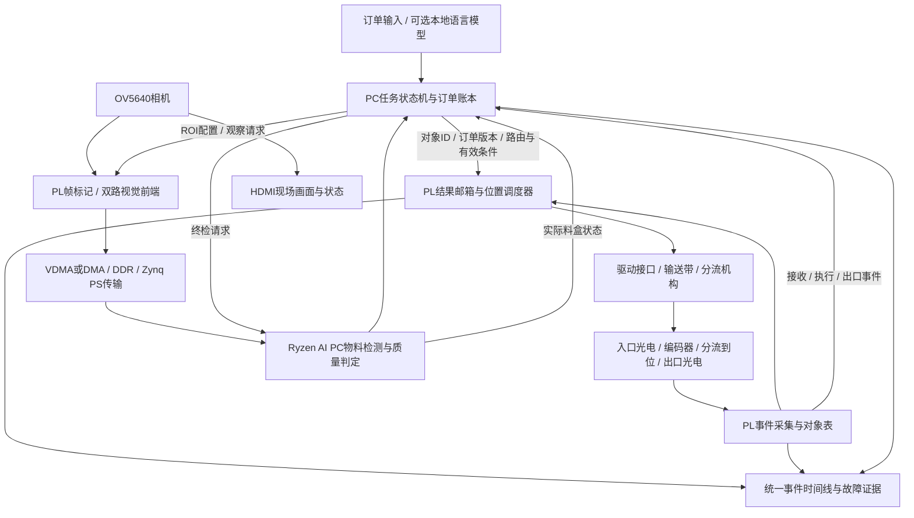

# AMD 赛题二完整技术路线：锐眼智配

> 发布说明：本页为方案设计。仓库已有资料使用相对链接；未随本次上传的本机证据链接指向[来源索引](doc/amd_topic2_publication_sources_2026-09-12.md)，其中列明原始路径与哈希。 本方案保留为输送配料候选；当前仅新增机械臂的推荐路线见[锐眼智臂](doc/amd_arm_fpga_roadmap_2026-09-12.md)。

> 面向小批量订单的任务驱动视觉质检、确定性分流与可验证配料系统。
>
> 版本：2026-09-12 / 方案评审稿。团队：2 人，分别负责 FPGA 与 PC。新增硬件预算上限：人民币 10,000 元。本文提出设计，不代表新功能已经实现，也不能保证获奖。

## 1. 推荐结论

建议以当前 EES-331 的 OV5640、VDMA、HDMI、UDP 和 PYNQ 工程为基础，开发一个桌面级柔性配料工位：识别连续来件的型号与可见质量状态，按订单需求动态分配到料盒，通过实际出口事件及视觉复核确认交付；遇到迟到的 AI 结果、临时遮挡、错路由或卡料时，拒收、重观测或暂停，并更新订单状态。

**推荐执行机构是一条成套小型输送带、两处分流门和三个出口（订单 A、订单 B、拒收）。机械臂作为后续可替换的末端，不进入第一阶段关键路径。** 两人团队应把主要时间用于视觉与实时协同，避免同时承担机械臂选型、逆运动学、抓取标定、末端设计和通用机器人策略训练。

作品的核心问题是：**AI 判断存在不确定性和可变延迟时，如何让正确的决定作用于正确的物体，并用物理证据确认订单完成？** 这一问题同时牵引 FPGA、PC 模型、通信协议、执行反馈和实验设计。增加模型数量、摄像头数量或机械自由度，不自动增强说服力。

建议保留三个核心贡献：

1. **任务驱动的视觉前端**：根据在途物体、订单与不确定性，动态配置 FPGA 的 ROI、全局巡检和重观测。证明相同识别质量下的带宽、CPU 占用及尾部延迟收益。
2. **按物体身份与位置执行的硬件调度**：FPGA 建立对象表、编码器位置和动作窗口，拒绝迟到、重复或属于旧订单的结果。AI 异步推理，分流时序由硬件维护。
3. **物理反馈驱动的订单提交与恢复**：计划数量、预留数量和实际确认数量分开；出口到达与最终视觉复核后才完成订单，异常时回退预留、补料或暂停。

第一阶段先完成第 2、3 项的最小闭环；第 1 项在对照数据证明瓶颈后逐步加入。ROI 只是固定裁剪时，应称固定裁剪，不能包装成任务驱动感知。

## 2. 赛题依据与赛程边界

主依据为本地 [AMD 赛题 PDF](pdf/AMD赛题.pdf) 的 3.2 节。已复用 SHA-256 匹配的 MinerU pipeline 输出，并人工核对物理第 15 页的平台要求和第 19 页的评分表。内容定位采用章节编号，避免混淆 PDF 物理页与印刷页。

| 官方评分项 | 权重 | 本方案优先提供的独立证据 |
|---|---:|---|
| 具身智能系统完整度 | 20 | 整单正确率、错配/漏配、人工干预与真实出口确认 |
| AI PC 端侧 AI 能力 | 20 | 物料/缺陷标注测试集、batch=1 分阶段延迟、离线推理 |
| FPGA/Zynq 设计质量 | 25 | 自研模块、位置调度误差、像素吞吐、资源与时序收敛 |
| AI PC 与 FPGA/Zynq 协同 | 20 | 对象关联、过期结果处理、通信尾延迟、传感到物理响应 |
| 工程完成度与创新 | 15 | 故障恢复、持续运行、复现与工作流复用 |

来源：3.2.5.6。同一项数据可解释多个维度，但不能重复计分。3.2.4 要求五类核心指标并至少补两项专项指标；没有统一的绝对性能门槛，因此本文数值均是内部目标或计算示例，不是官方达标线。

硬要求包括：真实 AMD Ryzen AI PC、实际参与任务的本地 AI、AMD FPGA/Zynq 硬件设计、完整物理任务，以及软硬件通信与异常处理。EES-331/Zynq-7020 可作为自备平台；PYNQ Python 不能替代 PL/PS 设计。赛题 3.2.3.1 明确要求 ROCm 7.14.0 及以上，并需声明真实软硬件版本。[ROCm 7.14.0 官方安装说明](https://rocm.docs.amd.com/en/docs-7.14.0/install/rocm.html)已核实存在；具体 SKU、OS、驱动和框架组合仍要在到手设备上验收。

时间依据：3.2.3.2、3.2.6 明确 **2026-10-09 中期借机申请，2026-10-13 评审及开始发放**。从 9 月 12 日到 10 月 9 日约 27 天。文件没有给出最终提交与决赛日期，要求以后续官网为准。本次官网首页抓取超时，搜索所得通知包含其他赛道，未据此推定本赛道最终时间。**27 天计划的终点是中期成果，不是国赛终点。**

## 3. 当前工程究竟已具备什么

| 能力 | 当前证据 | 可以复用到哪里 |
|---|---|---|
| 摄像头、帧缓存、HDMI | OV5640→PL→VDMA/DDR→HDMI 已板测 | 直接作为图像输入和现场监督基础 |
| PYNQ 视频服务 | 600 帧/120 秒发送测试，软件重启后自启恢复 | 控制面、部署、现有稳定图像通道 |
| PC 图像接收 | 604 完整渲染帧/124.125 秒，丢帧/CRC/坏头等计数为 0 | 保留重组、CRC、BGR 解码及可视化 |
| 成功整合镜像 | 222654 版本有用户实际写卡及双画面确认 | 可回退启动基线，不能外推其他镜像通过 |
| YOLOv8n 权重 | 已同步；7 类全部是手势 | 辅助人机交互与推理部署经验 |
| 物料识别与质检 | 尚未看到已验收模型 | 必须新增数据与模型 |
| 执行机构与物理反馈 | 型号、协议未确定 | 本方案首批硬件门槛 |
| Ryzen AI PC 实测 | 尚未确认设备到位和后端性能 | 借机或校内借用是正式验收依赖 |

证据：[PYNQ 联合运行报告](../4_metrics/logs/2026-09-11_pynq_camera_run01/REPORT.md)、[PC 原始统计](../4_metrics/logs/2026-09-11_pynq_camera_run01/pc_final_status.json)、[SD 镜像说明](../9_pynq/sd/README.md)、[模型说明](../3_host/model/MODEL.md)。这些是既有记录，本轮未重新上板。

必须修正旧设计中的几个假设：

- 实际上传设置为 5 fps；HDMI 480p60 不能证明相机产生 60 个独立新帧。约 200 ms 的上传周期可能比模型推理更影响闭环。
- 相机源是 RGB565，扩展后上传 BGR888。三字节网络像素不等于原生 24 位色彩采样。
- 当前 `camera.py` 的时间戳在发送软件中生成，不能直接当曝光时间或 PL 帧首时间。32 位微秒字段还需处理约 71.6 分钟回绕。
- 现有手势模型的 mAP50:95=0.438 来自队友报告，既不代表物料识别，也不代表本地 FPGA 到执行机构的闭环精度。
- 旧设计中的 CNN 加速、多轴插值、硬件急停和“超时自动归位”不能视为现有成果；本轮不沿用未验证的 5–10 倍加速承诺。

## 4. 为什么推荐输送配料，如何选择硬件

| 执行方式 | 适合任务 | 对两人团队的主要代价 | 选择结论 |
|---|---|---|---|
| 成套输送带＋分流机构 | 连续来件、质检、按配额配料 | 来件间距、打滑、分流到位与堵料关联 | **当前推荐**，硬件时序贡献最直接 |
| 成套 XYZ 龙门 | 单层台面吸取、精确格位配套 | 需完整驱动、回零、吸取与控制器 | 若完整系统能快速交付，可替代末端 |
| 桌面机械臂 | 抓取、姿态调整、位置放置 | 标定、可达性、夹爪、反馈与暂停语义 | 后续增强；不作为当前必要条件 |

市场可获得性已有厂商实例：DOBOT 的[输送带产品](https://www.dobot-robots.com/products/conveyor-belt/conveyor.html)列出光电检测、编码器和驱动供电参数；Waveshare 的[桌面机械臂文档](https://www.waveshare.com/wiki/RoArm-M2-S_Robotic_Arm_Control)列出位置命令、关节/负载回读。它们只证明此类成套产品存在，**不代表已验证可直接接 EES-331、符合预算或推荐立即购买具体型号**。厂商原有颜色分拣演示也说明“输送带＋视觉分拣”本身不新，差异必须由后续三个核心贡献与测试证明。

采购门槛应在 9 月 15 日前落实：

1. 成套电机与驱动、可控停带、速度范围、实际供货日期和可运行例程；不能只买裸架。
2. 编码器反映实际带面/滚轮运动，能得到信号类型与电平；步进指令数不冒充真实位移。
3. 分流器有明确驱动方式、上电默认位置、实际到位反馈；电气接口通过隔离/电平转换接入。
4. 入口、近分流校正点、三个出口传感器能实际安装，料件不会并排超车。
5. 人工停机、防护和停带链路独立可用；普通开发板逻辑不宣称工业安全认证。

若该门槛失败，应选已确认成套接口的桌面执行器完成单件闭环，并重写相应任务指标；不能同时采购两套机构碰运气。若采用商业机械臂，使用其正式控制器，不默认 FPGA 直接驱动关节；没有可验证的暂停/使能接口时，只能声称事件检测或下一条命令拦截，不能声称任意运动已被硬件制动。

## 5. 场景与任务契约

场景定位为教学、实验室及轻量工位的小批量订单配料，避免冒称达到工厂生产精度。初期使用 30–60 mm、轻量、非透明、单层、不堆叠的样件；两种型号加一种明确不合格状态，随后扩到 4–6 种已登记物料。一台固定 OV5640 覆盖观察区、分流区域和料盒确认区；若视野与分辨率不能同时满足，先重新布置台面与照明，再考虑第二摄像头。

示例任务：

> A 盒配齐 3 个完整环件和 2 个长垫块；B 盒配齐 2 个完整短垫块。缺口件拒收；A 盒完成后不再继续添加。若允许替代，必须由订单明确列出可替代型号。

这比“红色进左边、蓝色进右边”多出型号/质量、数量、动态订单、在途预留和结果确认。在线改变订单时，已经承诺执行的在途物体按旧订单完成并记录；新的订单版本只作用于未承诺对象，不能静默改路造成数量不一致。

物理任务状态：

`订单建立 → 来件编号 → 观察 → 识别/质检 → 分配并预留配额 → 位置窗口执行 → 出口确认 → 最终料盒复核 → 订单完成`

成功定义：在预定超时内，料盒中实际类别、质量、数量满足订单，且无需人工改判、移动错件或修正计数。人工上料在各组保持相同、明确列为供料方式；人工拿走卡料、补改结果均计干预。拒收后等待下一合格件属于系统恢复，但不能把人工把拒收件重新摆入称作自动回收。缺货应报告未完成/等待补料，不虚构库存。

第一阶段出口光电证明“通过与数量”，类别正确性由独立人工/录像核对作为评测真值。冲奖增强阶段加入料盒视觉终检，但有独立的机械落位门槛：每路使用被动单列导槽、限容浅盘和防叠料约束，初期选择厚度接近的样件、每盒最多3–5件，验证自然落料后无重叠且全部可见。两处分流门本身不能保证独立格位。若导槽/限高导致卡料或无法稳定保持可见状态，保留人工/录像真值，自动终检标记未完成；没有视觉类别确认的结果只能标记数量确认，不能提前宣传自动语义闭环已完成。

## 6. 完整架构与数据流

### PC：识别、理解、任务决策

- **物料模型**：优先采用熟悉的 YOLOv8n/s 检测或分割模型，识别型号、位置和可见缺陷；检测配合几何规则可作为第一版。模型精度与数值格式必须实测，不预设新模型一定优于旧模型。
- **质量判定**：第一版限明显缺口、缺件、形状不符等可见状态；不承诺微裂纹、内部损伤或仅凭 RGB565 区分细微材料差异。
- **对象关联**：将检测框与入口对象 ID、编码器预测位置、出现顺序匹配；冲突或置信度不足时禁止把结果随意绑定给最近物体。
- **任务账本**：分别记录 `required / reserved / confirmed`。多物体同时在途时先预留，出口验证后提交；拒收或失败撤销预留，避免超配。
- **恢复策略**：物体仍在观察区且允许停带时，最多一次停带重拍/改变照明；已经离开观察区则拒收。堵料或身份链断裂进入暂停，不能盲目连续重试。
- **可选语言理解**：本地小模型仅把文本转成受约束订单结构；型号、数量、替代条件、动作均经模式校验。无效或超范围任务返回说明。实时执行不等待大模型逐帧思考。

现有 7 类手势可保留“确认/暂停请求”等辅助交互，必须去抖并与上下文绑定，不能作为唯一急停。NPU 只做后期可选比较：AMD 当前 [Ryzen AI 发布说明](https://ryzenai.docs.amd.com/en/main/relnotes.html)和 [Linux 支持说明](https://ryzenai.docs.amd.com/en/latest/linux.html)区分具体平台与模型类型；启用 EP 不等于全部算子落在 NPU。正式主线使用满足赛题要求的 ROCm 与经验证 iGPU 模型，单列实际设备、算子分配、回退与延迟。

### Zynq PS：复用部署与通信，移出高频 Python 工作

保留 PYNQ Overlay 加载、设备检查和低频配置。当前 Python 快照复制、CRC 和逐包发送先剖析，再决定用原生扩展/独立 C/C++ 服务降低复制与系统调用开销。只在日志证明有必要时增加 DMA 数据通道，不先重写整个网络栈或做 PL 千兆 MAC。

图像与事件分端口/队列，事件及控制回执优先；满队列丢弃过时图像，不能让事件无限排队。控制配置有回执，图像不做无限重传。PS 不承担分流最终时刻的操作系统定时。

### FPGA：新增四组硬件模块

| 模块 | 自研内容 | 验证接口与证据 |
|---|---|---|
| 帧与事件统一标记 | 64 位单调计数器、帧首/帧末标记、传感边沿捕获、CDC与去抖 | 输入边沿到事件 FIFO 的波形；时间戳单位与跨域误差 |
| 视觉前端 | RGB565 原信息保留、全局降采样、2 路动态 ROI、按帧生效配置、溢出计数 | 与软件等价输出逐像素比较；像素吞吐、资源、延迟 |
| 对象位置表与执行调度 | 4 个在途对象起步、编码器位置、预期到达、路线窗口、到位确认 | 对象不串号、过期拒绝、窗口冲突、错路由注入 |
| 故障与证据通道 | 心跳、编码器异常、超时、出口未到、事件环形日志、明确恢复状态 | PC卡顿/断链时本地处理；触发到物理响应实测 |

硬件裁剪、计时或 PWM 单项并不能证明 FPGA 具有优势。需要展示它们在同一设计中并行处理像素与事件、在主机负载波动时维持对象和执行关系，并与优化软件方案比较。如果 MCU/PS 已足够，诚实报告适用边界，不能用“软件绝对做不到”作论据。

## 7. 三项贡献如何具体实现

### 7.1 根据任务分配观察资源

全局视图维持低速巡检；正在识别的物体、质量疑点和最终料盒区域得到更高频或更高分辨率 ROI。配置包含 `cfg_version / effective_frame / roi / scale / priority / ttl`，使用影子寄存器，在帧边界原子切换。PC 收到数据后校验配置版本，禁止一帧混用前后两套区域。

不能只发送 ROI：全局视图及周期性完整帧用于新物体、相机移动、漏检和区域外变化；全局视图超时则禁止仅依赖局部图像继续执行。ROI 数量、帧率与全景刷新在同条件消融中分别比较。

当物体仍在有效观察区内且质量判定不确定，可以停带、等待机械/照明稳定、再采一组图像。若重拍仍不确定则拒收。ROI 指向已经离开镜头的物体时，不能靠重拍“恢复”。

### 7.2 把异步 AI 结果变成可验证的空间动作

每个对象从入口得到 `object_id`，图像和推理结果携带帧号与编码器计数。控制包建议至少包括：

`protocol_version, boot_id, task_version, object_id, frame_id, roi_version, capture_ticks, encoder_at_capture, route, decision_seq, valid_until_ticks, target_position, crc`

`boot_id`防止重启后旧数据混入；`decision_seq`实现幂等，重复包只回执，不重复动作。执行硬件检查对象仍存在、版本一致、空间窗口未过、路由机构来得及到位、出口未堵塞、命令未过期。这里的订单版本与对象承诺时锁存的 `task_version` 比较，不能与全局最新订单版本比较；在线改单不撤销已承诺旧对象。尚未承诺对象使用新版本，取消已承诺动作必须走单独取消回执且确认仍在允许窗口。PC不能直接从以太网绕过该检查驱动分流器。

回执区分四类：`accepted`（合法接收）、`armed`（等待位置事件）、`actuated`（实际到位信号确认）、`delivered`（指定出口唯一关联到该对象）。任何一类都不能冒充下一类。按每条实际路径维护对象队列、分流门通过证据与预计出口窗口，两处分流门前分别有校正点；不同路径到达次序不等于总入口次序，不能用全局FIFO给出口脉冲分配身份。只有候选对象唯一且路径/窗口一致才能生成 `delivered`，多个候选、未知脉冲、错出口均进入异常。PC 订单最终状态还需结合视觉终检。

空间调度优先使用实际编码器计数。停带、速度改变、相机标定变化会使时间预测失效，需重算未承诺对象；已经错过动作窗口的结果拒绝。近分流光电重新校正到达位置，不能假设带面与物体永不打滑。

对象最小间距必须满足机构的实际动作/回位时间。示例关系：

`gap_mm >= v_mm_s × (切换时间 + 到位确认时间 + 裕量) + 物体有效占用长度`

这些时间来自后续器件实测。若两个对象的动作窗口冲突，停带或将无法确认的对象拒收，不能继续凭估计分流。系统只对规定速度、间距、不并排/不超车的任务域负责。

### 7.3 基于物理证据更新订单

同一物体全程关联：`入口 → 观测 → 预留 → 命令 → 到位 → 近门校正 → 出口 → 料盒终检`。入口/出口计数必须与在途表守恒；有未知对象、漏脉冲或关联歧义时暂停新承诺，排空/人工确认后重新建表。

恢复例子：AI结果迟到→该物体默认拒收→撤销其订单预留→等待下一合格件补足；一次可恢复识别失败不应把整单误标完成。发现错路由时，不把“后续补一件”视为已纠正被污染的料盒，应隔离该订单并要求复核/处理。卡料停机后需要物理检查，无法自动清除的卡料应如实计人工干预。

硬件默认拒收/停带必须按真实机构设计验证：断电或断链时机构可能停在上一个位置，不能只在代码里给默认值就宣称安全。上电前位置、动作中的断链、满载停机、已在途物体都要测试；不把“失联自动归位”作为通用策略。

## 8. 带宽、存储、资源与时序预算

### 8.1 带宽计算与现状

当前 640×480 BGR888，每帧 921,600 字节，5 fps 纯像素约 **36.864 Mbit/s**。604 帧/124.125 秒推得 4.866 fps、约 35.88 Mbit/s 完整帧像素率；这是从计数推算，非独立网卡吞吐测试。

以下是假设相机独立新帧已达 30 fps 的增强预算：

| 数据组合 | 纯像素负载 |
|---|---:|
| 640×480 BGR888，30 fps | 221.184 Mbit/s |
| 同源 RGB565 全帧，30 fps | 147.456 Mbit/s |
| 320×240 RGB565 全景，5 fps | 6.144 Mbit/s |
| 两路 160×160 RGB565 ROI，各 30 fps | 24.576 Mbit/s |
| 全景＋两路 ROI 合计 | **30.720 Mbit/s** |

不含包头、冗余全景、重采与丢包。与同为 RGB565 的全帧相比理论减少 4.8 倍，与旧 24 位全帧相比 7.2 倍；**这不是已实测加速，也不能把像素格式变化全部算作 ROI 功劳**。ROI 为 20 fps 时总负载 22.528 Mbit/s。

千兆链路理论带宽并不紧张，当前瓶颈可能是复制、CRC、发送循环和队列。必须先测各阶段；若完整图像经合理优化即可满足目标，则将 ROI 主张限定为 CPU/能耗/多对象扩展收益，不虚构“必须压缩才传得动”。

### 8.2 时延与运动的约束

首阶段保留 5 fps、单件低速/停带观察，也可形成真实订单闭环。增强目标为 20–30 个独立新帧/秒，前提是曝光、DVP输入、DMA和接收逐级证实。

示例：速度 100 mm/s 时，200 ms 观测年龄对应约 20 mm 位移，50 ms 对应约 5 mm。这说明应同时报告感知年龄和位置误差，不能只报模型耗时。该计算假设匀速，不覆盖打滑与加速。

观察位置距离分流门 `d`、带速 `v`，则可用窗口约为 `d/v`；必须扣除分流到位、校正、通信和测量裕量。例：200 mm/100 mm/s=2 s，说明慢速工位不应人为宣称需要亚毫秒 AI；需要验证的是负载扰动下截止期命中、对象绑定与更高吞吐时的边界。

### 8.3 PL 增量资源控制

初始设计上限建议：新增 LUT≤10k、FF≤12k、DSP≤24、BRAM36≤32，目标处理时钟 100 MHz。它们是模块预算，不是综合报告；现有工程资源余量须先提取后才能承诺。整体实现以 WNS≥0、TNS=0、约束完整、CDC无未解释风险为门槛，不为高资源使用率而堆模块。

只在 BRAM 保留行缓存、事件 FIFO、配置与对象表；ROI/完整帧存在 DDR，不放满图在片上。两路 160×160 RGB565 双缓冲约 200 KiB，仅该缓存就约需 45 个 BRAM36，已经超过上述预算；因此明确采用流式抽取＋DDR DMA。背景监测如需前一帧，也在 DDR 或降采样块统计中实现。

主显示/采集链路不能被观测分支背压拖死；满缓冲时丢弃整个观测帧并计数，下一帧重新同步，不能输出部分帧冒充完整 ROI。沿用当前 VDMA 启动次序、CMA 地址窗口与 cache 一致性经验。

## 9. AI 数据与模型开发

PC 队友的优先级应从“继续提高所有手势”转向物料与任务效果：

1. 冻结物体尺寸、类别与可见缺陷定义，采集真实 OV5640 图像，保持训练与部署像素格式一致。
2. 开发集按不同日期/摆放/物理样件采集，覆盖光照、旋转、背景、空带和轻微模糊。首轮预算约 1,000–2,000 张开发图像，另留至少 300 张独立测试图；这是采样计划，是否足够取决于学习曲线。
3. 按采集会话和物理样件分 train/validation/test，不随机拆相邻视频帧。测试集不得参与阈值选择或 INT8 校准；旧 MODEL.md 中“test/train 子集校准”的建议不在新方案沿用。
4. 推理输出除了类别/框，还包含质量置信度与不确定状态；阈值在验证集上固定。用覆盖率与错放率观察拒识代价，不能靠大量拒收刷正确率。
5. 若量化，比较同一独立测试集的 mAP50:95、关键缺陷漏检和端到端任务成功率；只接受有意义的吞吐/能耗收益。
6. 料盒终检以经过落料验收的单列浅盘、无遮挡和已知背景降低问题难度；被动槽道须先证明自然落料不会堆叠，不假定分流门具备格位放置能力。多层堆叠或遮挡使数量不确定时报告无法确认，不编造计数。

推荐顺序：检测＋几何规则→物料/缺陷专用模型→料盒终检→可选小模型订单理解。OpenVLA/VLA 微调不作为两人团队交付依赖。

## 10. 必须准备的对照与可证伪目标

### Material Passport

- Origin Skill: academic-research-suite / experiment-agent
- Origin Mode: plan
- Origin Date: 2026-09-12
- Verification Status: UNVERIFIED（以下实验尚未执行）
- Version Label: amd_topic2_experiment_plan_v1

主假设：在相同物料、模型、物理执行机构、速度与负载下，任务驱动前端与本地位置执行能降低过期观测导致的错配，并在合理资源代价下改善尾延迟或 CPU/通信负载。

### 10.1 公平基线

| 实验 | 控制变量 | 目的 |
|---|---|---|
| A：优化完整图像＋PC策略 | 使用latest-wins、合理发送和相同像素格式；不故意保留低效实现 | 与真实可用的软件方案比较 |
| B：相同 ROI/订单策略在 PS/PC 软件实现 | 和硬件组相同 ROI、采样率、输出质量、模型及动作规则 | 区分算法效果与硬件实现收益 |
| C：ROI/事件计算迁入 PL | 除执行位置外，其余与 B 相同；保留相同校验策略 | 归因到采集前端、复制减少和硬件并行 |
| D：本地位置窗口调度 | 与 C 相同模型、数据，比较PC/PS调度与PL调度；正常与CPU/网络压力都测 | 证明执行时刻/身份约束收益 |
| E：完整账本和有限恢复 | 与 D 比较是否启用任务级复核/恢复 | 证明整单收益以及额外时间/拒收代价 |

做两种 ROI 对照：PL 与 PS 对同源数据做等价裁剪，验证纯实现成本；全帧上送再 PC 裁剪与源端裁剪比较网络成本。前者不能拿传输收益重复记一次。若具备 MCU，可再加入其传感/分流实现；至少要有优化 PS 软件对照，不能只与旧 5 fps 演示比。

故障消融保留急停、防护与基本硬件限位；只切换待评估的任务策略，低速、轻件条件下运行。不能为了测试移除必要物理保护。

### 10.2 数据采集

- 首阶段每条件不少于 30 次完整订单，仅作为工程试验。
- 定版建议至少 3 天、每条件累计 100 次订单，记录全部有效尝试，配对随机摆放/上料序列。先试运行估计效果与方差，再决定是否增加样本；不保证 100 次即可证明任意小提升。
- 条件包括正常、缺陷/错件、订单修改、短遮挡、CPU压力、网络附加延迟/丢包、对象间距不足、出口未到/错路由。干扰范围事先冻结，不事后选择有利曲线。
- 通信/事件统计至少 10,000 样本；真实动作响应尽量 1,000 次以上、跨多轮采集。100 次动作下 P99 接近最大值，必须说明尾部估计不稳定。
- 计数必须同时包含合格接受率、拒收率、错配率、补料成本、整单超时与人工干预，防止全拒收“零错配”。

### 10.3 内部目标与停止条件

| 指标 | 中期目标 | 后续冲奖目标/可证伪条件 |
|---|---|---|
| 完整订单 | 2 类＋明显错件，30 次可追溯实物任务 | 正常整单成功率目标≥95%；扰动组目标≥85%，均给样本数与区间 |
| 动作错误 | 迟到结果不作用于已过对象，错路由可检测 | 过期命令测试无错误接受；同时报告拒收/误拒绝 |
| FPGA前端收益 | 测出真实基线与瓶颈 | 等价输出下 CPU占用或前端P99目标降低≥30%；否则撤回相应加速主张 |
| 视觉数据供给 | 固定ROI或全帧可工作 | 相同任务质量下带宽目标减少≥3倍，整单成功率下降不超过2个百分点 |
| 受扰恢复 | 一种迟到/拒收后的配额恢复 | 扰动场景成功率相对无恢复目标提升≥15个百分点，同时给时间成本 |
| 持续运行 | 30分钟与3次冷启动 | 2小时、至少5次冷启动，保留每次失败记录 |

这些是工程筛选阈值，不是官方标准或已经得到的结果。若固定颜色规则已经与模型等效，应提高任务中真正需要视觉模型的形状/可见质量差异，或承认 AI 贡献不足。若硬件和优化软件等效，就减少冗余模块，聚焦确实有收益的指标，不继续堆未经证明的“创新”。

### 10.4 真正端到端的测量

同一 PL 计数器记录帧采集完成或入口传感时刻，以及分流门位置传感器检测到实际运动/到位的时刻。区分“首次物理响应延迟”和“到位延迟”，起止事件在报告中固定。GPIO输出、UART发送完成、控制器 ACK 均不是物理动作。该动作延迟实验要求分流门确实从另一路切换；连续对象同路而门已到位时，单列为无需切换的对象通过/交付时间，不能沿用旧到位状态生成新的响应样本。两类样本均报告数量，不用选择性切换样本代表全部任务。

同时记录 `capture / pc_receive / preprocess / infer / postprocess / decision / board_receive / armed / motion_start / at_position / exit`。PC 单调时钟测本机各阶段；单向跨机时延必须估计同步偏移、漂移和不确定度，不可直接相减。未获得可靠同步时报告 RTT，并用同板硬件事件测物理端到端。曝光开始与帧末不是同一口径，需声明采集区间。

原始每条记录至少包含 run_id、boot_id、task/object/frame/command ID、相机模式、模型哈希、后端、时钟、带速、编码器标定、条件标签、结果与干预。成功率使用 Wilson 区间；延迟给 P50/P95/P99/max与样本量，连续时间数据按运行轮次分析，不能把相邻帧当独立订单扩大样本。

## 11. 两人分工与 27 天路线

| 时间 | FPGA负责人 | PC负责人 | 共同门槛 |
|---|---|---|---|
| 9/12–9/15 | 核实物理接口/PL余量，定义事件与对象ID | 冻结订单、物料与数据采集；落实AI PC借用渠道 | 成套机构/交货/反馈可确认，预算与范围冻结 |
| 9/16–9/22 | 时间戳、传感边沿、分流输出与到位回读 | 物料模型首版、订单状态机、日志 | 单物体入口→识别→正确出口，有实际反馈 |
| 9/23–9/29 | 编码器对象表、窗口与过期拒绝 | 对象关联、配额预留/提交、有限恢复 | 连续来件不串号，演示结果迟到和出口未到 |
| 9/30–10/05 | 资源允许时一项ROI硬件增量；保留稳定旁路 | 公平基线、真实数据集、自动统计 | 功能冻结，至少一种可量化硬件收益或明确瓶颈证据 |
| 10/06–10/08 | 时序/接口证据、启动与异常演练 | 中期报告、复现说明、完整演示视频 | 30次订单、30分钟稳定记录、全部指标分清实测/计划 |
| 10/09 | 合同/器件/接口材料 | 模型与系统成果材料 | 提交借机申请；本方案不代替正式提交授权 |

每日共享一个接口契约，前 10 天隔日共同联调；之后每晚固定验收当日接口。FPGA负责人同时承担电气与机构接入，PC负责人承担数据/AI/订单/指标工具；不要再分出第三人的机械专项工作。记录总投入与阻塞，若到货延误，先用信号发生器/控制器模拟器验证协议，但中期必须明确哪些阶段仍无实物。

10 月 13 日之后的增强按依赖顺序展开：

1. 到手 Ryzen AI PC 上完成符合赛题的模型与版本验收，保存 batch=1 性能及设备证据。
2. 从单件扩大到 4 个在途对象；完成动态 ROI 和全局监视，验证真实新帧率。
3. 增加一种可复现质量缺陷、自动料盒终检和两种故障恢复。
4. 冻结参数后运行消融、持续实验和复现；再做可选自然语言/手势和第二任务工作流。

最终日期确认后，至少保留最后 7–10 天只用于证据、修复和演示。若时间不足，先砍第二摄像头、NPU、语言模型、第二执行机构；保留物理闭环、一个有数据的硬件贡献和异常处理。

## 12. 预算与必要资源

以下为预算分配上限，非已询价采购单。复用已有 EES-331、OV5640、显示器、开发电脑；正式 Ryzen AI PC 依赖借用，不假定申请必然成功。

| 项目 | 上限/元 |
|---|---:|
| 成套小输送带、电机、基本驱动 | 3000 |
| 成套分流门及执行器 | 1200 |
| 编码器、入口/校正/出口与到位传感器 | 700 |
| 接口驱动、隔离、电平转换 | 600 |
| 电源与配电 | 400 |
| 导轨、料盒、支架、定位件 | 500 |
| 急停、防护与电气保护 | 600 |
| 固定照明 | 300 |
| 线缆与连接器 | 300 |
| 运费、耗材、关键备件 | 500 |
| 未定项与测量资源预留 | 1900 |
| **合计** | **10000** |

采购前要求实际含税运费报价落在分项上限；不足时减少机构复杂度，不能挪掉必要驱动/反馈预算。逻辑分析仪/示波器优先借用；若无法借到，需从预留中解决并相应减少其他开支。

AI PC 资源：先核对校内/实验室借用，再申请赛事支持。普通PC可以开发和提供中期原型数据，标明设备；正式比赛必须补齐真实 Ryzen AI PC 实测。如果必须把购买AI PC也纳入这1万元，当前方案尚未被证明可负担，应先锁整机价格、借租条件，再重分配执行机构预算，不能宣称“1万元已覆盖全套”。

## 13. 现场演示与答辩

五分钟主演示应让观众看到真实任务变化，而不只看到框：

1. 输入两份小订单，同类合格件会因剩余配额不同被分配到不同出口，完成后不超配。
2. 混入一个明显缺口件，展示质量拒收和订单等待补料。
3. 对指定对象注入可见网络延迟，展示旧结果被拒绝、物体进入拒收口，后续对象不串号。
4. 演示一次观察区内遮挡后的停带重拍，或一次出口未到导致的暂停；成功与失败都显示具体原因。
5. 显示料盒实际状态、订单账本与同条件消融图，随机选一个对象展开完整事件时间线。

HDMI 保留实时图像，可叠加对象ID、ROI、订单配额、当前拒绝原因和阶段耗时。界面明确区分计划路由与实际出口、预计到达与实际到位，不播放预制动画代替动作。

答辩必须能回答：

- 为什么不是普通分拣？——订单、在途预留、质量拒收、版本化决策和结果确认改变实际路由。
- 为什么需要 FPGA？——用优化软件对照展示像素处理与位置事件并行、尾延迟/资源/错误约束的实际差异。
- 为什么需要 AI？——用真实形状/质量测试与简单规则基线说明模型在任务中的贡献。
- 断网时会怎样？——只说明已测故障状态、在途物体处理和恢复边界。
- 是否通用？——当前是明确任务域，未知物料/堆叠/严重遮挡可能拒收；跨任务复用需要另一次实验。

## 14. 与既有工作相比如何表述创新

机器人任务分解与反馈规划已有充分先例：[SayCan](https://say-can.github.io/)将语言选择与技能可执行性结合；[Inner Monologue](https://innermonologue.github.io/)使用环境及成功反馈进行闭环规划；[OpenVLA](https://openvla.github.io/)提供视觉语言动作模型与适配路线。因此不主张“大模型控制机器人”“动作后验证”“失败重试”为学术首创。

本项目适合主张并验证的是：**在现有 Zynq-7020 和本地 AI PC 条件下，以物体身份、空间有效期和任务配额为共同契约，把任务驱动图像供给、硬件位置调度和物理结果提交组合成可复测系统。** 这是待证实的工程贡献定位，尚未完成系统性专利/新颖性检索。

让竞争力建立在一个具体结果上：面对相同物料和扰动，系统减少了多少错配/人工干预，为什么发生，付出了多少资源、时间和能量。不能仅凭架构命名预测国一，也不能把理论计算或外部论文结果写成本项目实测。

## 15. 实施入口、保存边界与交付物

本轮没有修改已验证 FPGA、执行器、模型或镜像。后续授权实施时：

- `2_fpga` 保持冻结；先记录基线哈希，将开发副本放在专属 `4_metrics/logs/YYYY-MM-DD_<task>_runNN/workspace/`，不要直接在成功工程上试验。
- 复用 [板端摄像头程序](../2_fpga/0_diaplay_test/pynq/camera.py)、[UDP接收器](../3_host/udp_video/udp_video_rx.py) 与 [模型入口](../3_host/model/MODEL.md)，扩展前分别保存接口和源文件哈希。
- 每个 FPGA 模块依次通过接口冻结、仿真、综合/实现、低速板测、系统对照；不得把仿真通过等同物理任务通过。
- 原始证据统一在 `4_metrics/logs/<run-name>`，工程会话记录统一在 `7_logs/YYYY-MM-DD/`。最终指标写入现有 `4_metrics/metrics.csv`，只填实际测量值。
- 交付包括 RTL/BD脚本与 bit/xsa/hwh、时序资源报告、PC源码与模型声明、硬件接线/BOM、协议、部署脚本、指标CSV、原始记录和完整复现步骤。
- 赛题要求提交仓库路径为英文文件名。当前中文资料先保留；正式提交时另行生成路径规范的发布包和来源映射，不在本次设计中批量改名或污染既有路径。

复用工作流建议只做三项：部署自检、订单执行与证据导出、故障重放。除干净环境启动外，再用同一套接口完成“按订单配料”和“合格/不合格质检分流”两种任务，记录复用时修改了什么，不能只复制一份 README 就声称可迁移。

方案和本轮依据的索引：[本次研究与验证记录](doc/amd_topic2_publication_sources_2026-09-12.md#source-04)。下一个有价值的动作是完成机构接口与交货核验、冻结两类物料任务及建立真实单物体闭环；先取得这一组证据，再决定增加哪些增强模块。
