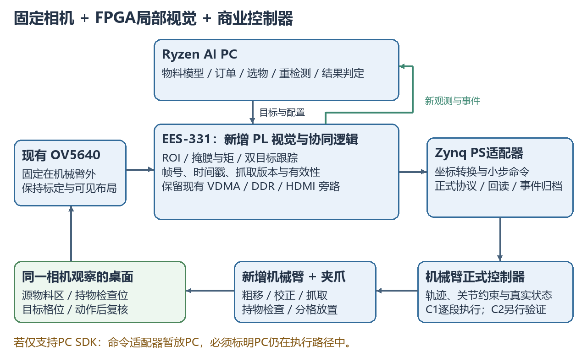
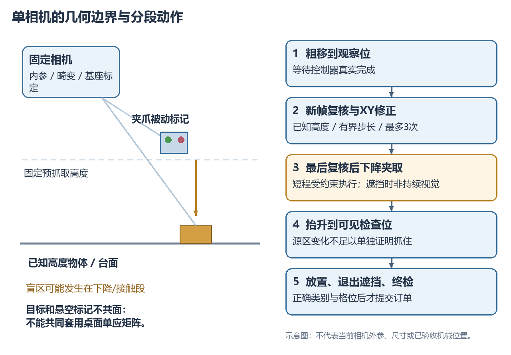

# 锐眼智臂：固定单目与 FPGA 协同的自校正抓取系统

> 发布说明：本页为方案设计。仓库已有资料使用相对链接；未随本次上传的本机证据链接指向[来源索引](amd_topic2_publication_sources_2026-09-12.md)，其中列明原始路径与哈希。

AMD 赛题二技术路线｜2026-09-12｜仅新增机械臂版本

适用条件：现有 EES-331 / Zynq-7020、板端独立 OV5640、VDMA、HDMI、网口和 PYNQ；2 人分别负责 FPGA 与 PC；新增硬件预算不超过 1 万元。首版只增加机械臂及其配套控制器、夹爪、电源和必要连接件；后期才考虑腕部相机。

本文为完整设计方案，不代表新模块已实现、实测指标已达到或能够保证获得一等奖。当前主线采用机械臂，之前的输送带方案保留为历史候选，不适用于本次硬件约束。

## 1. 先确定作品要证明的能力

推荐作品定位：**面向桌面零件配套，在目标发生移动、PC 推理出现波动、抓取可能失败时，仍能重新定位、分段校正、验证抓取结果并完成订单的视觉机械臂系统。**

主任务不是“看到物体后按旧坐标抓一次”，而是：

**识别选物 → FPGA 几何精定位与跟踪 → 预抓取位置复核 → 小步修正 → 下降夹取 → 持物检查 → 分格放置 → 结果复核。**

示例订单：“把两个完整环件放入 A1/A2，把一个长块放入 B1；缺口件不取。若抓取前目标移动，重新定位；若抓空，不记入完成数量。”

FPGA 的价值落在三个待证明的贡献：

1. **流式几何精定位与双目标跟踪。** PC 给出类别、粗框和目标身份；FPGA 对待抓物与夹爪标记持续计算质心、方向、位移、匹配质量和时间戳，为位置修正提供新观测。
2. **带有效期的分段动作协同。** 图像、目标、标定、抓取计划与命令版本绑定；抓取前检查最新位置、图像年龄、可见性、允许区域和步长。旧计划不能因为网络重发重新生效。
3. **同一套视觉硬件支持动作后验证。** 在不同阶段切换源区、持物检查位和目标格位 ROI，提供及时的变化/占用证据，PC 结合语义和控制器真实反馈决定成功、重试或暂停。

其中 ROI 裁剪、HDMI 叠加和通信优化属于支撑能力，不独立包装成三四项创新；系统的说服力应由“定位更准确、观测更及时、少用旧坐标、失败能被发现”的对照数据建立。

## 2. 赛题契合与现有基础

赛题 3.2.5.6 权重：完整度20、AI能力20、FPGA设计25、两端协同20、工程与创新15。FPGA与协同合计45，适合让 FPGA 承担图像流的实时测量与动作前检查，而 PC 使用成熟的小模型和清晰的任务状态机。

官方要求五类核心数据：完整任务成功率、传感到真实物理响应的延迟分位数、AI效果与推理性能、FPGA量化贡献、通信性能；另报至少两项专项。本文选择定位/跟踪、资源时序与可靠性。目标数字是内部研究目标，不是官方分数线。

| 当前资产 | 已有事实与限制 | 新方案复用方式 |
|---|---|---|
| EES-331 / xc7z020clg484-1 | 器件和现有工程已确认 | 保留硬件基础，不要求换 KR260 |
| OV5640→VDMA→HDMI | 已有板测；源RGB565展开为BGR888上传 | 从现有图像流分出计算支路 |
| PYNQ/UDP | 120秒600发送帧；重启窗口604完整渲染帧/124.125秒，错误计数0 | 复用部署、接收、CRC及稳定旁路 |
| 图像更新 | 当前上传设置5fps；不等于传感器独立新帧率 | PL增加真实帧计数，测清相机与上传两种速率 |
| 模型 | YOLOv8n 7类手势，非零件模型 | 复用环境/推理框架，新增零件数据 |
| 模型环境 | 最新记录MODEL_ENV_BASELINE_PASS，含离线重建与合成输入 | 可直接作为PC算法开发起点，真实精度另测 |
| 机械臂 | 尚未选型/接入 | 采购先验收协议、反馈和相机可见布局 |
| Ryzen AI PC | 尚未确认实机性能 | 正式验收需借用/取得真实设备 |

来源：[PYNQ报告](../../4_metrics/logs/2026-09-11_pynq_camera_run01/REPORT.md)、[PC原始统计](../../4_metrics/logs/2026-09-11_pynq_camera_run01/pc_final_status.json)、[模型说明](../../3_host/model/MODEL.md)、[最新环境报告](amd_topic2_publication_sources_2026-09-12.md#source-05)。本轮读取既有证据，没有重新上板。

用户照片说明当前相机模块与FPGA板组合摆放，机械臂尚未接入。照片不能证明俯视几何、镜头畸变、有效工作距离、抓取精度或电气接口。本方案不要求把当前相机装上机械臂。

## 3. 物理布局：固定相机先解决可见性

先把现有板卡/相机可靠固定，使相机能看见源物料区、预抓取校正位置、持物检查位和分格放置区；不要求一定正俯视，固定斜视也可，但必须标定并验证视差。不得边运行边改变相机或整块板的位置。

桌面采用单层、非堆叠、已登记高度的轻小零件。首批选2–3种30–60mm、轮廓明确、夹爪能可靠抓住的物体；最终类别、重量、尺寸必须与实际臂负载和夹爪宽度匹配。首期不做随机堆叠、任意6D姿态、透明薄片、精密插装或人手追逐抓取。

可使用纸质标定板、工作区标记和夹爪上的两个被动色块/标记，属于安装耗材，不增加电子传感器。固定支撑、线缆应力释放、物料托盘和防护也属于装置必要附件，不视为新增计算平台。

工作区取“相机可见区域 ∩ 标定可信区域 ∩ 机械臂可达区域”，再向内收缩留出误差余量。源区与目标格位分开；持物检查位要能看到夹爪夹持的物体，而不是被夹爪或腕部完全挡住。

若单相机无法同时覆盖这些区域，优先调整固定视角、台面大小及机械臂姿态。不能以移动相机后继续沿用旧标定解决。布局仍不成立时应缩小任务范围，把中间持物验证标记为未知；腕相机只是后续解决盲区的路径，不作为首版必需条件。

## 4. 总体架构与三条更新节奏

| 层级 | 职责 | 预期节奏与边界 |
|---|---|---|
| PC语义与任务 | 零件类别/粗框、订单、选物、重检测、成功判定 | 事件触发或2–5Hz起步；不是必须连续运行多个模型 |
| FPGA图像测量 | ROI几何、目标与夹爪标记跟踪、变化/置信度、帧龄 | 每个真实新帧更新；先测可用帧率，再争取20–30Hz |
| PS/控制器执行 | 坐标转换、限幅小步命令、协议适配、运动完成反馈 | 首版逐段“停稳—观察—修正”；上限取决于控制器 |

100MHz是计算时钟，HDMI60Hz是显示刷新，二者不能当视觉闭环频率。控制器接收100Hz命令也不意味着相机每秒提供100次新观测。1kHz检查可用于看门狗，不能借此宣传1kHz视觉伺服。

数据路径：OV5640采集支路保留原VDMA/HDMI；新增PL流式处理后，元数据通过AXI-Lite/FIFO到PS，高质量全景/ROI按需通过DMA/DDR上传PC。PC任务配置返回PL，配置只在帧边界原子生效。

执行路径优先为“FPGA测量/有效性检查 → Zynq PS小步执行适配器 → 机械臂正式控制器”。如果所选臂只能经PC专有SDK控制，则先采用“FPGA→PC适配器→控制器”，并明确PC仍在控制路径内，不能宣称离开PC也能继续运动闭环。

## 5. 首版和增强版必须按控制器能力区分

| 控制器能力 | 可以实现的功能 | 不能直接承诺的功能 |
|---|---|---|
| C0：仅动作组/固定姿态，缺少真实回读 | 基础动作演示 | 不适合作为自校正主平台 |
| C1：绝对/相对位置、真实状态、到位与停止语义 | 停稳→新图像→小步XY修正→等待完成 | 运动中连续跟踪、硬件即时中断 |
| C2：在线重规划或有超时机制的速度接口 | 经稳定性验证后低速连续视觉修正 | 未测之前不能许诺固定高更新频率 |
| C3：高频servo pose/关节流接口 | 高级轨迹输入 | 并不自动替用户完成插补、限速和轨迹连续性 |

**首版按C1可完成来设计，采购优先争取C2，不以C3为必要条件。** 点到点模式中，每次只能存在一条未完成动作；回执到位前不能把多个修正排入队列。SDK函数返回、设定值回显、动作完成及真实位置是不同信息。

公开厂商文档可以帮助定义接口验收，例如[UFactory接口说明](https://github.com/xArm-Developer/xarm_ros2/blob/humble/xarm_api/ReadMe.md)区分上述控制方式，[Waveshare控制说明](https://www.waveshare.com/wiki/RoArm-M2-S_Robotic_Arm_Control)给出位置及反馈实例。它们只是能力参考，不是已选型号、万元报价或本工程兼容证明。

四自由度臂可能无法独立实现期望的垂直抓取姿态和任意偏航。若只采购四自由度，应选圆形/方向不敏感物体，或让物料方向适应该臂的可达姿态；若最终要“有方向的精确放置”，必须验收腕部能力，不能仅看“4/6自由度”标签。

## 6. FPGA重点一：从检测框中心升级为几何抓取点

PC模型负责目标类别和粗ROI。FPGA对所选区域执行轻量、可解释的图像流水线：颜色/灰度变换→阈值或边缘→可选3×3形态学→面积、质心、主轴与质量统计。目标ROI先限128×128；不同材质使用事先验证的参数集，不能声称简单阈值能分割任意场景。

核心统计量：M00为掩膜面积，M10/M01为一阶矩，M20/M02/M11为二阶矩。质心由M10/M00、M01/M00得到；中心矩用于主轴角度。除法与角度计算每ROI/帧进行一次，可在共享单元或PS实现，先比较代价，不为“全放PL”而增加无意义算术。

边界设计：空掩膜不除零，面积/长宽比超出范围标记INVALID；圆形或近对称物体方向不可观测，不输出虚假的稳定角度；主轴存在180°歧义，方向敏感任务需非对称特征或PC判别；质心不在可夹持区域时，按类别模板选择抓取点，不能把环件空洞中心直接当接触点。

固定点起点建议：128×128 ROI下M00用16位、M10/M01用24位、二阶矩用32位，中间乘积/差值保留64位；具体溢出界由最大坐标证明。坐标量化、舍入、饱和与无效码形成协议，软件黄金模型逐项比对。

实验分两层：先比较“检测框中心”和“加入几何定位”的抓取误差，证明算法是否有用；再对比相同算法在PS/PC与PL的延迟、CPU占用和持续吞吐，证明实现贡献。不能把换算法带来的精度提升全部归因FPGA。

## 7. FPGA重点二：目标与夹爪的局部跟踪器

比裁剪更值得投入的模块，是在PC两次检测之间持续跟踪目标和夹爪可见标记。第一版夹爪标记使用流式分割/矩；目标先使用几何中心跟踪，增强版再共享SAD模板匹配硬件。

建议增强配置：每个目标32×32灰度模板，在48×48当前patch内搜索17×17个候选位移，即±8像素；两路目标分别是待抓物与夹爪标记。SAD为绝对差累加，输出最佳位置、代价、次佳峰差异与纹理质量。模板更新需要高置信度和状态许可，不能持续用错误匹配更新模板造成漂移。

| 计算/存储项 | 设计计算，非实测 |
|---|---:|
| 每帧双目标差值数 | 2×32×32×17×17 = 591872 |
| 30fps所需差值率 | 17.75616M次/秒 |
| 共享1差值/拍，50MHz理想核时间 | 11.83744ms |
| 共享2差值/拍，50MHz理想核时间 | 5.91872ms |
| 两路48×48、双缓冲灰度patch | 9KiB |
| 两个32×32灰度模板 | 2KiB |

时间不含等下一帧、曝光/读出、patch装载、端口冲突和调度，最终必须测ROI最后像素到结果有效的延迟。双lane需要处理奇数x候选跨字读，不能未经bank/双端口设计就假定每拍两像素。数据RAM约5块BRAM36等效起步，连同FIFO/跨域/端口安排预留8–12块，而不是仅用总字节数相除。

±8像素是每次成功跟踪之间的局部搜索边界，不是任意物体移动范围。移动过快、旋转明显、光照变化、纹理不足、相似物体互换或遮挡都可能失效；失效置为UNKNOWN并要求PC重检测，不能无限外推。预抓取演示中移动目标20mm而超出搜索窗，应展示重新识别，而非假称小窗跟踪器直接追到。

两个ROI在同一帧不同位置被采集的时间也可能不同。记录各ROI采集区间，运动场景评估其时间差对误差的影响；降低移动速度/增大裕量，不能仅凭相同frame_id声称严格同时观测。

## 8. FPGA重点三：观测有效性和分段动作契约

配置与命令统一携带：boot_id、task_version、object_id、grasp_version、calibration_version、frame_id、ROI配置版本、采集时间、允许工作区、有效期、command_id。

新抓取定位生成新grasp_version；任何目标移位、身份不确定、标定变化、超龄或重启都会使相关旧版本失效。图像/模板更新在帧边界提交，不能在一帧中途改ROI。相同command_id重发只查询/回执，不重复下降、闭爪或释放。

抓取前的允许条件包括：目标与工具标记可见、跟踪质量合格、采用的是新帧、位置误差收敛、标定版本匹配、控制器停稳、末端位姿在允许区域、步长/速度未超界、无未完成命令。连续2–3个真实新帧收敛是候选门槛，帧数与误差阈值需用误差数据确定。

PL可输出误差和限幅运动建议，但XY/Z范围约束不等于机械臂全身无碰撞。真实轨迹、逆运动学和关节限制仍由正式控制器负责；首版使用经验证的空旷走廊与固定预抓取高度。

对于FPGA/PS直接连接控制器的增强实现，可把完整待发送包与许可条件绑定，在发送开始前再次检查新鲜度，并记录实际发送时间。已经发送的运动不会因撤销许可自动停止；需要厂商明确的暂停/停止/使能机制。串口传输途中不能随意截断字节并假定机械臂会安全停住。

只有PC专有SDK可用时，PL提供观测有效性和下一动作许可，PC适配器在调用前再校验；这属于协同检查，不能宣传硬件强制截断控制链或保证PC崩溃后的任意制动。即使不具备独立运动控制，前两项视觉计算仍可产生可量化贡献。

## 9. 固定单目如何完成位置校正

最容易出错的一点：桌面物体与悬空夹爪不在同一高度，不能一起套桌面单应矩阵后直接相减。先做相机内参/畸变、相机到机器人基座、夹爪标记到TCP的标定，并记录误差与可信工作区。

已知平面高度z时，可用 H(z)=K[r1,r2,t+z·r3] 把基座平面映射到图像，再用逆映射恢复XY。目标使用已登记物高，夹爪标记使用反馈高度和安装偏移；夹爪偏航变化时标记到TCP偏移也要相应旋转。关节设定值不能冒充真实反馈高度。

两人团队首版更简单的路线：固定预抓取高度与夹爪姿态，在该高度标定局部像素—XY映射/雅可比J；结合目标已知高度得到该目标对应的期望工具图像位置。误差e变成有界的小步XY修正，候选控制律为ΔXY=-λJ⁻¹e，并做步长、速度与区域限幅。J奇异或条件数过大时禁用该局部控制区，不直接求逆。控制律的符号、增益与收敛性先在软件和低速实机验证。

PC负责标定与系数生成；PS首版做坐标转换；PL优先做每帧几何量与误差/许可。后续若测得转换阶段确实需要确定性，再将固定系数矩阵乘法与限幅移到PL。每帧几个矩阵乘法的计算量很小，不能把这部分包装成大型加速器。

误差预算应至少含：标定/畸变残差、像素定位、物高误差、标记到TCP偏差、控制器重复误差、观测年龄造成的位移。先用各项绝对界相加形成保守范围；有充分独立性证据才采用平方和。初始目标可设定位95分位≤3–5mm，但只有误差预算支持时才能承诺。不要预设亚毫米抓取。

示例：有效横向视野400mm对应640像素时，平均比例约0.625mm/像素；它不是透视视野内处处相同。40mm/s移动速度下，200ms观测年龄对应约8mm位移，33ms约1.32mm。这里的计算解释新鲜度价值，不代表相机或控制器实测。

## 10. 动作流程与结果判断

采用以下有限状态机，每条状态转移都记录观测和命令版本：

SEARCH → SELECT → MOVE_TO_PREGRASP → SETTLE → OBSERVE → CORRECT → READY_TO_DESCEND → DESCEND_GRIP → LIFT_INSPECT → PLACE → RETREAT_VERIFY → COMMIT。

| 阶段 | 行为与验收 | 失败处理 |
|---|---|---|
| 搜索/选物 | PC识别类别和粗框，订单预留一个格位 | 无目标等待；身份歧义不沿用旧对象 |
| 预抓取/观察 | 到固定安全高度，等待真实完成和画面稳定 | 命令超时暂停，不能继续排队 |
| 小步校正 | FPGA新观测支持XY修正，每次完成后再观察 | 最多3次或固定时限；不收敛则重新识别/放弃 |
| 下降夹取 | 最后一次可见复核后，执行已知高度的短程垂直动作 | 只按已验证轨迹与控制器反馈执行 |
| 抬升检查 | 到相机可看清夹爪及物体的姿态 | 证据不足=UNKNOWN，暂停或走预先验证的受约束放置后终检；不能直接重抓 |
| 放置与退出 | 放入指定格位，夹爪退出遮挡再拍摄 | 错物/错格不提交；需要纠错或人工介入 |
| 订单提交 | 正确类别、数量、格位满足约定 | 源物消失或命令完成不能单独提交 |

下降接触时夹爪可能遮挡目标。该段是“最后可见复核后、受约束的短程执行”，不是全程视觉闭环，也不要求被遮挡目标仍连续输出VALID。进入此段必须显式锁存许可和限定时长；异常停机依赖实际控制器。若无力觉/接触反馈，不宣称具备碰撞检测或精密力控。

抓取验证分三份证据：源区目标离开；检查位可见持物；目标格位最终正确。源区变空可能是目标被推走；夹爪闭合可能是抓空；负载变化也不自动等于正确物料。成功口径分两级：中期“完成配套”以最终格位正确并经终检为准，中间持物可记录未验证；增强版“抓取后自验证”专项必须在检查位看到正确持物，UNKNOWN不算该专项成功。UNKNOWN时暂停，或在预先验证的空旷走廊内完成受约束放置后终检，不能直接再次抓取。完全遮挡的检查位应调整姿态或标记未知，不能凭模板分数补造持物结论。

恢复限一次重抓起步。目标被推到未知位置时重新全景检测，保留目标身份不确定状态。错误物体已放入不能仅再补一个正确物体就说恢复；需把错误物体取出并复核，或隔离订单计失败/干预。配额账本区分required、reserved、confirmed，抓空撤销预留，成功放置才增加confirmed。

动态演示第一版限定：在等待或观察阶段移动目标，系统停稳后重定位。若C2控制器能力、帧率、延迟、停止与稳定性都通过，后续才尝试低速运动中的连续视觉修正。对象进入夹爪接触区后由人继续推拉物体，不作为首版演示条件。

## 11. FPGA模块清单与资源/带宽预算

| 新模块组 | 主要实现 | 优先级 |
|---|---|---|
| frame_stamp / roi_config | 64位时戳、真实新帧计数、帧边界配置、ROI帧完整性 | P0 |
| roi_stream / mask_moments | 全局缩略图、ROI、掩膜和一二阶矩 | P0 |
| local_tracker | patch双缓冲、SAD、最佳/次佳、纹理与跟踪状态 | P1 |
| observation_guard | 对象/抓取/标定版本、帧龄、可见性、许可与事件FIFO | P0基础、P1增强 |
| correction_mailbox | 误差、限幅建议、命令ID、发送/执行回执关联 | P1 |
| overlay_osd | 目标/夹爪/误差箭头、帧龄、状态与失败原因 | P2 |

上述是建议模块名，不是已存在文件。观察支路不能因DMA/PC阻塞拖死摄像头和HDMI；缓冲不足时丢弃整观察帧并报计数，下一帧重新同步。帧内部分ROI不能作为有效观测。

当前发布HWH显示AXI/PS FCLK0约50MHz、HDMI像素约25MHz、相机XCLK约24.038MHz，板输入100MHz。不能据此认为所有新增逻辑可直接运行100MHz；新增时钟域须约束、CDC检查和时序收敛。

历史9月7日放置报告为LUT4674/53200、FF7214/106400、BRAM36等效20/140、DSP9/220，但其BIT与当前发布BIT哈希不同，**只能用于规模参考，不能认定当前资源余量已查明**。后续实现第一门槛是生成与开发基线对应的资源/时序报告。

增量预算建议≤16k LUT、20k FF、40块BRAM36等效、32 DSP；SAD/矩/缓存的实际分项经综合后调整。整机目标保留不少于20%资源余量，WNS≥0、TNS=0、约束完整；这些是规划指标，非当前实现结果。

不把整帧长期塞进BRAM：640×480灰度单帧约300KiB，已经相当于约67块BRAM36的纯容量；双缓冲代价更高。局部patch与行缓存放BRAM，全帧沿用DDR，校验CMA地址窗、cache一致性、VDMA启动和错误位处理。

当前BGR888 640×480×5fps纯像素约36.864Mbit/s。两路每帧128字节测量包×30Hz仅约7.68KiB/s；仍要保留低速全景与按需ROI，以供模型、可视化和失败复核。相同源RGB565与BGR888的对比要分开计账，不能把位宽减少全部算成硬件算法加速。

PC负担可以减轻到“低频语义识别＋状态机＋控制器适配”，但不能取消异常处理和真实模型效果评估。正式平台满足赛题ROCm≥7.14.0；iGPU为部署主线，NPU作为后期实测比较，不因其可用就同时维护多套复杂模型栈。

## 12. 能支持冲奖的对照实验

### Material Passport

Origin Skill: academic-research-suite / experiment-agent；Mode: plan；Date: 2026-09-12；Verification Status: UNVERIFIED；Version: arm_only_v1。

主假设：相同相机、物体、模型、夹爪、控制器与运动条件下，FPGA流式几何与局部跟踪降低观测年龄/前端波动，配合版本化位置复核，减少旧坐标造成的抓取失败；恢复提高整单成功率，代价可以测量。

| 对照 | 固定条件 | 回答的问题 |
|---|---|---|
| A：优化全帧＋PC框中心定位 | 同一模型、latest-wins、合理发送、相同像素格式 | 现有路线合理优化后能到什么水平 |
| B：几何/跟踪/有效性监测全部软件实现 | 冻结同一算法、ROI、阈值、模板与任务策略S；S含版本检查/重定位，明确抓空后停止，不自动重抓 | A与B反映新增算法/策略整体效果 |
| C：相同几何/跟踪/监测迁移PL | 与B完全相同的策略S、模型和输入，软件实现也允许优化 | B与C仅比较计算位置，归因FPGA的延迟、CPU、吞吐贡献 |
| D：固定C为底座的独立策略消融 | 分别关闭版本检查、关闭重定位、或加入一次重抓；每个子实验只改变一项，其余固定 | 哪项协同机制改善任务结果，增加多少时间 |

每项功能单独开关，不同时换模型、降分辨率、改速度后宣称FPGA加速。策略消融可采用“发现失败后停下并计失败”对比“有限恢复”，无需让基线盲目执行危险旧坐标。保留实际控制器保护与人工停机。

重点实验：

1. 标定网格定位误差：不同位置、物高、夹爪姿态，分别记录像素/毫米误差和失败区域。
2. 相同录像/图像的定点一致性：掩膜、矩、SAD位置、无效码与软件黄金模型逐项比较；离线回放不计物理抓取结果。
3. 正常抓取、观察阶段目标移位、短遮挡、相似物体干扰、CPU压力、网络延迟、可见抓空与错位放置。
4. 资源与持续性能：真实采集帧率、ROI完整率、处理P50/P95/P99/max、CPU、网络、失效/重检次数。
5. 单件与整单成功率、拒绝执行率、UNKNOWN比例、人工干预、恢复成功率及总完成时间；不能大量拒绝任务后只报告高精度。

内部目标建议：正常整单≥95%、规定扰动场景≥85%；定位95分位≤3–5mm；等价软件与硬件比较时前端P99或CPU负担至少改善30%才保留强加速主张；开启有效复核后旧计划错误使用应为0，同时报告误拒绝。上述目标均未验证，机械精度/可见性不支持时应修改任务范围，不修饰数据。

中期每条件至少30次任务用于发现问题。后续至少3个采集日、关键条件各100次完整任务起步，根据试运行方差增加样本；成功率给Wilson区间，所有有效尝试计入。P99事件统计至少10000个事件；真实运动样本较少时明确尾估计不稳定，不把图像帧数当独立抓取次数。

不新增传感器也可以测物理响应：用PL采集时间和相机中首个可见夹爪运动帧定义“观测到可见物理响应”，同时报告帧周期、曝光/读出与判定不确定度。30fps也有约33ms采样粒度，5fps约200ms，不能据此声称毫秒或微秒级机械响应。若控制器提供真实位置回读，另列该口径与时钟同步误差；若两种证据都没有，就将该项标记待测，不能用ACK代替。

时间线至少保存capture、roi_ready、feature_ready、pc_receive、infer_done、decision、command_send、controller_ack、motion_observed、in_position、grasp_check、place_check。PC内部用单调时钟；跨机时延先解决偏移/漂移，不直接相减。无同步时报告RTT，用同相机时间域观察物理响应。

## 13. 机械臂选择与万元预算

购买门槛：控制器支持可编程位置/相对位移、真实关节或末端状态、夹爪控制、队列/完成/停止语义可查；接口能在拟用PC或Zynq上实际运行；配套电源与线缆齐全；关键姿态可达；能将物体带到可见检查位。标称重复定位精度、自由度和演示视频不能代替这些条件。

不要假定EES-331现有USB口已具备目标Linux USB Host驱动，也不要假定某臂TTL串口可直接接板卡。USB/UART/RS485/Ethernet以正式手册、电平与实际验收决定；必要转换件计入机械臂接入预算。若必须PC SDK，先在该路径交付，不无期限追求全板端控制。

| 新增项目 | 预算上限/元，非报价 |
|---|---:|
| 机械臂本体、正式控制器、夹爪 | 6500 |
| 配套电源、连接/必要接口转换 | 500 |
| 固定支撑、工作台/托盘、线缆固定与必要防护 | 700 |
| 标定打印、被动标记、试验零件 | 300 |
| 运费、关键易损备件 | 500 |
| 预留 | 1500 |
| 合计 | 10000 |

仅新增电子设备为机械臂及其配套接入设备；不采购输送带、编码器、深度相机或力传感器。现有光照不够时先改布置/曝光和缩小任务范围，腕相机与额外传感器另作增强评审。预算假设Ryzen AI PC能借用，既有FPGA、相机、显示器继续使用；若需买AI PC，也必须计入总万元，当前预算则不能直接成立，需要重新锁定整机资源与臂报价。

## 14. 两人排期与验收门槛

赛题已明确10月9日为AI PC中期申请、10月13日为评审及开始发放；最终提交/决赛日期在本地文件中未给出，本方案不假定最终截止日期。

| 时间 | FPGA负责人 | PC负责人 | 必须共同完成 |
|---|---|---|---|
| 9/12–9/15 | 当前基线与接口/帧率/资源审计 | 机械臂SDK能力核实、两类任务与数据方案 | 确认到货、预算、相机可见布局与C1/C2能力 |
| 9/16–9/22 | 帧标记、ROI、几何流水线初版 | 标定、物料模型、控制器单段动作/回读 | 单个物体按静态坐标抓放，真实终检 |
| 9/23–9/29 | 几何校验、版本/帧龄、目标变化监测 | 停稳重拍、小步修正、订单账本 | 目标移位后重新定位，一次抓空/放置异常被发现 |
| 9/30–10/05 | 资源允许时加入SAD原型或优化统计核 | 同算法软件对照、失败样本分析 | 只保留稳定模块，测一项实际FPGA增益 |
| 10/06–10/08 | 波形、时序/资源、启动检查 | 30次任务、报告、完整录像与复现 | 中期实物闭环和证据冻结 |
| 10/09 | 联合准备中期材料 | 联合准备中期材料 | 申请AI PC，普通PC原型明确标注 |

机械臂未到货期间可做控制器模拟器和录像回放，但这些结果不得替代中期实物验收。若到货延误，优先砍SAD增强、角度对齐、自然语言；保留单件真实抓放、位置复核与终检。

中期之后依次完成：正式Ryzen AI PC部署→双目标跟踪与动态ROI→可见持物验证/两种恢复→规定条件下的完整消融→2小时稳定运行与多次冷启动。C2连续视觉修正只有在前述任务稳定、控制器行为和帧率都验收后才进入计划。

## 15. 腕相机以后怎样增加才有价值

固定相机负责全局身份、任务区域和粗定位；腕相机负责夹爪附近被遮挡的局部对准、夹持状态或末端精细检查。新增相机不能只为了画面数量，必须改善固定相机明确测出的失败类别。

需要新增手眼标定、内外参、设备时间戳/同步、两视角身份关联与冲突处理。默认先停稳再使用两视角，未验证同步前不做高速融合。腕相机若仅接PC，则不把它算成FPGA多路同步采集；若要接PL，需要重新确认接口、采集IP、资源和时钟，不能假定USB相机可直接接现有DVP逻辑。

只有新视角真实减少遮挡误判、提高抓取/放置结果或降低重试次数，才保留该增强。第一版方案不依赖它成立。

## 16. 现场演示与创新表述

五分钟主线：输入一个三件订单→正确选物→观察阶段移动一件目标→旧抓取版本失效并重新定位→完成抓放→受控演示一次抓空或错误落位的发现→展示真实格位结果及一次失败的完整时间线。

HDMI显示目标粗框、FPGA几何中心、夹爪标记、位置误差、帧龄、抓取版本和当前阶段。FPGA暂停/UNKNOWN、PC重新检测和控制器正在执行用不同状态显示；预计成功不能画成已成功。

答辩围绕三张实测图：同算法PC/FPGA前端延迟与CPU对比；目标移位/网络压力下的旧坐标错误与任务完成率；定位误差、恢复时间及资源代价。不能仅展示综合频率或单次成功抓取。

固定相机视觉伺服、几何跟踪和反馈抓取都有既有研究。[Hutchinson的作者研究页](https://faculty.cc.gatech.edu/~seth/res.php?u=vs)介绍图像/位置视觉控制及视野约束；[ViSP固定相机实现](https://github.com/lagadic/visp/blob/master/example/servo-afma6/servoAfma6Points2DCamVelocityEyeToHand.cpp)给出相关工程先例。本项目不把这些基础算法称为首创；竞争力在现有Zynq平台上的实现、与AI/控制器的具体分工、有限资源下的可测收益和真实异常闭环。本轮不是系统性专利/新颖性检索。

## 17. 实施路径与证据入口

本轮只设计，没有修改RTL、BD、模型或启动镜像。后续获准实施时，`2_fpga`继续作为冻结板测基线；在独立run开发副本中逐模块增加功能，并保留原始旁路比较。不得因本方案描述了新模块，就直接在成功工程上构建或覆盖位流。

复用入口：[板端摄像头程序](../../2_fpga/0_diaplay_test/pynq/camera.py)、[UDP接收器](../../3_host/udp_video/udp_video_rx.py)、[稳定模型环境](amd_topic2_publication_sources_2026-09-12.md#source-01)。源码/模型/bit/xsa/hwh/标定文件均绑定版本与哈希。

工程会话只写 `7_logs/YYYY-MM-DD` 四份文件；原始仿真、综合、板测、录像、模型与时延数据均写 `4_metrics/logs/<run-name>`，由每日验证摘要链接。新增文档与将来的发布包采用英文文件名，正文可中文；不在本轮批量改名历史资料。

赛题源：[AMD赛题PDF](../pdf/AMD赛题.pdf) 3.2节；MinerU pipeline结果MINERU_PARSE_PASS，输入SHA-256匹配、中文质量pass、无解析回退。完整SHA、Markdown和content JSON路径见[本次来源核验](amd_topic2_publication_sources_2026-09-12.md#source-03)。[研究与交付记录](amd_topic2_publication_sources_2026-09-12.md#source-02)区分已验证事实、设计计算和未完成实验。
