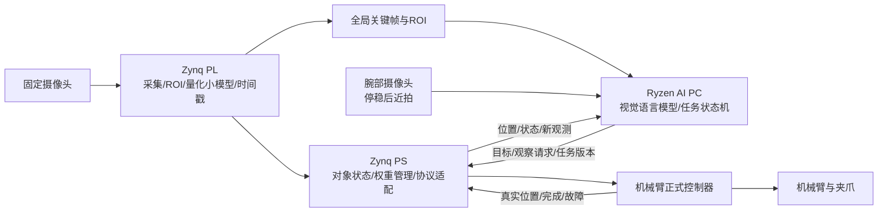

# 锐眼智臂：双视角主动复核与大小模型协同的柔性配套系统

2026-09-12｜方向设计与评审稿｜DESIGN_ONLY

> GitHub 发布副本。原始归档位于本机 `E:/competition/1_docs/赛题方向/`；本机未随仓库发布的原始证据登记在[来源与文件清单](amd_topic2_publication_sources_2026-09-12.md)中。

当前输入：EES-331/Zynq-7020＋固定摄像头＋带摄像头机械臂＋AMD Ryzen AI PC。用户要求研究 PC 大模型、FPGA 本地小模型与快速场景切换，面向 AMD 赛题二高奖项。本文按本地《全国大学生嵌入式芯片与系统设计竞赛 2026 选题指南（AMD）》3.2 设计。此前两人分工、万元预算只作为延续的规划假设，腕部相机和所选机械臂的实际成本、型号与协议仍未确定。

## 1. 推荐结论

**值得做双模型，并且推荐同时部署、分工协作。主线应是“较慢的语义理解＋持续的本地视觉观测＋有反馈的动作”，快速模型切换列为后续扩展。**

两个模型同时存在并不缺乏场景：PC 正在读取腕部相机看到的标签、判断零件是否符合订单时，固定摄像头上的 FPGA 小模型仍需确认原目标没有移走、目标位置是否更新、目标格位是否被占用。理解物体“是什么、为什么选它”与观测“它现在在哪里、刚才动作是否改变了状态”是不同任务。

建议作品名：**锐眼智臂——基于 Ryzen AI PC 与 Zynq 的双视角主动复核柔性配套系统**。

作品要解决的具体问题：小批量、多品种物料在全局图像中可能外观相似，PC 推理结果又可能滞后。系统如何选择需要靠近查看的物体，在查看期间保持目标关联，并在抓取与放置后用新观测确认整单完成？

“双模型”“大小脑”“双摄像头”本身都不宜主张原创。Figure 的 [Helix 02 开发者说明](https://www.figure.ai/news/helix-02)已采用不同时间尺度的语义与控制层，并利用局部相机补充遮挡视野。这里可争取的贡献是资源受限平台上的具体实现、观测与命令的一致性，以及可重复的任务收益；本轮不是穷尽式新颖性检索。

## 2. 与赛题的直接对应

主依据为 [仓库赛题 PDF](../pdf/AMD赛题.pdf) 的 3.2；通过匹配哈希的 MinerU content JSON 阅读物理第13–20页。最新官网版本未成功在线复核，不能把本地版本称为已确认的最新修订。官网最终赛程也未核实。

| 评分项 | 权重 | 本作品需要展示的证据 |
|---|---:|---|
| 具身智能系统完整度 | 20 | 完整订单正确交付、抓空与错放检测、异常恢复、人工干预次数 |
| AI PC 端侧 AI 能力 | 20 | 订单结构化、近景属性/标签识别、歧义目标拒绝；真实 Ryzen 上离线推理效果与延迟 |
| FPGA/Zynq 设计质量 | 25 | 自研量化 CNN/流式前端、硬件时间戳、持续吞吐、资源与实现时序 |
| 两端协同 | 20 | 主动复核触发、目标与帧关联、过期结果拒绝、通信异常处理及延迟分位数 |
| 工程完成度与创新 | 15 | 长时间运行、第二任务复用、可重建部署与可复测实验 |

3.2.2 明确允许图像预处理、数据流加速、实时处理与 PL/PS 协同；没有要求 FPGA 必须部署神经网络，也没有规定大模型参数规模。3.2.4 明确资源利用率不是越高越好。因此，不能以“FPGA 还有空间”代替小模型的任务价值论证。

3.2.3.1 要求真实 AMD Ryzen AI PC、ROCm 7.14.0及以上，并声明硬件/软件版本。PC 的“纯软件部署”应理解为用标准模型与推理软件实现，不代表必须纯 CPU 推理。优先测试适配的 AMD GPU/ROCm 后端；NPU 是另外的后端与兼容性问题，不能从 ROCm 推出 NPU 已参与。AMD 的 [ROCm 7.14.0 安装文档](https://rocm.docs.amd.com/en/docs-7.14.0/install/rocm.html)已核实存在，实际 SKU/OS/模型算子组合还需到机验收。

必须报告五类核心数据：整任务成功率、传感到实际物理响应的 P50/P95/P99/最大延迟、AI 效果与推理性能、FPGA 量化贡献、通信性能。另选至少两类专项指标，建议资源/时序和可靠性。软件函数返回或控制器 ACK 不能代替实际运动起点。

## 3. 一项主任务，两个有实际意义的工作模式

主任务是桌面级柔性配套与返检。首版采用单层、不堆叠、30–60 mm级的轻量不透明样件，登记高度，准备2–3类、可抓取且近景差异清楚的物料。尺寸只是选件起点，应适配真实夹爪与机械臂。

### 3.1 订单配套

订单示例：“给 A 盒配两个标记为 M 的完整环件和一个长垫块；缺口件不要放入。”

1. 固定相机获取全局图像。PC 将自然语言订单解析成受约束的 TaskSpec，并给候选对象分配语义与目标身份。
2. FPGA 小模型提供目标掩膜/关键点、位置、质量和时间戳，PS 根据新观测更新目标记录。
3. 对全局视图无法确定的规格或缺陷，机械臂先到预设观察位，停稳后用腕部相机近拍。
4. PC 结合近景判断是否满足订单。看不清或证据冲突时输出 UNKNOWN，转复核/拒取，不把语言生成当检测事实。
5. 查看期间 FPGA 继续观察全局目标。若对象移动、被遮挡或关联丢失，先使旧目标版本失效，重新关联后再抓。
6. 从最新位置生成分段抓取动作；真实到位后夹取，在可见检查位及目标盒进行复核。
7. 抓取前的预留数与实际已交付数分开管理；只有放置复核通过才记为订单完成。抓空、缺件或错格位触发有限次重试，超过上限进入等待状态。

### 3.2 来料复核与归位

同一台设备改为：“检查这批物料的标记和可见缺陷，将合格件归位，异常件放复检格，输出盘点差异。”

这一模式复用定位、近拍、选物、抓取和复核能力，改变订单逻辑与判定标准。它自然证明任务切换与工作流复用，但**未必需要换神经网络权重**。如果原模型已经覆盖两种任务，换 TaskSpec/策略就是正确做法。

需要真正权重切换时，选择经过数据验证的不同物料域，例如环件/垫块与塑料壳/连接器。为它们训练同一计算图、不同权重的局部视觉模型。只有专用模型在相同资源约束下优于联合模型，才能解释切换的必要性。第二域采用相同桌面和夹爪可处理的物体，避免引入另一套机械问题。

## 4. 两个摄像头与两个模型如何协作

图中的 PS 直连控制器仅在厂家开放协议可用时成立。若只能通过 PC 专有 SDK 控制，执行适配器放到 PC，完整路径仍包含 PC 的调度抖动，不能宣称 PC 卡顿时动作链路仍可自主闭环。

| 部分 | 输入与模型 | 输出/任务 | 更新方式 |
|---|---|---|---|
| PC 较大模型 | 全局关键帧、腕部近景、订单；候选为3B/7B级视觉语言模型 | 类别/文字/属性、任务解释、复核决策，生成有限动作类型的结构化结果 | 新任务、疑点、失败或视图变化时调用 |
| FPGA 本地小模型 | 固定视角下经验证的低分辨率全景或目标 ROI；定制量化 CNN | 前景掩膜/关键点/少量状态；服务持续定位与结果观测 | 每个被调度的真实新帧；不宣称所有ROI都满帧率 |
| PS 与确定性逻辑 | CNN结果、标定、对象ID、控制器反馈 | 几何计算、状态关联、有效期检查、权重切换、控制协议 | 受实际帧率、协议与控制器能力约束 |
| 商业控制器 | 有界位置/姿态命令 | 内部运动控制、执行与真实反馈 | 采用厂家定义的接口与完成语义 |

PC 候选可从 [Qwen2.5-VL 官方说明](https://qwenlm.github.io/blog/qwen2.5-vl/)列出的3B/7B模型起测，用于视觉属性、标签/OCR和结构化输出。该来源说明模型能力，不证明本项目准确率或 Ryzen 实时性能。先比较模型大小、量化方法、batch=1延迟、峰值内存与任务错误率；不以更大参数量为升级理由。生成坐标仅作粗定位候选，实际抓取依赖标定与新观测。

固定相机建议保持现有 FPGA 原始采集链路；腕部相机优先通过开放 USB/UVC、Ethernet或厂家图像API向PC提供原始图像。采购必须确认能读取图像，不能把只提供厂商“识别结果”的摄像头当成可用近景输入。腕部视频先不绕经7020，以免新增USB主机驱动和双路视频带宽成为关键路径。

腕部相机的必要价值是主动补充观察：外观近似、标记较小或局部遮挡时靠近查看。若只把同一完整场景再拍一遍，就没有证明双视角价值。腕相机是否看得见夹持中的物体必须现场确认；看不见时只承担抓前复核，抓后以固定相机和盒位观测为准。

## 5. FPGA 小模型值得部署到什么程度

推荐 **PL 计算密集层＋PS 管理/后处理**。PL实现卷积、激活、必要池化与流式缓存；PS管理模型描述、DMA/DDR、对象关联、少量几何计算和协议。只在PS用Python/CPU跑模型，不能声称实现了PL模型加速。纯PL推理可作为专用核实现方式，但不需要把订单、复杂策略与所有后处理都硬化。

首版模型建议是固定128×128输入、少量3×3/1×1卷积、量化友好的激活/下采样、一个低分辨率掩膜或关键点输出；优先保持算子集合小。目标参数量0.15–0.4M、约10–30MMAC/ROI是待训练和逐层核算的设计区间，尚不是已存在模型。先INT8对齐，再评估INT4是否值得精度与调试代价。避免一开始承诺完整YOLO、通用ViT或端到端机器人策略可高速塞入7020。

网络输出是观测，不是运动策略。第一阶段只在已登记物料与受控背景内验证；PC能理解陌生对象，不代表小模型能可靠分割该对象，更不代表机械臂能够自动抓取所有开放类别。

小模型必须击败的基线包括阈值/连通域/模板跟踪。对于轮廓清晰、固定光照的任务，传统视觉可能更快、更准且资源更低；若CNN在背景、反光、轻遮挡等预先定义条件下没有提高定位或任务成功率，就不应把它作为主创新。可以保留模型部署成果，但不能为双模型形式压低系统质量。

训练数据至少包含空场、目标缺失、部分遮挡、光照变化、相似件、夹爪遮挡和放置后的状态。按实物实例、采集日期/光照分组拆分训练与测试，不能把同一段视频相邻帧分到两侧。VLM伪标签只能用于经人工核查的训练辅助，独立测试真值不能由同一模型生成。

## 6. Zynq-7020 容量与实时性的边界

本轮读取的[历史实现资源报告（本机证据登记）](amd_topic2_publication_sources_2026-09-12.md#source-07)来自9月7日 Fully Placed 工程：

| 资源 | 历史占用 | 器件总量 | 历史占比 |
|---|---:|---:|---:|
| LUT | 4,674 | 53,200 | 8.79% |
| FF | 7,214 | 106,400 | 6.78% |
| BRAM36等效块 | 20 | 140 | 14.29% |
| DSP | 9 | 220 | 4.09% |

这支持“轻量视觉CNN值得做可行性试验”，**不支持认定当前位流还有相同余量**。新开发前须关联当前 `.bit/.hwh/.xsa` 哈希与对应的实现报告，再在独立工程中评估增量资源。当前冻结 `2_fpga` 不在本轮修改范围。

140个36 Kibit块合计约630 KiB物理BRAM位容量，实际可用数据容量还受端口宽度、布局和其他模块占用限制。0.3M个INT8权重本身约300 kB；128×128×16个INT8激活就是256 KiB，双缓冲会翻倍。权重能放下不等于权重、特征图、FIFO和现有视频都能同时放下。

优先采用片上分块/行缓存＋DDR权重库/必要特征缓存，并测量与VDMA同时访问DDR的影响。保存两个模型到DDR或SD，不需要复制两套完整计算阵列；活跃任务才占用计算核。常驻的是PC语义模型和当前FPGA小模型，而不是所有候选小模型都在PL并行运行。

示例预算：64个有效MAC通路、100 MHz对应理想6.4 GMAC/s，20MMAC需要3.125 ms纯计算；若有效利用率25%–50%，算量部分约6.25–12.5 ms，另加读写、流水排空和软件开销。这里没有假定一个DSP必然实现一个所需精度MAC，具体映射须综合确认；MAC与OPS也不混写。多ROI串行处理时按总工作量预算，不能把单ROI吞吐当全景多目标吞吐。

建议首轮工程预算：整设计LUT、DSP不超过约75%，BRAM不超过约80%，目标100 MHz；这些是留调试与布线余量的内部警戒线，不是官方门槛。验收需实现后WNS≥0、无未约束的必要路径、实际持续吞吐及与视频并发的正确性。

现有[9月11日图像链路记录](../../4_metrics/logs/2026-09-11_pynq_camera_run01/REPORT.md)上传约5 fps。这不能代表传感器只产生5个新帧，也不能证明传感器为30/60 fps。要让本地模型发挥价值，应从PL原始流观察真实新帧，增加帧号/采集时间戳；若仍从5 fps的软件上传反向取图，推理加速不会消除约200 ms的更新间隔。

## 7. 双视角、动作与结果的一致性

首版使用“停稳—取新图—判断—小步动作”的离散闭环，要求控制器支持位置命令、真实状态回读、到位与停止语义。控制器没有在线修正能力时，不承诺连续视觉伺服。固定相机标定、腕部内参/手眼关系与TCP安装偏差分别测量；固定平面单应只适用于限定高度的桌面，不能推广到任意6D姿态。

每份观测至少记录camera_id、frame_id、capture_time、target_id、target_version、calibration_version、model_version、有效ROI与质量。每份动作绑定task_version、目标版本、允许区域/步长与截止期。模型结果出炉后须再次对照当前对象状态；失配、丢失、过期、切换后旧结果均拒绝提交动作。

腕部图像先用停稳后的单张新帧，减少曝光与姿态不同步问题。若相机不提供硬件曝光时间，只能记录主机取帧时间与估计误差；不能冒充精确同步。固定相机观测过期或目标被遮挡时进入UNKNOWN，不能用坐标外推无限续命。

CNN本身不作为经过认证的急停系统。PC断联或新观测超时后停止提交新动作；对于正在执行的动作，只有控制器真实支持且测过中止/暂停接口时，才能报告停止响应。可复测的动作抑制与厂商物理停机链路分开说明。

## 8. 如何真正实现快速模型切换

必须区分四种能力：

| 类型 | 实际改变 | 推荐顺序 | 证据口径 |
|---|---|---|---|
| 任务配置切换 | 订单、允许类别、ROI、阈值、策略或已存在输出头选择 | 第一优先 | 请求到新版本首个有效任务结果 |
| 同计算图权重切换 | 卷积权重、量化参数、标签映射等任务包 | 第二优先，须证明需要 | 装载、校验、首个有效推理及系统恢复时间 |
| 支持范围内的计算图配置切换 | 预先实现的算子、尺寸与调度描述 | 可选增强 | 只对声明支持的图验证，不声称任意ONNX |
| 部分/完整位流重配置 | 硬件电路 | 当前主线不采用 | 通道停顿、重配置、驱动恢复和重新校准成本 |

建议固定推理引擎，模型包放PS可访问DDR/SD；首次实现允许在停稳后装载，资源足够才增加权重双缓冲。FINN [官方示例驱动](https://github.com/Xilinx/finn-examples/blob/main/finn_examples/driver.py)有运行时权重管理实现可供参考；采用前需锁版本、检查算子和EES-331集成条件，并不能由此宣称任意模型热切换已具备。自研有限算子引擎也可实现相同目标。

切换事务：停止接收新任务→等待/确认当前动作进入允许切换状态→排空当前推理→加载并校验新包→核对计算图、位宽、归一化、标签/输出契约→运行固定自检输入→帧边界提交model_version/task_version→丢弃旧版本结果→获取新观测→恢复任务。失败时回退已知有效模型包，未确认回退完成前保持暂停。ROI/跟踪状态随新模型重新初始化。

同拓扑并不足够：量化尺度、折叠BatchNorm/阈值、张量顺序、输入预处理和输出语义都必须随包一致。训练阶段就固定兼容接口，不能训练两个无关网络后才期待一个位流自动兼容。

计算示例：0.3 MB权重通过实测有效30 MB/s通道传输，纯装载下限约10 ms；它不是总切换时间。首帧等待、完整性验证、自检和机械臂停稳可能占主要部分。工程内部可先争取“已停稳状态下，模型切换请求到首个有效新结果P95≤200 ms”，不把运动中到停稳的时间隐去，并单独报告完整任务切换时间。目标尚未实测，若无性能收益就保留简单停稳加载。

如果资源允许同时保留两个小模型权重，也仍需要基于任务选择输出；并行全速计算只有在两个观测任务确实同时有截止期需求且资源/带宽均满足时才值得做。算力余量本身不构成场景需求。

## 9. 冲击高奖项应集中证明的三项贡献

**贡献一：根据任务疑点主动获得近景证据。** 对容易辨认的物体直接处理，对规格/缺陷不确定的物体靠近查看。比较“只看全局”“每件都近拍”“仅疑点近拍”，在相同错误上限下衡量整单时间、复核率和正确率。使用经过标注集校准的置信度/歧义规则；VLM自己声称的置信度不能直接视为概率。

**贡献二：PC长耗时推理期间，保持目标位置与版本有效。** 同一小模型放PC与放PL进行同条件对照，固定相机帧率、相机路径、控制器与策略尽量一致。再单独测试系统架构允许的PL高更新率收益，不能把提高摄像头帧率的收益全部算成模型加速。目标移动和计算拥塞发生时，关注旧坐标动作比例、位置误差、P99观测年龄与恢复后的任务成功率。

**贡献三：可验证的复用与切换。** 证明同一硬件支持第二工作模式；只有不同物料域专用权重确实优于单一联合模型时，再展示受控权重切换。量化切换时间、切换后精度、旧结果隔离和持续正确性。主贡献一、二及整任务闭环优先于该扩展。

## 10. 对照实验与内部验收目标

所有数值为待评审的内部目标，不是官方合格线或已经实现的成绩。

| 实验 | 保持不变 | 唯一主变量 | 主要观察 |
|---|---|---|---|
| 小模型必要性 | 数据、ROI、后处理和任务 | CNN vs 阈值/连通域/模板 | 定位误差、mIoU/关键点误差、任务成功率、资源 |
| PL加速归因 | 同一量化模型、输入精度/帧序列、策略 | PC小模型 vs PL小模型 | 同一功能P50/P95/P99延迟与CPU占用 |
| 近景策略 | 两摄像头、模型、对象与控制器 | 不近拍/全部近拍/按疑点近拍 | 误配率与每单时间的折中 |
| 新鲜度检查 | 双模型与近景策略 | 目标版本/有效期检查开关 | 旧结果拒绝、移动目标下错误动作/恢复 |
| 专用权重价值 | 引擎算力、模型大小预算、数据拆分 | 联合模型 vs 两域专用权重 | 两域最差精度、装载成本与整体任务收益 |
| 切换正确性 | 相同动作状态、相同模型包 | A/B反复切换与失败包注入 | 旧版本输出/动作、回退、自检、首结果时间 |

版本检查关闭的对照优先在离线回放或控制器模拟环境运行；实体实验限受控、低速和可承受范围。真实目标移动安排在下降前，用预设夹具/受控位移产生，不在运动夹爪旁手动干扰。

建议先达到：清晰场景整单成功率≥95%；预先限定的歧义/目标位移/抓空条件下成功率≥85%；精度最终需按实际场景锁定。每个条件至少50次独立任务作为起点，按对象/场景/日期分组并报告置信区间，不仅给百分比。固定集之外另保留未见布局与物理实例测试。

定位容差按物体、夹爪和机械重复性共同确定，不先承诺毫米级。可以先把低速观测更新目标设为20–30个真实新帧/秒、PL单ROI推理P95≤20 ms；若传感器或算量不支持，降低可声明目标并量化其对任务的影响。该数值不代表完整机械臂动作频率。

至少采集1,000次通信/观测处理事件作为延迟分布起点；P99尾部样本仍少，应另做长时持续测试并报告最大值。最终目标可设连续运行2小时，记录每次异常、人工干预与所有未完成订单。切换试验至少100次起步，旧版本动作出现次数必须为0；有限样本零错误不等于数学保证。

完整延迟拆为：采集→等待/传输→预处理→模型→后处理/有效性检查→控制器排队→真实物理响应。用同步时钟说明误差或外部同一计时设备观察物理事件；时钟未同步时先报RTT和本地段延迟，不相减两台机器的时间戳伪造单向值。带宽、功耗收益需实测，不能仅因“FPGA”自动宣称更省电。

## 11. 两人团队的阶段门槛与取舍

| 阶段 | FPGA负责人 | PC负责人 | 通过后才推进 |
|---|---|---|---|
| G0：硬件与接口 | 当前位流/资源对应、真实新帧、冻结副本策略 | 实际臂/腕相机图像API与反馈、Ryzen设备计划 | 固定/腕图像可读；控制器能位置命令、到位反馈与停止；已有视频故障先恢复 |
| G1：一项任务闭环 | 元数据/帧号/ROI通道与黄金模型接口 | 模板任务→近拍→抓取→放置复核 | 简单对象可重复成功，失败不会误记完成 |
| G2：小模型必要性与PL实现 | 小CNN整数对齐、独立IP、资源/时序、并发视频测试 | 数据集、训练、CNN/传统视觉对照及PC小模型基线 | 小模型有价值且整合后不破坏视频；否则保留有效传统算法 |
| G3：语义与主动复核 | 新鲜度/版本检查、目标状态和时延证据 | Ryzen视觉语言模型、有限动作契约、歧义策略 | 同条件对照证明收益，异常可复现处理 |
| G4：第二任务与模型包 | 停稳切换、校验、回退、自检 | 第二任务/物料域、联合模型对照与复用脚本 | 如无需换权重则只宣称任务切换；如切换则提供正确性与精度证据 |

按本地赛题，10月9日是中期借机申请节点，10月13日评审/发放，不是已核实的决赛期限。距离本轮9月12日约27天，建议中期争取G1和G2的可测结果，G3有端到端原型；G4安排在主闭环稳定以后。实际排期取决于臂交付、相机可读、资源收敛和Ryzen到位，不承诺在未知硬件条件下一次完成所有增强。

机械臂选择看文档接口、反馈、夹持、观察姿态和实际可达性。若任务涉及方向敏感抓取/放置，要验收腕部自由度，不能只凭标称自由度推定可实现；四自由度可先做方向不敏感物体。该轮不指定采购型号或未核实报价。

完成度与贡献的优先级为：真实完整任务＞双视角带来的可测收益＞PL小模型与通信协同证据＞第二场景＞权重热切换＞复杂动态重配置。项目本次保留新方向方案，旧设计稿作为比较背景；实际执行仍应从G0另行开始。

## 12. 本次证据与结果边界

本轮完成赛题复用核验、历史资源读取、一手技术来源核对和方向设计；未训练模型、编译硬件、上板运行或操作机械臂。结果为DESIGN_ONLY，不代表国一等奖评审结论。

- [本轮研究记录（本机证据登记）](amd_topic2_publication_sources_2026-09-12.md#source-06)
- [MinerU原始解析Markdown（本机证据登记）](amd_topic2_publication_sources_2026-09-12.md#source-08)
- [MinerU原始content JSON（本机证据登记）](amd_topic2_publication_sources_2026-09-12.md#source-09)

输入SHA-256：`C6AD82ACD4F7BDCD13BD412E232ED85D05F2A87DD5E2CDD04F9D219F88B569FC`。原结果`MINERU_PARSE_PASS`；ChineseQuality=pass，Fallback=false；本轮匹配哈希后复用，未重新解析。相关页内容与表格可读，无新增解析质量告警。
