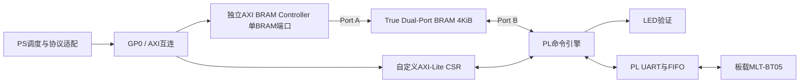

# EES-331 板载蓝牙优先验证与 AXI-Lite / BRAM 控制开发方案

版本：v1.1，2026-09-12。状态：PC与板载蓝牙短时双向通信已实测通过；正式AXI-Lite/BRAM控制、完整B0/B1/B2验收及机械臂适配仍待执行。

### 最新实测状态（优先于下文历史起点）

- 已实现独立PL串口电平桥，三段式上电FSM复位为STATE_IDLE；不是正式字节级UART/FIFO控制器，也未接入PS、AXI-Lite或BRAM。
- COM4/9600/8N1连续三次AT返回OK；实际固件MLT-BT05-V4.2，服务FFE0、特征FFE1。PIN已从模块只读确认，凭据原始记录仅留本地。
- 经用户批准仅移除目标Windows配对后，未配对GATT远端读取通过；无线与COM4之间11轮双向收发，连接61.703秒，每方向166字节完全一致，结束主动断开。
- 这是B0基础通路和B1短时预验证，不降低下文正式门槛：B0十次/帧错误诊断，B1双向各1000帧、CRC/分片/10分钟并行及延时统计，B2十轮重连/复位均未完成。
- 现有电平桥不产生字节错误/溢出计数，CDC报告仍有异步复位未知端点；后续正式UART/FIFO与同步释放复位需单独实现、仿真和验收。
- [当前结论、复现和下一阶段](ees331_ble_validation_status_2026-09-12.md)；[实测原始事件与报告](../../4_metrics/logs/2026-09-12_ble_bridge_duplex_run01/REPORT.md)。本次不修改已验证视频基线。

## 1. 目标、当前证据与边界

最高优先级是证明EES-331板载蓝牙可用：先与现有Windows主机双向通信，随后验证其主动连接机械臂的能力。最终形成 PC视觉决策 -> PS调度 -> PL控制 -> 蓝牙 -> LeArm控制器 -> 动作反馈的链路。

已确认设计：自定义AXI4-Lite Slave只承载控制/状态寄存器；独立AXI BRAM Controller访问双口BRAM；PL侧使用板载MLT-BT05。UART字节收发、限长和超时在PL，设备连接策略和机械臂协议适配优先在PS软件，避免把易变AT指令固化进RTL。

历史证据：摄像头UDP到PC模型已贯通，但左右分类仍不可用，Up曾有明显误判；控制输出首期采用人工命令，模型接入从LED开始。不能将最后连续三轮通过视为模型整体稳定。机械臂载板图纸BT1标注BT24-MODULE，经过串口切换连接STM32；ESP32-DevKitC-S是兼容核心接口标注，不能当作该版本蓝牙型号。

初版制定时仅完成主机蓝牙枚举；现已取得顶部所列固件、UUID和短时GATT实测。MLT主动连接能力及LeArm定制固件互通仍未知。厂家BT24标准资料提供FFE0/FFE1/FFE2及双向透传，但LeArm定制固件和具体后缀仍待核实。

当前冻结工程为 `E:/competition/2_fpga`，后续开发在独立副本进行。旧位流、SD镜像、视频上位机和模型环境作为回退基线，不原地升级。早期讨论中的绝对AXI地址均属举例，不是已审计地址。

## 2. 优先级与实施顺序

|阶段|优先级|工作与前置条件|出口|
|---|---|---|---|
|G0|P0|备份/哈希、主机蓝牙能力、引脚及电源极性核验|可恢复开发基线与接线表|
|B0|P0|最小PL UART通路、模块AT响应和版本查询|实际模块身份和串口参数|
|B1|P0|PC Central连接MLT Peripheral、服务发现、双向收发|主机蓝牙链路验收|
|B2|P0|断连恢复及MLT主机能力核对|恢复行为、机械臂直连可行性分支|
|C0|P1|自定义AXI-Lite控制寄存器仿真|AXI协议与语义验收|
|C1|P1|BRAM控制器、双口存储、命令邮箱和LED|PS-PL闭环验收|
|C2|P1|把B阶段UART迁入正式寄存器/BRAM框架|统一蓝牙控制通路|
|A0|P1，到货后|BT24服务与MLT主机互通、STM32协议|机械臂通信验收|
|A1|P1，到货后|低速空载单关节/动作组/反馈|受限动作闭环|
|V0|P2|视频、模型、LED到受限机械臂联动|系统演示与回归|

B阶段不等待完整C阶段设计实现。MLT主机模式不支持或机械臂未到货时，保存B阶段结论并继续C0/C1；不得把该分支写成机械臂直连PASS。各阶段完成后交付结果，按用户后续执行指令推进；已通过范围仅为顶部明确列出的预验证。

## 3. G0与蓝牙优先验证

### 3.1 开发副本和最小UART硬件

在 `4_metrics/logs/YYYY-MM-DD_ble_bringup_runNN/dev_project` 建立受控开发副本；只读提取当前基线的源文件、IP配置、时钟、约束、地址表及工具版本，记录manifest。生成文件留在run内。禁止依据目录名认定它是当前板上位流。

首选最小诊断BD：PS GP0 -> 官方AXI UARTLite -> MLT-BT05；使用小型GPIO或明确复位逻辑管理模块供电、复位。UARTLite IP位于PL，满足板载PL引脚通信要求；这是B阶段临时诊断通路，C阶段再替换为自定义控制器。若UARTLite不可调参数影响识别固件，则使用经仿真验证的可编程PL UART，不盲目反复编译波特率。首次可牺牲视频同时运行，B1通过后再做联合回归。

EES手册已知引脚：PL TX -> BT_RX/AA13；PL RX <- BT_TX/Y13；供电控制U14；低有效复位H15。U14有效电平必须按供电驱动原理图确认，不能由名字推断。电压标准、bank、复用冲突、复位释放延时及其他配置脚默认值在G0确认后方可出XDC。RX用同步器；UART时钟和波特率误差均记录。

### 3.2 B0：先取得模块真实信息

未建立无线连接时先以手册9600 8N1尝试基本AT，仅查询、不恢复出厂、不刷模块固件。按实际模块手册确认命令结尾；CRLF无回应时保留十六进制TX/RX日志，再有界尝试其他结尾。CSDN文章的双CRLF是经验线索，不是通用要求。每次只改变波特率或结尾中的一个变量。

输出模块响应、版本、名称、地址、角色查询结果及适用指令表。不能把HC-05的按键/38400流程或HC-08的主从说明套用到MLT-BT05。查询命令名字和格式以实际固件为准，尚未确认前不硬编码AT+ROLE1等写命令。

B0验收：基本AT与至少可用身份查询连续10次完整响应；UART无帧错误和溢出；如版本查询不支持，明确列UNKNOWN及已确认命令，不能编造版本。无响应时停止该配置，按供电/复位、RX/TX、串口参数、结尾顺序定位。

### 3.3 B1：先与用户Windows主机通信

角色固定：PC为BLE Central/GATT Client，MLT为Peripheral/GATT Server。Windows设备“配对成功”不是收发验收；BLE通常不自动产生串口COM。PC采用独立Python虚拟环境和Bleak/WinRT，扫描、枚举服务、订阅Notify和写入特征，依赖版本与哈希冻结在本次run，不污染现有模型环境。

先保存设备地址、名称、RSSI、服务、特征UUID及属性。只选确认的EES目标；不要对键盘、耳机等其他设备操作。优先按实际发现属性决定write-with-response或without-response，不假定FFE0/FFE1必然存在。订阅Notify后再发送。写分片以实际允许长度为准，初始按20字节上限；应用帧解析必须处理拆包与粘包，Notify次数不是包数。

双向证据：PC BLE写入 -> MLT UART -> PL/PS收取并记录；PS主动发送不同内容 -> PL UART -> MLT -> PC Notify。回显应发生在板端软件或PL测试逻辑，禁止在PC本地伪造回显；记录双方独立发送序号和接收计数。

测试帧：magic、协议版本、方向、32位序号、16位长度、payload、CRC32。第一版little-endian；CRC32统一采用IEEE反射形式，poly=0xEDB88320、init/xorout=0xFFFFFFFF，覆盖CRC字段前所有字节。每帧最大256字节，按GATT能力分片；测试1/16/20/21/64/128字节payload和0x00/0xFF/递增字节。单方向每秒1帧，双向各1000帧，含10分钟同时收发；9600 8N1约960字节/秒是UART理论上限，按双向流量和分片节流。

B1验收：正常连接期各1000帧原始序号、长度和CRC全正确，CRC/溢出错误0，缺失和重复0；报告P50/P95/P99往返延时，初始P95目标<=500ms且明确是工程目标。若失败，保留全部样本，不通过反复重试筛出PASS。超时2秒记录失败，最多2次诊断重传，原始失败与重传恢复分开统计。

### 3.4 B2：断连、重启、角色边界

PC主动断开/重连10轮，模块受控复位3轮，检查重连后旧包隔离和序号重建。断连窗口允许通信中断，但每轮都需明确识别断连、恢复后首次有效包及恢复时长；目标30秒内恢复。模块复位不冒充整板冷启动。

PC作为Central的B1通过，只证明板载模块的Peripheral通路。机械臂通常也作为Peripheral，因此下一步单独核对MLT能否作Central、能否发现服务和订阅BT24通知。若需PC模拟BLE Peripheral，必须先查询Windows适配器Peripheral/GATT Server支持，使用WinRT服务端；Bleak Client不能替代该功能。PC不支持Peripheral时记录限制，不能据此判定MLT失败。

MLT Central不支持时，保留板载方案失败原因；备选为PL UART外接可编程BLE Central或有线UART，两者都需要方案变更记录。不得偷偷将PC中继路径称为FPGA直接控制机械臂。

## 4. 正式PS-PL架构

首版CSR、BRAM两端口、命令引擎和UART采用同一个控制时钟，优先沿用已核验PS FCLK，频率不写死为未经审计值。视频时钟域保持独立。若以后跨时钟，增加异步FIFO/握手与CDC检查，不能认为双口BRAM自动解决状态总线跨域。

拟议源码模块：`axi_lite_csr`、`command_engine`、`bram_portb_access`、`uart_tx_rx`、`uart_fifo`、`timeout_guard`、`led_executor`。先在run副本开发，正式源码落点在实施时登记；不把新文件直接放入冻结2_fpga。

## 5. BRAM选型与地址划分

选择Block Memory Generator的True Dual Port RAM，1024×32位=4096字节，32位数据宽度、4路字节写使能、首版无ECC。预计主体使用1个RAMB36E1（具体由综合确认）；另外UART FIFO/内部命令缓存可能用LUTRAM或额外BRAM，分别计数。4KiB足够首期控制负载；不在BRAM存视频帧。

关键配置：AXI BRAM Controller设置单BRAM端口模式，只占用RAM Port A；RAM本身仍是True Dual Port，Port B留给PL。不能把控制器设为双端口并占满A/B后，再把B连接业务逻辑。控制器对外优先32位AXI4-Lite；若工具版本采用AXI4入口，由互连适配，不改变软件邮箱语义。读延迟先目标1周期、不开附加输出寄存器，但以生成IP真实时序为准，适配器参数化并仿真确认。

CSR建议预留4KiB窗口，BRAM另4KiB窗口。`CSR_BASE`、`BRAM_BASE`最终由G0地址冲突审计和Address Editor确认，写入HWH/XSA与软件manifest。本文所有表格均为字节偏移，不指定已占用的物理地址。

|BRAM偏移|长度|用途与写入所有者|
|---|---|---|
|0x000–0x03F|64B|命令头，PS写、PL读|
|0x040–0x3FF|960B|命令负载，PS写、PL读|
|0x400–0x43F|64B|结果头，PL写、PS读|
|0x440–0x7FF|960B|结果负载，PL写、PS读|
|0x800–0xBFF|1024B|UART RX环形缓冲，PL写、PS读|
|0xC00–0xFFF|1024B|预留诊断/扩展，v1不得访问|

BRAM非只读/只写硬件隔离；所有者是驱动协议约束。PS软件不得在BUSY期间改命令区，不得写结果/RX区。双口同地址冲突不可依赖read-first/write-first来修复；仿真检测并报错。BRAM复位不等于清空内容，使用valid、会话和seq隔离旧数据。

## 6. AXI-Lite寄存器定义v1

全部32位、4字节对齐，little-endian。RW配置寄存器支持WSTRB逐字节写；命令/门铃/序号等事务寄存器要求WSTRB=0xF，否则SLVERR且无副作用。RO写、越界、非对齐访问返回SLVERR；未实现地址读返回0并SLVERR。协议设计只允许一个写响应和一个读响应挂起，AW/W必须可独立先后到达，不能要求同周期。BVALID/RVALID保持至握手，反压期间响应稳定，复位释放同步。

|偏移|寄存器|访问/复位|语义|
|---|---|---|---|
|0x00|IP_ID|RO/常量|0x45455343（EESC）|
|0x04|ABI_VERSION|RO/0x00010000|major=1，minor=0|
|0x08|CAPS|RO/实现值|bit0 LED、1 UART、2 RX_RING、3 IRQ；未实现位为0|
|0x0C|CONTROL|RW/0|bit0 ENABLE；关闭停止接收新命令并进入abort处理|
|0x10|ACTION|WO/0|bit0 SUBMIT、1 ABORT、2 CLEAR_FAULT、3 RESULT_ACK；一次只允许一位|
|0x14|STATUS|RO/0|bit0 READY、1 BUSY、2 RESULT_VALID、3 FAULT、4 UART_TX_IDLE、5 RX_AVAILABLE|
|0x18|SESSION_ID|RW/0|PS启动生成非零会话；仅disabled且空闲可写|
|0x1C|CMD_SEQ|RW/0|本次提交序号；从1递增，禁止会话内回绕|
|0x20|CMD_LEN|RW/0|负载字节数，0..960|
|0x24|ACCEPT_SEQ|RO/0|完成锁存和校验后接受的seq|
|0x28|DONE_SEQ|RO/0|结果已发布的seq，不代表机械动作到位|
|0x2C|ERROR_CODE|RO/0|0无错；版本/长度/CRC/会话/序号/UART/超时等错误枚举|
|0x30|HEARTBEAT|RW/0|变化才刷新PL看门狗；重复值不刷新|
|0x34|WD_TIMEOUT_MS|RW/1000|仅空闲配置，100..10000ms；ENABLE后生效|
|0x38|IRQ_STATUS|W1C/0|bit0 RESULT、1 FAULT、2 RX；同周期置位优先清除|
|0x3C|IRQ_ENABLE|RW/0|对应事件中断使能；v1先轮询|
|0x40|UART_DIV|RW/生成值|按实际时钟和采样倍率计算；只在disabled且TX_IDLE配置|
|0x44|BT_CONTROL|RW/安全值|bit0逻辑供电允许、1逻辑复位释放；顶层转换实际极性|
|0x48|UART_STATUS|RO/0|FIFO计数/帧错误/溢出状态；无凭据不提供伪LINK_UP|
|0x4C|LED_APPLIED|RO/0|实际LED逻辑值，物理高低有效由顶层转换|
|0x50|RX_PROD|RO/0|PL发布的RX单调计数|
|0x54|RX_CONS|RW/0|PS已消费计数；只允许消费已发布字节|
|0x58|RESULT_ACK_SEQ|RW/0|RESULT_ACK时必须匹配DONE_SEQ|
|0x5C|RX_DROPPED|RO/0|缓冲满丢弃的新字节累计数|
|0x60|RESET_CAUSE|RO/实现值|上电/软件abort/看门狗诊断信息|

SUBMIT在disabled、BUSY、RESULT_VALID或FAULT时返回SLVERR，不覆盖旧结果；写B响应OK仅表示门铃受理，不能当成命令接受或执行完成。CLEAR_FAULT仅disabled空闲时接受，清诊断不执行残留命令。配置范围错误无状态副作用。会话切换前清结果、清环形索引和故障；支持由PS发现重置后重新握手。

## 7. 命令和结果格式、握手

命令头16个32位字：word0 MAGIC=0x45455343；1 ABI；2 SESSION；3 SEQ；4 OPCODE；5 FLAGS（v1=0）；6 PAYLOAD_LEN；7 EXEC_TIMEOUT_MS；8 CRC32；9..15保留为0。CRC32算法同B1，覆盖64字节头（word8置零）及实际负载，尾部未用BRAM不参与。默认最大超时5000ms，允许1..10000ms，范围外拒绝。CSR的session/seq/len必须与命令头一致。

v1指令：0x01 PING（回传负载）；0x02 LED_SET（32位mask+32位value，mask限实际LED数）；0x10 UART_TX（原始字节，不超过960B）；0x11 UART_LOOPBACK_TEST仅诊断固件启用。AT和LeArm帧由PS编码放入UART_TX；未来轨迹指令须ABI扩展，不给未实现功能返回假完成。

结果头16个字：MAGIC、ABI、SESSION、SEQ、RESULT_CODE、RESULT_LEN、EXEC_TICKS、CRC32（自身置零计算）、其余保留。结果负载最高960B。UART_TX的DONE仅表示末字节停止位已发完；结果类型明确为TX_COMPLETE。机械臂ACK/运动完成由PS从RX_RING解析并另建状态，不能由UART DONE推断。PING/LED结果也区分逻辑执行与用户物理观察。

提交顺序：

1. PS确认READY、无旧结果，选择新SEQ；写完整BRAM头/负载。
2. PS进行device MMIO顺序保证，完成BRAM写，再写CSR元数据，最后敲SUBMIT。跨两个AXI Slave不能仅靠源代码语句顺序推断可见性。
3. PL设置BUSY，从Port B复制命令到本地快照（最多1024B，优先LUTRAM），核验版本/长度/CRC/session/seq；失败发布错误结果，绝不触发LED/UART。
4. 验证通过后更新ACCEPT_SEQ并执行。PS从提交到RESULT_ACK前都不改命令区。快照不是允许PS并发覆盖的理由。
5. PL先写完整结果头/负载，再在后续时钟发布DONE_SEQ、RESULT_VALID、清BUSY和事件位。
6. PS观察有效位并作读顺序保证，读取并校验结果session/seq/CRC，写RESULT_ACK_SEQ再敲RESULT_ACK；成功后清有效位、恢复READY。

同会话重复已接受SEQ不再次执行；旧SEQ拒绝。网络重试须在PS按(session,seq)缓存原结果，不能生成新SEQ再次执行非幂等动作。超时或重启后动作状态不确定时先查询/人工确认，不自动补发动作。

PL FSM：DISABLED -> READY -> SNAPSHOT -> VALIDATE -> EXECUTE -> PUBLISH -> WAIT_ACK。ABORT或看门狗导致安全LED、停止排入新UART字节；允许在途字节发完避免截断字符，记录部分发送并发布ABORT结果。无线对端已收到的动作无法由本地abort撤销，需远端停止命令及STM32本地超时策略。

## 8. UART RX、PS软件与主机软件

RX采用1024B字节环：index=counter&1023，差值按32位无符号计算，使用量不得超过1024；生产者先完成BRAM字节写再发布RX_PROD。PS读取到快照prod的全部字节后更新RX_CONS。满时丢新字节、RX_DROPPED递增和置FAULT，保留未读字节，协议解析器丢弃残帧并重新同步。

Port B由命令引擎、结果写入和RX写入仲裁；UART RX FIFO提供缓冲，设有界最长等待周期并仿真验证。首版建议TX/RX FIFO各256字节，控制/结果优先策略不得饿死RX。CSR只读状态计数在控制时钟域更新，不把整个RX字节流塞进CSR。

PS优先沿用当前PYNQ/Linux运行基础，单进程独占CSR/BRAM；硬件资源映射长度和HWH核验在启动时检查。device映射不可cacheable，使用有顺序保证的MMIO访问器。不能只用Python普通数组赋值或认为volatile等于内存屏障；实施时确认PYNQ MMIO底层语义，必要时使用小型C访问层。裸机替代通过Xil_In32/Out32和适当barrier验证，不能把两套运行路径混为一个验收。

PC后续增加独立BLE诊断工具，再给既有普通/测试上位机增加连接、控制使能、当前动作、发送/接受/完成/故障状态和日志导出。默认人工操作，测试模式每项开始/重测/下一项均由用户按空格确认，失败保留所有轮次；不能自动替用户确认。

PC -> PS控制使用独立协议和端口，建议UDP5001（实施前查占用），视频保持UDP5000。控制消息包含版本、会话、序号、动作、TTL和校验。PS返回RECEIVED/ACCEPTED/TX_COMPLETE/REMOTE_ACK/REMOTE_DONE等分级状态；不同链路序号建立映射。网络包重复不得重复执行，陈旧视觉结果在PS校验TTL并拒绝。

## 9. 仿真和板测矩阵

|对象|必测项|验收标准|
|---|---|---|
|AXI-Lite|AW先/W先/同时、B/R反压、连续读写、WSTRB、复位中断事务、非法地址|至少10000个受约束随机事务与记分板一致，无死锁和重复副作用|
|BRAM|A/B独立访问、字节写、读延迟、边界、所有权冲突|合法访问全匹配，主动冲突被测试断言检出|
|命令|CRC错、超长、旧seq、重复seq、错误session、busy提交、未ACK新提交|错误不触发执行，结果不被覆盖|
|异常|snapshot中复位、执行中abort、心跳重复、超时、结果ACK不匹配|安全状态可预测，旧命令不重放|
|UART|收发随机数据、边界波特率、连续帧、FIFO满、RX环绕|无合法数据丢失，异常有显式计数|
|LED板测|全灭、逐灯、组合、重复/非法命令、看门狗|每种100次写读一致，人工物理观察独立确认|
|BLE板测|双向1000帧、分片、10分钟并行、10轮重连|按B1/B2完整标准，无筛选轮次|
|联合视频|恢复基线后与控制同时运行60秒|完整帧持续更新，CRC/坏头/丢帧增量0；报告帧率而非猜测|

实现验收：无未解释DRC critical/black box/未约束路径，WNS/WHS>=0，新增DSP目标0；资源报告分别列CSR、邮箱BRAM、快照和FIFO。每次BIT/HWH/XSA/软件哈希成套归档。仿真PASS不替代板测，下载成功不替代有效串口回包。

## 10. 机械臂接入与安全语义

到货先对STM32型号、载板版本、BT24丝印/固件和PWM/总线舵机版本做匹配。取得PC/App协议和源码后确定停止、动作组、关节目标、错误/位置回读语义。STM32保留PWM、运动学、速度/行程限制和通信超时；PL只做受控传输和本地保护。

先原厂手动低速空载确认，再PC/有线协议查询，再BLE双向查询，最后单关节小幅动作。对于PWM版，控制器返回目标脉宽或时间到达不代表实际位置反馈；无传感器时REMOTE_DONE只能标称软件完成，实际完成由用户或视觉确认。总线舵机也需核实具体可读字段。

模型阶段先输出LED。左右暂时禁用；UNKNOWN、冲突、多目标、低置信度和过期帧默认不触发新动作。Up复验失败则保持禁用。首期动作逐次人工授权、低速空载，增加机械臂端失联策略；本地心跳或蓝牙断开不能代替物理停止能力。持物时安全态需具体决定保持还是释放，不能统一掉电松爪。

## 11. 任务交付、恢复与执行入口

FPGA负责人交付：开发副本manifest、引脚表、最小UART诊断位流、CSR/BRAM RTL及仿真、正式BIT/HWH/XSA和板测。PC/PS负责人交付：BLE诊断工具、MMIO驱动、PS单进程服务、协议测试、上位机状态和全量数据日志。各阶段按接口契约协作，分工不等于当前已启动多代理开发。

每个run保存：原始命令/console、source/tool manifest、UART十六进制、GATT服务表、TX/RX序号与CRC、latency.csv、result.json、REPORT.md。result必须含stage、PASS/FAIL/INCOMPLETE、失败数、断连窗口与重试数。原始证据在 `4_metrics/logs`，四份日记在 `7_logs/YYYY-MM-DD`。

失败恢复：保存失败现场 -> 停止本次控制服务 -> 关闭新命令入口 -> 必要时装回已核验基线位流并冷启动 -> 重做视频健康检查。不要同时运行两个串口所有者或两个UDP5000接收器。未知设备固件禁止恢复出厂/批量刷写；身份查询优先。

下一次先读取最新验证状态，不重复要求完成已通过的基础AT与短时双向测试。保持当前电平桥作为回退；经用户确认后补齐B0/B1/B2严格测试，或进入C0/C1的独立设计实现。PL正式FSM须以STATE_IDLE复位，现有规划中的DISABLED应作为IDLE之后的业务状态。优先顺序不得退回“先把整套寄存器和机械臂全部写完再测蓝牙”。

## 12. 来源与证据索引

以下历史证据为本地资料，原始厂商PDF、图纸、MinerU输出和大日志不随本次方案批量发布；不能把目录名当作远端已附原件。完整源路径与SHA记录在本地对应run的manifest。

- EES手册核验：`E:/competition/4_metrics/logs/2026-09-12_ees331_bluetooth_manual_run01`。
- 核心板/载板核验：`2026-09-12_stm32_core_schematic_run01`、`2026-09-12_arm_carrier_schematic_run01`，同上证据根目录。
- 在线BT24资料核验：`2026-09-12_ble_online_check_run01`、`2026-09-12_ble_serial_check_run01`。
- 旧模型板测：`2026-09-12_fpga_udp_model_run01`，只作已有结果边界。
- [BT24厂商串口指南](https://www.szdx-smart.com/static/upload/2025/10/23/202510234819.pdf)：标准固件UUID/透传线索，不能证明LeArm版本。
- [Bleak客户端文档](https://bleak.readthedocs.io/en/latest/api/client.html)：GATT枚举、显式写入类型和Notify，版本在实施时冻结。
- [AMD AXI VIP示例](https://xilinx-wiki.atlassian.net/wiki/spaces/A/pages/18842507/Using+the+AXI4+VIP+as+a+master+to+read+and+write+to+an+AXI4-Lite+slave+interface)：后续协议验证参考。
- [AMD PG078](https://docs.amd.com/api/khub/documents/B6Uh5gbO0aGleXW3kIcXTA/content)：实施时按实际Vivado/IP版本核对single-port controller与TDP RAM配置。
- [用户提供的MLT调试文章](https://blog.csdn.net/DaMercy/article/details/102514684)：调试经验线索，HC-08角色说明不外推到MLT；非固件兼容证明。

v1.0只交付方案；v1.1增加了顶部限定的蓝牙实测和电平桥证据。正式CSR/BRAM和机械臂尚未验收，不能以本次通信通过替代控制闭环证明。
