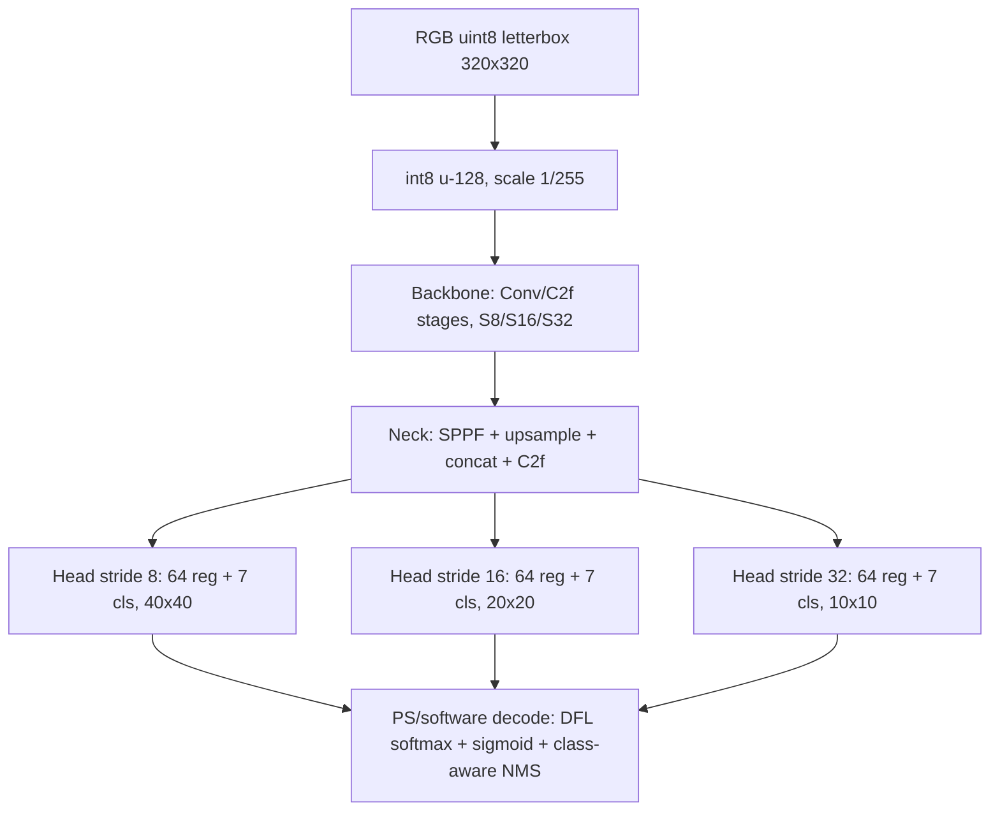

# YOLOv8n W8A8 软件量化推理审查

日期：2026-09-18。范围限定为软件侧数值模拟、量化推理和检测精度；不把 RTL 仿真或上板结果当作软件精度结论。

## 结论

当前 `run04`/`rom_data` 是**数值上可作为硬件 golden 的候选版本**，但还不能称为“精度已通过”：

- 数值闭合：通过。量化包四文件 SHA-256 与 `rom_data` 一致；从原始 `best.pt` 重新折叠 BN、量化 63 个 Conv 的权重和偏置，全部逐字节一致。
- 推理闭合：通过。5 个深度样本逐节点复现，315 次独立 INT64 卷积对照零差异；128 张回归图的三尺度原始检测头 SHA-256 全部一致；数据图的分支尺度、Add/Concat、MaxPool、Upsample 边界检查通过。
- 验证集：按当前脚本口径，FP32 mAP50=0.89394，INT8=0.90310；mAP50-95 的独立复算为 FP32=0.46252，INT8=0.47115。
- 测试集：FP32 mAP50=0.72548，INT8=0.69213，下降 0.03335；独立复算 mAP50-95 为 FP32=0.42099，INT8=0.40528，下降 0.01571。测试集精度门不能判 PASS。
- 旧评估器的两个问题已复现：AP 实现对没有预测的类别会返回 `None` 并从均值排除；NMS 先按类别处理后直接截断，`max_det` 边界可能不是全局最高置信度。对本项目 128 张图，NMS 集合未发生变化，且每类均有预测，所以旧 mAP50 数值没有被这两个问题改变；它们仍必须在后续评估器中修复。

因此，建议把当前包冻结为“数值 golden / 硬件接口设计基线”，暂缓把它冻结为“最终精度模型”。硬件重设计可以先按其整数语义进行，但应保留替换量化参数和重新评估的空间。

## 建议的 PS/PL 分区

分区不要求重新训练或重新量化：只要 PL 使用同一 `quant.json`、同一 `(M, shift)`、同一 LUT 和同一饱和规则，PS/PL 只是执行位置变化，数值结果应逐层不变。建议的第一版分区如下：

| 部分 | 放置算子 | 说明 |
|---|---|---|
| PL | 63 个 Conv + INT32 累加 + per-OC RNE + SiLU LUT | 每层输出直接进入片上 tile buffer |
| PL | 16 view/split、6 Add、13 Concat | view 是地址重排；Concat 尽量做流式拼接，避免写回 DDR |
| PL | 3 个 5×5 MaxPool、2 个 nearest×2 Upsample | 都是固定整数算子，适合与 line buffer/streaming buffer 融合 |
| PS | 输入 BGR/RGB、letterbox、帧控制 | 可先保留；后续可用 DMA/PL 预处理优化 |
| PS | 三尺度 raw head 的 DFL softmax、sigmoid、NMS | 仅处理 149,100 B 的三尺度头，远小于中间特征图搬运量 |

当前软件 schedule 共 103 个 PL 特征图任务和 1 个 PS head 任务；等价分区脚本及样例 raw-head hash 见 [`partition_result.json`](../4_metrics/logs/2026-09-18_yolo_quant_audit_run01/partition_result.json)。这一步不会改变量化模型，只改变后端执行器。真正需要新增的是 PL 的 Add/Concat/Pool/Upsample 流水线、片上 buffer 和描述符，而不是重做量化公式。

如果资源不足，优先级应为：先把 Add、Concat、MaxPool、Upsample 放 PL；再考虑把 DFL 放 PL。Sigmoid/softmax/NMS 可以暂留 PS，因为它们只处理检测头，不会造成中间 3.5 MB 特征图在 PS/PL 之间来回搬运。

## 量化计算图

模型输入为 BGR 图像经过 320×320 letterbox（填充值 114），转 RGB 后存为 `int8 = uint8 - 128`，输入尺度 `1/255`。计算图包含 63 个 Conv、16 个通道 view、6 个 Add、13 个 Concat、3 个 5×5 MaxPool、2 个最近邻×2 Upsample 和三尺度检测头。三尺度输出为 stride 8/16/32，回归各 64 通道（4×16 DFL），分类各 7 通道。

逐层机器可读图和层表：[`network_full.mmd`](../4_metrics/logs/2026-09-18_yolo_quant_audit_run01/network_full.mmd)、[`layers.csv`](../4_metrics/logs/2026-09-18_yolo_quant_audit_run01/layers.csv)。

## 软件数值合同

权重为每输出通道对称 INT8；激活为逐张量对称 INT8；累加为 INT32；BN 折叠后的偏置为 INT32；每输出通道使用 `(M, shift)` 重定标；重定标是带 ties-to-even 的 RNE，乘法中间为 INT64；激活使用 256 项 SiLU LUT；Add 在一次饱和前先统一尺度；Concat 对不同尺度先重定标；MaxPool 边界为 `-128`；DFL 在 PS 侧对每个 16-bin 回归分布做稳定 softmax 和期望值计算。

独立审查输出：[`audit_result.json`](../4_metrics/logs/2026-09-18_yolo_quant_audit_run01/audit_result.json)、[`supplement_result.json`](../4_metrics/logs/2026-09-18_yolo_quant_audit_run01/supplement_result.json)。

## 数据和准确率解释

420 张校准图全部来自 train，和 valid/test 无精确图像哈希交集；train 与 test 有 20 个去除 `.rf.*` 后相同的文件名来源，不能据此断言图像重复，但应作为数据 provenance 风险记录。当前独立复跑使用原始 59 张 valid 和 69 张 test，图像哈希与数据清单一致。测试集只有 69 张图，类别样本很少，结论有明显统计不确定性；仍然不能用验证集改善来替代测试集下降。

## 重新设计硬件前的准入条件

1. 将 `audit_result.json` 中的整数语义和 `quant.json` 作为接口合同：特别是首层 `u-128`、padding 常量、RNE ties-to-even、SiLU LUT 输入/输出尺度、Add/Concat 重定标。
2. 修正评估器后，用固定 test split 再跑一次 FP32/INT8，并增加每类 AP、召回、定位误差和 raw-head hash；把 `mAP50` 与 `mAP50-95` 同时设为门。
3. 对 Right、Thumbs Down、Left 等测试集弱类做逐图误差分析；若下降来自量化敏感层，优先只对检测头或敏感激活做更高精度/重新校准，再考虑 QAT。
4. 硬件第一版必须逐层对比 63 个 Conv 的 int8 张量和三尺度 raw head；只对最终框做比较不足以定位尺度或舍入错误。

原始复验日志和结果：[`accuracy_console_retry02.log`](../4_metrics/logs/2026-09-18_yolo_quant_audit_run01/accuracy_console_retry02.log)、[`accuracy_result.json`](../4_metrics/logs/2026-09-18_yolo_quant_audit_run01/accuracy_result.json)、[`frame_audit.json`](../4_metrics/logs/2026-09-18_yolo_quant_audit_run01/frame_audit.json)。
