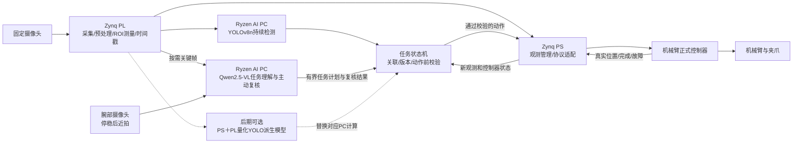

# 锐眼智臂：双视角主动复核与大小模型协同的柔性配套系统

2026-09-12｜融合修订 r2：YOLO＋千问与分阶段 PS＋PL 路线｜DESIGN_ONLY

当前输入：EES-331/Zynq-7020＋固定摄像头＋带摄像头机械臂＋AMD Ryzen AI PC。用户要求研究 PC 大模型、FPGA 本地小模型与快速场景切换，面向 AMD 赛题二高奖项。本文按本地《全国大学生嵌入式芯片与系统设计竞赛 2026 选题指南（AMD）》3.2 设计。此前两人分工、万元预算只作为延续的规划假设，腕部相机和所选机械臂的实际成本、型号与协议仍未确定。

## 1. 推荐结论

**值得做双模型，并且推荐同时部署、分工协作。主线应是“较慢的语义理解＋持续的本地视觉观测＋有反馈的动作”，快速模型切换列为后续扩展。**

两个模型同时存在有明确场景：PC 的千问视觉语言模型读取腕部近景标签、判断物料是否符合订单时，YOLO 与几何/跟踪逻辑持续更新全局目标，确认物体是否移走、格位是否变化。语义理解与位置观测异步协作，不需要让每帧 YOLO 结果排队等待千问。

保留原方向，融合截图中的模型分工，并按三阶段落实：**先在 PC 跑通 YOLOv8n＋Qwen2.5-VL-3B 的实物闭环；再实现 PL 图像观测、时间戳与 PS/PC 有效性校验的协作；最后依据实测将 YOLOv8n 派生模型的计算密集层迁移到 PS＋PL。** 前两阶段双模型都可驻留 PC，不能提前称为 FPGA 神经网络推理。原定制小 CNN 保留为迁移困难时的替代方案，不增加为必做的第三个模型。

建议作品名：**锐眼智臂——基于 Ryzen AI PC 与 Zynq 的双视角主动复核柔性配套系统**。

作品要解决的具体问题：小批量、多品种物料在全局图像中可能外观相似，PC 推理结果又可能滞后。系统如何选择需要靠近查看的物体，在查看期间保持目标关联，并在抓取与放置后用新观测确认整单完成？

“双模型”“大小脑”“双摄像头”本身都不宜主张原创。Figure 的 [Helix 02 开发者说明](https://www.figure.ai/news/helix-02)已采用不同时间尺度的语义与控制层，并利用局部相机补充遮挡视野。这里可争取的贡献是资源受限平台上的具体实现、观测与命令的一致性，以及可重复的任务收益；本轮不是穷尽式新颖性检索。

## 2. 与赛题的直接对应

主依据为 [本地赛题 PDF](E:/competition/1_docs/pdf/AMD赛题.pdf) 的 3.2；通过匹配哈希的 MinerU content JSON 阅读物理第13–20页。最新官网版本未成功在线复核，不能把本地版本称为已确认的最新修订。官网最终赛程也未核实。

| 评分项 | 权重 | 本作品需要展示的证据 |
|---|---:|---|
| 具身智能系统完整度 | 20 | 完整订单正确交付、抓空与错放检测、异常恢复、人工干预次数 |
| AI PC 端侧 AI 能力 | 20 | 订单结构化、近景属性/标签识别、歧义目标拒绝；真实 Ryzen 上离线推理效果与延迟 |
| FPGA/Zynq 设计质量 | 25 | PL 图像预处理/ROI测量、硬件时间戳、持续吞吐、资源与实现时序；后期另提供量化模型加速证据 |
| 两端协同 | 20 | 主动复核触发、目标与帧关联、过期结果拒绝、通信异常处理及延迟分位数 |
| 工程完成度与创新 | 15 | 长时间运行、第二任务复用、可重建部署与可复测实验 |

3.2.2 明确允许图像预处理、数据流加速、实时处理与 PL/PS 协同；没有要求 FPGA 必须部署神经网络，也没有规定大模型参数规模。3.2.4 明确资源利用率不是越高越好。因此，不能以“FPGA 还有空间”代替小模型的任务价值论证。

3.2.3.1 要求真实 AMD Ryzen AI PC、ROCm 7.14.0及以上，并声明硬件/软件版本。PC 的“纯软件部署”应理解为用标准模型与推理软件实现，不代表必须纯 CPU 推理。优先测试适配的 AMD GPU/ROCm 后端；NPU 是另外的后端与兼容性问题，不能从 ROCm 推出 NPU 已参与。AMD 的 [ROCm 7.14.0 安装文档](https://rocm.docs.amd.com/en/docs-7.14.0/install/rocm.html)已核实存在，实际 SKU/OS/模型算子组合还需到机验收。

必须报告五类核心数据：整任务成功率、传感到实际物理响应的 P50/P95/P99/最大延迟、AI 效果与推理性能、FPGA 量化贡献、通信性能。另选至少两类专项指标，建议资源/时序和可靠性。软件函数返回或控制器 ACK 不能代替实际运动起点。

## 3. 一项主任务，两个有实际意义的工作模式

主任务是桌面级柔性配套与返检。首版采用单层、不堆叠、30–60 mm级的轻量不透明样件，登记高度，准备2–3类、可抓取且近景差异清楚的物料。尺寸只是选件起点，应适配真实夹爪与机械臂。

### 3.1 订单配套

订单示例：“给 A 盒配两个标记为 M 的完整环件和一个长垫块；缺口件不要放入。”

1. 固定相机获取全局图像。PC 千问模型将自然语言订单解析成受约束的 TaskSpec；YOLO 提供物料候选框，跟踪/关联逻辑分配目标身份。
2. 首期由 PC 检测与几何模块更新位置、质量和时间戳；中期引入 PL ROI 几何测量/跟踪，后期才替换或加速检测网络。检测框不等于掩膜、关键点或抓取姿态，所需精定位必须独立验证。
3. 对全局视图无法确定的规格或缺陷，机械臂先到预设观察位，停稳后用腕部相机近拍。
4. PC 结合近景判断是否满足订单。看不清或证据冲突时输出 UNKNOWN，转复核/拒取，不把语言生成当检测事实。
5. 查看期间全局感知持续更新；中期由 PL 的真实新帧观测支撑这一能力。若对象移动、被遮挡或关联丢失，先使旧目标版本失效，重新关联后再抓。
6. 从最新位置生成分段抓取动作；真实到位后夹取，在可见检查位及目标盒进行复核。
7. 抓取前的预留数与实际已交付数分开管理；只有放置复核通过才记为订单完成。抓空、缺件或错格位触发有限次重试，超过上限进入等待状态。

### 3.2 来料复核与归位

同一台设备改为：“检查这批物料的标记和可见缺陷，将合格件归位，异常件放复检格，输出盘点差异。”

这一模式复用定位、近拍、选物、抓取和复核能力，改变订单逻辑与判定标准。它自然证明任务切换与工作流复用，但**未必需要换神经网络权重**。如果原模型已经覆盖两种任务，换 TaskSpec/策略就是正确做法。

需要真正权重切换时，选择经过数据验证的不同物料域，例如环件/垫块与塑料壳/连接器。为它们训练同一计算图、不同权重的局部视觉模型。只有专用模型在相同资源约束下优于联合模型，才能解释切换的必要性。第二域采用相同桌面和夹爪可处理的物体，避免引入另一套机械问题。

## 4. 两个摄像头与两个模型如何协作

图中的 PS 直连控制器仅在厂家开放协议可用时成立。若只能通过 PC 专有 SDK 控制，执行适配器放到 PC，完整路径仍包含 PC 的调度抖动，不能宣称 PC 卡顿时动作链路仍可自主闭环。

| 部分 | 输入与模型 | 输出/任务 | 更新方式 |
|---|---|---|---|
| PC 检测模型 | 固定相机图像；首选YOLOv8n，使用本任务数据适配 | 类别、框与检测分数；不直接提供跟踪ID、精确抓取姿态或抓取成功结论 | 连续新帧，独立于千问推理 |
| PC 千问模型 | 全局关键帧、腕部近景、订单；首选Qwen2.5-VL-3B | 属性/标签、任务理解、主动复核与有限动作类型的结构化计划 | 新任务、疑点或失败事件触发 |
| PL 观测前端 | 固定相机原始流、ROI与标定配置 | 预处理、时间戳，中期增加经验证的几何测量/跟踪 | 按真实新帧调度，独立报告多ROI吞吐 |
| 后期 PS＋PL 模型 | 量化YOLOv8n派生模型或替代小CNN | 加速声明范围内的计算层，输出经对齐的检测/观测结果 | 达到资源、精度和端到端收益门槛后启用 |
| PS/PC 确定性逻辑 | 检测/几何结果、标定、对象ID、控制器反馈 | 状态关联、有效期检查、模型包管理、控制协议 | 所在处理器与耗时均须记录 |
| 商业控制器 | 有界位置/姿态命令 | 内部运动控制、执行与真实反馈 | 采用厂家定义的接口与完成语义 |

PC 候选可从 [Qwen2.5-VL 官方说明](https://qwenlm.github.io/blog/qwen2.5-vl/)列出的3B/7B模型起测，用于视觉属性、标签/OCR和结构化输出。该来源说明模型能力，不证明本项目准确率或 Ryzen 实时性能。先比较模型大小、量化方法、batch=1延迟、峰值内存与任务错误率；不以更大参数量为升级理由。生成坐标仅作粗定位候选，实际抓取依赖标定与新观测。

截图中的 [Qwen3-1.7B](https://huggingface.co/Qwen/Qwen3-1.7B) 是文本因果语言模型，不能直接读取摄像头像素。它可作为简化基线，读取订单、结构化检测和已确认状态，生成任务计划；若仍要近景标签/外观判断，需另有经过验证的视觉/OCR模块。本主线保留主动近拍价值，故优先采用Qwen2.5-VL-3B，不同时强制部署两种千问模型。

“部署到AI PC”与“运行在NPU”分别验收。YOLO先建立可重复的浮点基线，再评估量化；千问根据实际Ryzen型号、系统和可用后端测试。记录执行提供程序、算子分配与CPU/GPU/NPU回退，不能从ONNX、INT8或ROCm名称推定NPU部署成功，参见 [AMD模型运行说明](https://github.com/amd/ryzen-ai-documentation/blob/main/docs/modelrun.rst)。普通PC/CPU可用于原型，正式参赛仍需满足第2节平台要求。

固定相机建议保持现有 FPGA 原始采集链路；腕部相机优先通过开放 USB/UVC、Ethernet或厂家图像API向PC提供原始图像。采购必须确认能读取图像，不能把只提供厂商“识别结果”的摄像头当成可用近景输入。腕部视频先不绕经7020，以免新增USB主机驱动和双路视频带宽成为关键路径。

腕部相机的必要价值是主动补充观察：外观近似、标记较小或局部遮挡时靠近查看。若只把同一完整场景再拍一遍，就没有证明双视角价值。腕相机是否看得见夹持中的物体必须现场确认；看不见时只承担抓前复核，抓后以固定相机和盒位观测为准。

## 5. YOLO选型与后期PS＋PL迁移条件

推荐 **PL 计算密集层＋PS 管理/后处理**。PL实现卷积、激活、必要池化与流式缓存；PS管理模型描述、DMA/DDR、对象关联、少量几何计算和协议。只在PS用Python/CPU跑模型，不能声称实现了PL模型加速。纯PL推理可作为专用核实现方式，但不需要把订单、复杂策略与所有后处理都硬化。

首期PC检测首选YOLOv8n，YOLOv8s仅在任务精度收益明确且PC预算允许时比较。[Ultralytics官方表](https://docs.ultralytics.com/models/yolov8/)中的标准COCO检测模型在640输入下，n约3.2M参数、8.7 GFLOPs，s约11.2M参数、28.6 GFLOPs；这些是参考模型规格，不是本任务部署成绩。减少类别不会消除骨干计算量，缩小输入可能损失小物料检出率。检测、分割和姿态模型的输出不能混用。

后期从逐层耗时、算子支持和DDR流量出发，选择量化/剪枝/蒸馏后的v8n派生网络，或仅把主要卷积层映射到PL。PS管理DDR、调度与适合的软件后处理，必要时保留PC协同；如存在PS/PC回退，必须明示映射边界及往返成本。先做整数数值对齐，再验证资源、实现时序、视频并发和端到端收益，最后决定是否扩大映射范围。导出INT8模型不等于完成FPGA编译和部署，不承诺标准YOLOv8n/s在7020达到30 fps。

若YOLO迁移不收敛，可选固定128×128输入、少量3×3/1×1卷积、低分辨率掩膜或关键点输出的定制CNN。0.15–0.4M参数、10–30MMAC/ROI仅为这一替代网络的待训练设计区间，不能套用到YOLO。该分支应替代对应本地任务，不作为必须常驻的第三模型；是否保留仍由任务收益决定。

网络输出是观测，不是运动策略。第一阶段只在已登记物料与受控背景内验证；PC能理解陌生对象，不代表小模型能可靠分割该对象，更不代表机械臂能够自动抓取所有开放类别。

小模型必须击败的基线包括阈值/连通域/模板跟踪。对于轮廓清晰、固定光照的任务，传统视觉可能更快、更准且资源更低；若CNN在背景、反光、轻遮挡等预先定义条件下没有提高定位或任务成功率，就不应把它作为主创新。可以保留模型部署成果，但不能为双模型形式压低系统质量。

训练数据至少包含空场、目标缺失、部分遮挡、光照变化、相似件、夹爪遮挡和放置后的状态。按实物实例、采集日期/光照分组拆分训练与测试，不能把同一段视频相邻帧分到两侧。VLM伪标签只能用于经人工核查的训练辅助，独立测试真值不能由同一模型生成。

## 6. Zynq-7020 容量与实时性的边界

本轮读取的[历史实现资源报告](E:/competition/4_metrics/logs/2026-09-07_vivado_full_build_run01/post_build_outputs/impl_1/display_test_wrapper_utilization_placed.rpt)来自9月7日 Fully Placed 工程：

| 资源 | 历史占用 | 器件总量 | 历史占比 |
|---|---:|---:|---:|
| LUT | 4,674 | 53,200 | 8.79% |
| FF | 7,214 | 106,400 | 6.78% |
| BRAM36等效块 | 20 | 140 | 14.29% |
| DSP | 9 | 220 | 4.09% |

这支持“轻量视觉CNN值得做可行性试验”，**不支持认定当前位流还有相同余量**。新开发前须关联当前 `.bit/.hwh/.xsa` 哈希与对应的实现报告，再在独立工程中评估增量资源。当前冻结 `2_fpga` 不在本轮修改范围。

140个36 Kibit块合计约630 KiB物理BRAM位容量，实际可用数据容量还受端口宽度、布局和其他模块占用限制。0.3M个INT8权重本身约300 kB；128×128×16个INT8激活就是256 KiB，双缓冲会翻倍。权重能放下不等于权重、特征图、FIFO和现有视频都能同时放下。

标准YOLOv8n/s的INT8权重本身约3.2 MB/11.2 MB，已经超过7020总BRAM容量，且尚未计入激活与缓存。优先采用片上分块/行缓存＋DDR权重库/必要特征缓存，并测量与VDMA同时访问DDR的影响。保存多个模型到DDR或SD，不需要复制完整计算阵列。前期YOLO与千问均在PC；后期千问仍在PC，检测计算可按实测迁移到PS＋PL，不要求多个检测模型在PL全速并行。

仅针对替代小CNN的示例预算：64个有效MAC通路、100 MHz对应理想6.4 GMAC/s，20MMAC需要3.125 ms纯计算；若有效利用率25%–50%，算量部分约6.25–12.5 ms，另加读写、流水排空和软件开销。这不是YOLO吞吐预测，也没有假定一个DSP必然实现一个所需精度MAC；具体映射须综合确认，MAC与OPS不混写。多ROI串行处理时按总工作量预算，不能把单ROI吞吐当全景多目标吞吐。

建议首轮工程预算：整设计LUT、DSP不超过约75%，BRAM不超过约80%，目标100 MHz；这些是留调试与布线余量的内部警戒线，不是官方门槛。验收需实现后WNS≥0、无未约束的必要路径、实际持续吞吐及与视频并发的正确性。

现有[9月11日图像链路记录](E:/competition/4_metrics/logs/2026-09-11_pynq_camera_run01/REPORT.md)上传约5 fps。这不能代表传感器只产生5个新帧，也不能证明传感器为30/60 fps。要让本地模型发挥价值，应从PL原始流观察真实新帧，增加帧号/采集时间戳；若仍从5 fps的软件上传反向取图，推理加速不会消除约200 ms的更新间隔。

## 7. 双视角、动作与结果的一致性

首版使用“停稳—取新图—判断—小步动作”的离散闭环，要求控制器支持位置命令、真实状态回读、到位与停止语义。控制器没有在线修正能力时，不承诺连续视觉伺服。固定相机标定、腕部内参/手眼关系与TCP安装偏差分别测量；固定平面单应只适用于限定高度的桌面，不能推广到任意6D姿态。

每份观测至少记录camera_id、frame_id、capture_time、target_id、target_version、calibration_version、model_version、有效ROI与质量。每份动作绑定task_version、目标版本、允许区域/步长与截止期。模型结果出炉后须再次对照当前对象状态；失配、丢失、过期、切换后旧结果均拒绝提交动作。

千问走低频事件路径，检测/几何观测走持续更新路径；千问输出须通过任务语义、动作白名单和当前状态校验，JSON格式正确不等于计划正确。提交抓取前再次读取最新观测，不能沿用千问开始推理时的坐标。截图中的FPGA直接PWM/电机控制不纳入默认架构，商业控制器继续负责关节运动；逻辑时钟粒度不代表视觉或机械物理响应达到微秒级。

腕部图像先用停稳后的单张新帧，减少曝光与姿态不同步问题。若相机不提供硬件曝光时间，只能记录主机取帧时间与估计误差；不能冒充精确同步。固定相机观测过期或目标被遮挡时进入UNKNOWN，不能用坐标外推无限续命。

CNN本身不作为经过认证的急停系统。PC断联或新观测超时后停止提交新动作；对于正在执行的动作，只有控制器真实支持且测过中止/暂停接口时，才能报告停止响应。可复测的动作抑制与厂商物理停机链路分开说明。

## 8. 如何真正实现快速模型切换

必须区分四种能力：

| 类型 | 实际改变 | 推荐顺序 | 证据口径 |
|---|---|---|---|
| 任务配置切换 | 订单、允许类别、ROI、阈值、策略或已存在输出头选择 | 第一优先 | 请求到新版本首个有效任务结果 |
| 同计算图权重切换 | 卷积权重、量化参数、标签映射等任务包 | 第二优先，须证明需要 | 装载、校验、首个有效推理及系统恢复时间 |
| 支持范围内的计算图配置切换 | 预先实现的算子、尺寸与调度描述 | 可选增强 | 只对声明支持的图验证，不声称任意ONNX |
| 部分/完整位流重配置 | 硬件电路 | 当前主线不采用 | 通道停顿、重配置、驱动恢复和重新校准成本 |

建议固定推理引擎，模型包放PS可访问DDR/SD；首次实现允许在停稳后装载，资源足够才增加权重双缓冲。FINN [官方示例驱动](https://github.com/Xilinx/finn-examples/blob/main/finn_examples/driver.py)有运行时权重管理实现可供参考；采用前需锁版本、检查算子和EES-331集成条件，并不能由此宣称任意模型热切换已具备。自研有限算子引擎也可实现相同目标。

切换事务：停止接收新任务→等待/确认当前动作进入允许切换状态→排空当前推理→加载并校验新包→核对计算图、位宽、归一化、标签/输出契约→运行固定自检输入→帧边界提交model_version/task_version→丢弃旧版本结果→获取新观测→恢复任务。失败时回退已知有效模型包，未确认回退完成前保持暂停。ROI/跟踪状态随新模型重新初始化。

同拓扑并不足够：量化尺度、折叠BatchNorm/阈值、张量顺序、输入预处理和输出语义都必须随包一致。训练阶段就固定兼容接口，不能训练两个无关网络后才期待一个位流自动兼容。

计算示例：假设有效传输速率30 MB/s，替代小CNN的0.3 MB权重纯传输约10 ms；标准YOLOv8n的3.2 MB权重则约107 ms。两者均不包含校验、自检、缓存配置、首帧等待和机械臂停稳，不能作为总切换时间。先测当前模型包完整链路，再锁定P95目标；不把小CNN的200 ms设想继承给YOLO。分别报告已停稳后的模型切换时间和含动作收敛的完整任务切换时间，若无收益就保留简单停稳加载。

如果资源允许同时保留两个小模型权重，也仍需要基于任务选择输出；并行全速计算只有在两个观测任务确实同时有截止期需求且资源/带宽均满足时才值得做。算力余量本身不构成场景需求。

## 9. 冲击高奖项应集中证明的三项贡献

**贡献一：根据任务疑点主动获得近景证据。** 对容易辨认的物体直接处理，对规格/缺陷不确定的物体靠近查看。比较“只看全局”“每件都近拍”“仅疑点近拍”，在相同错误上限下衡量整单时间、复核率和正确率。使用经过标注集校准的置信度/歧义规则；VLM自己声称的置信度不能直接视为概率。

**贡献二：PC长耗时推理期间，保持目标位置与版本有效。** 中期比较PC观测基线与PL几何/跟踪观测，明确算法和链路变化；后期再把同一量化模型放PC与PS＋PL进行同条件对照。固定帧率、输入和策略，将采集架构提高更新率的收益与模型加速分开。目标移动和计算拥塞发生时，关注旧坐标动作比例、位置误差、P99观测年龄与恢复后的任务成功率。

**贡献三：可验证的复用与切换。** 证明同一硬件支持第二工作模式；只有不同物料域专用权重确实优于单一联合模型时，再展示受控权重切换。量化切换时间、切换后精度、旧结果隔离和持续正确性。主贡献一、二及整任务闭环优先于该扩展。

## 10. 对照实验与内部验收目标

所有数值为待评审的内部目标，不是官方合格线或已经实现的成绩。

| 实验 | 保持不变 | 唯一主变量 | 主要观察 |
|---|---|---|---|
| 检测与量化 | 数据拆分、输入尺寸、后处理 | YOLO浮点 vs 量化版本 | mAP50:95、召回率、量化精度下降、batch=1延迟 |
| 千问任务效果 | 订单、图像、独立标注真值 | 固定版本与部署配置逐项比较 | 任务语义正确率、标签/属性准确率、UNKNOWN率、计划延迟、内存；结构合法率单列 |
| 小模型必要性 | 数据、ROI、后处理和任务 | CNN vs 阈值/连通域/模板 | 定位误差、mIoU/关键点误差、任务成功率、资源 |
| PL加速归因 | 同一量化模型、输入精度/帧序列、策略 | PC小模型 vs PL小模型 | 同一功能P50/P95/P99延迟与CPU占用 |
| 近景策略 | 两摄像头、模型、对象与控制器 | 不近拍/全部近拍/按疑点近拍 | 误配率与每单时间的折中 |
| 新鲜度检查 | 双模型与近景策略 | 目标版本/有效期检查开关 | 旧结果拒绝、移动目标下错误动作/恢复 |
| 专用权重价值 | 引擎算力、模型大小预算、数据拆分 | 联合模型 vs 两域专用权重 | 两域最差精度、装载成本与整体任务收益 |
| 切换正确性 | 相同动作状态、相同模型包 | A/B反复切换与失败包注入 | 旧版本输出/动作、回退、自检、首结果时间 |

版本检查关闭的对照优先在离线回放或控制器模拟环境运行；实体实验限受控、低速和可承受范围。真实目标移动安排在下降前，用预设夹具/受控位移产生，不在运动夹爪旁手动干扰。

建议先达到：清晰场景整单成功率≥95%；预先限定的歧义/目标位移/抓空条件下成功率≥85%；精度最终需按实际场景锁定。每个条件至少50次独立任务作为起点，按对象/场景/日期分组并报告置信区间，不仅给百分比。固定集之外另保留未见布局与物理实例测试。

定位容差按物体、夹爪和机械重复性共同确定，不先承诺毫米级。中期几何观测可暂以20–30个真实新帧/秒为探索目标；替代小CNN可探索PL单ROI推理P95≤20 ms。两个目标都需到机验证，均不是YOLO帧率承诺，也不代表完整机械臂动作频率。YOLO迁移指标须由锁定网络、输入尺寸、映射范围和并发条件的实测基线确定。

至少采集1,000次通信/观测处理事件作为延迟分布起点；P99尾部样本仍少，应另做长时持续测试并报告最大值。最终目标可设连续运行2小时，记录每次异常、人工干预与所有未完成订单。切换试验至少100次起步，旧版本动作出现次数必须为0；有限样本零错误不等于数学保证。

完整延迟拆为：采集→等待/传输→预处理→模型→后处理/有效性检查→控制器排队→真实物理响应。用同步时钟说明误差或外部同一计时设备观察物理事件；时钟未同步时先报RTT和本地段延迟，不相减两台机器的时间戳伪造单向值。带宽、功耗收益需实测，不能仅因“FPGA”自动宣称更省电。

## 11. 两人团队的阶段门槛与取舍

### 11.1 三阶段分工总览

| 阶段 | AI PC | Zynq | 主要目标 |
|---|---|---|---|
| 前期闭环 | YOLO＋千问 | 采集、预处理、时间戳、观测有效性检查 | 先跑通真实配套任务与结果复核 |
| 中期协同 | YOLO检测＋千问决策 | ROI几何定位/跟踪、目标版本检查 | 证明PC推理期间仍能及时更新现场状态 |
| 后期加速 | 千问保留；YOLO保留对照实现 | 评估压缩YOLO或其主要算子的PS＋PL实现 | 证明迁移带来的延迟、CPU占用或任务收益 |

本表融合用户提供的阶段分工截图，作为实施总览。YOLO与千问的具体候选及能力边界沿用第4–5节；观测有效性与版本检查由PS/PC确定性逻辑配合PL元数据实现，不暗示全部逻辑都在PL。后期保留PC对照实现用于同模型验证，不要求两端检测重复常驻运行。

### 11.2 人员分工与阶段验收

前期闭环对应G1，中期协同对应G2，后期加速对应G3；G0为共同前置检查，G4为主闭环稳定后的扩展。

| 阶段 | FPGA负责人 | PC负责人 | 通过后才推进 |
|---|---|---|---|
| G0：硬件与接口 | 当前位流/资源对应、真实新帧、冻结副本策略 | 实际臂/腕相机图像API与反馈、Ryzen设备计划 | 固定/腕图像可读；控制器能位置命令、到位反馈与停止；已有视频故障先恢复 |
| G1：PC双模型实物闭环 | PL预处理/ROI、帧号/时间戳，PS/PC观测有效性接口 | YOLOv8n＋Qwen2.5-VL-3B，订单→近拍→抓取→放置复核 | 简单任务可重复成功；有界计划校验，失败不会误记完成；CPU原型与正式Ryzen验收分开 |
| G2：实时协作与主动复核 | PL ROI几何/跟踪，原始新帧、目标版本与时延证据 | 持续检测与事件式千问异步运行，疑点复核和对照试验 | 慢语义推理期间观测仍更新，旧结果拒绝；近拍收益可测，PL不只是转接板 |
| G3：条件式模型迁移 | 在独立工程做量化YOLO派生模型卷积加速，或小CNN替代；整数对齐、DDR、时序和并发验证 | 数据集、量化精度、逐层分析、同模型PC基线与后处理 | 资源/精度及端到端收益成立才扩大映射；未通过则保留G2可演示方案 |
| G4：第二任务与模型包 | 停稳切换、校验、回退、自检 | 第二任务/物料域、联合模型对照与复用脚本 | 如无需换权重则只宣称任务切换；如切换则提供正确性与精度证据 |

按本地赛题，10月9日是中期借机申请节点，10月13日评审/发放，不是已核实的决赛期限。距离本轮9月12日约27天，中期优先争取G1/G2可测演示，G3只要求形成算量、精度和映射可行性证据，不作为实物闭环前置条件；G4安排在主闭环稳定以后。实际排期取决于臂交付、相机可读、资源收敛和Ryzen到位，不承诺在未知硬件条件下一次完成所有增强。

机械臂选择看文档接口、反馈、夹持、观察姿态和实际可达性。若任务涉及方向敏感抓取/放置，要验收腕部自由度，不能只凭标称自由度推定可实现；四自由度可先做方向不敏感物体。该轮不指定采购型号或未核实报价。

完成度与贡献的优先级为：真实完整任务＞双视角带来的可测收益＞PL观测与通信协同证据＞有收益的模型加速＞第二场景＞权重热切换。此次在原方向内融合模型选型与实施顺序，实际执行仍从G0另行开始。

## 12. 本次证据与结果边界

本轮完成赛题复用核验、历史资源读取、一手技术来源核对和方向设计；未训练模型、编译硬件、上板运行或操作机械臂。结果为DESIGN_ONLY，不代表国一等奖评审结论。

r2融合依据为[截图思路评审](E:/competition/4_metrics/logs/2026-09-12_dual_model_screenshot_review_run01/review.md)，修改记录见[融合验证](E:/competition/4_metrics/logs/2026-09-12_dual_model_fusion_run01/review.md)。截图属于待评估建议，不作为赛题条款；其MinerU解析为MINERU_PARSE_PASS，但ChineseQuality=review（short_text），人工核对了主要流程，未把图标和缺失箭头当作技术内容。本次编辑不重新解析参考文件，也不新增模型或板测成绩。

- [本轮研究记录](E:/competition/4_metrics/logs/2026-09-12_amd_dual_model_design_run01/research_record.md)
- [三阶段分工表解析与融合记录](E:/competition/4_metrics/logs/2026-09-12_stage_table_fusion_run01/review.md)
- [MinerU原始解析Markdown](E:/competition/4_metrics/logs/2026-09-09_amd_sait_pynq_mineru_run01/AMD赛题/auto/AMD赛题.md)
- [MinerU原始content JSON](E:/competition/4_metrics/logs/2026-09-09_amd_sait_pynq_mineru_run01/AMD赛题/auto/AMD赛题_content_list.json)

输入SHA-256：`C6AD82ACD4F7BDCD13BD412E232ED85D05F2A87DD5E2CDD04F9D219F88B569FC`。原结果`MINERU_PARSE_PASS`；ChineseQuality=pass，Fallback=false；本轮匹配哈希后复用，未重新解析。相关页内容与表格可读，无新增解析质量告警。
