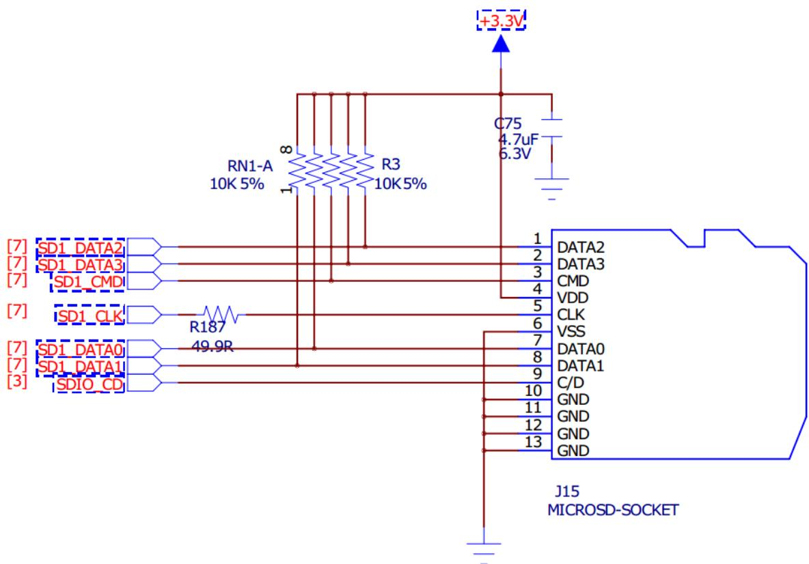
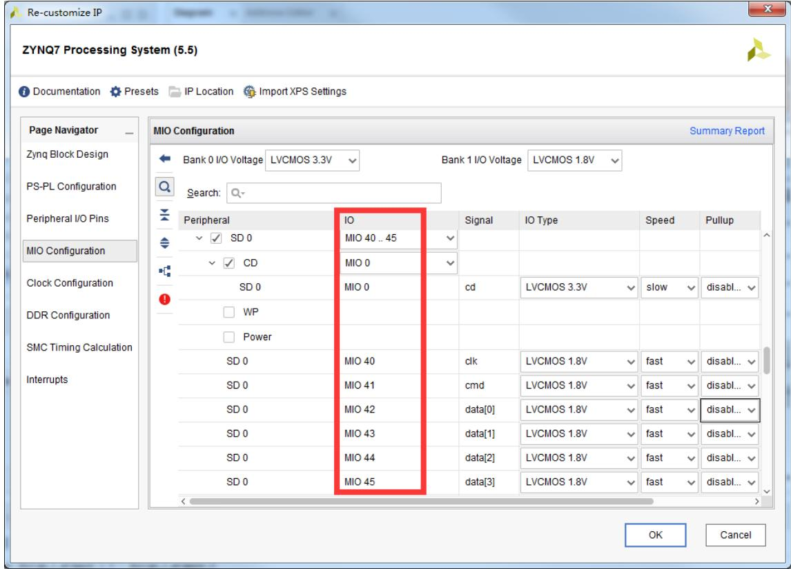
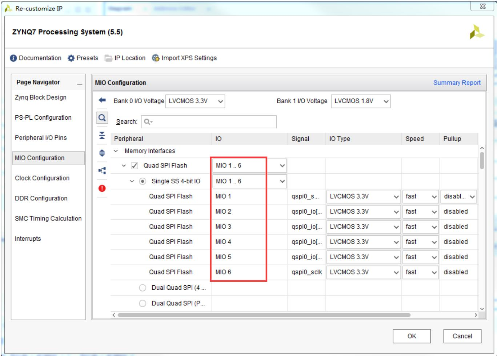
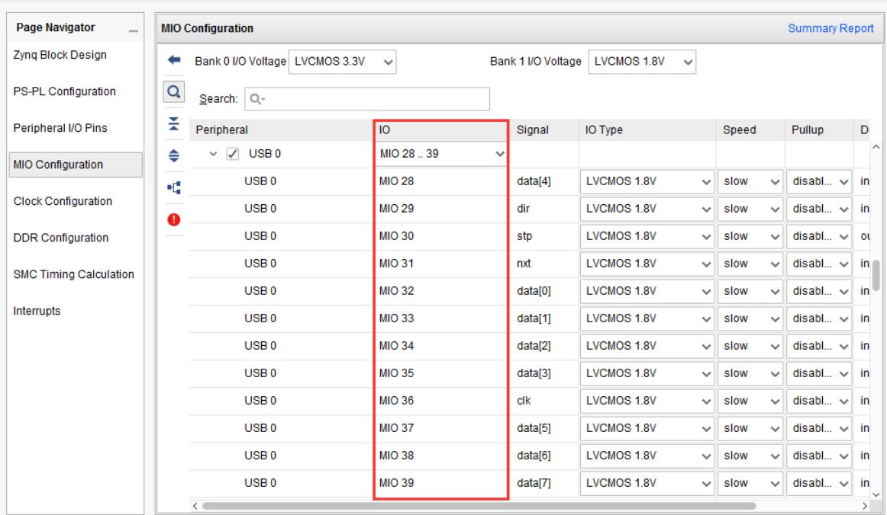
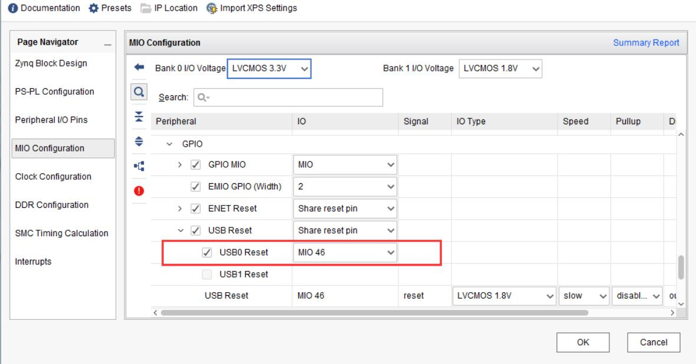

XILINX

UNIVERSITY PROGRAM PARTNER

## EES-331 用户手册

2017.12 ver1.0

E-ELEMENTS

依元素科技有限公司

## 目录

1. 概述 .... ..............................  
2. 注意事项 ....  
3. FPGA 资源概览 ...  
4. 板卡供电 .......  
5. 系统时钟 .......  
6. 启动配置方式 ..........  
7. 复位电路 ....... ........... 7  
8. PS——DDR3 ...... ............................................................... ...... 8  
10. PS——QSPI 接口 .................................................................. ........ 10  
11. PS——USB ........................ ......... 11  
12. PS——UART0/UART1 ............................................................................ ....... 13  
13. PS——以太网........ ........ 15  
15. PL——IIC .... ......... 17  
16. PL——扩展 IO-J5 ... ......... 18  
18. PL——八段数码管.......... ....... 22  
21. PL——按键电路........ ...... 28  
23. PL——HDMI 视频接口 ........ ...... 29  
24. PL——蓝牙模块电路............................................................................... ....... 32  
25. PL——WIFI 模块电路 .......... ....... 33  
26. PL——底部扩展 IO-fx8........ ...... 34  
27. XADC 模块 ..... ....... 37  
联系我们 ..... ..... 39

## 1. 概述

EES-331 是依元素科技基于Xilinx ZYNQ-7000 FPGA 研发的基础教学平台。EES-331 配备的 FPGA (xc7z020clg484-1)具有 ARM-A9 双核处理器+丰富 PL 逻辑资源等特点，结合 SoC 设计的概念能实现较复杂的数字逻辑设计和复杂的控制逻辑设计。该平台拥有丰富的外设，以及灵活的通用扩展接口。

开发平台主要功能外设概览：

<table><tr><td rowspan=1 colspan=1>编号</td><td rowspan=1 colspan=1>功能描述</td></tr><tr><td rowspan=1 colspan=1>1</td><td rowspan=1 colspan=1>外部 JTAG 调试下载器接口</td></tr><tr><td rowspan=1 colspan=1>2</td><td rowspan=1 colspan=1>PS 端的 UART1 转 USB3.0（支持 USB 供电）*1</td></tr><tr><td rowspan=1 colspan=1>3</td><td rowspan=1 colspan=1>供电方式选择</td></tr><tr><td rowspan=1 colspan=1>4</td><td rowspan=1 colspan=1>PS 端的以太网接口*1</td></tr><tr><td rowspan=1 colspan=1>5</td><td rowspan=1 colspan=1>PL 端的 UART 转 USB(J8 上)/PS 端的 UART0 转 USB(J8 下)</td></tr><tr><td rowspan=1 colspan=1>6</td><td rowspan=1 colspan=1>外部 5V电源适配器供电端子</td></tr><tr><td rowspan=1 colspan=1>7</td><td rowspan=1 colspan=1>电源开关</td></tr><tr><td rowspan=1 colspan=1>8</td><td rowspan=1 colspan=1>USB 通信母口(J4)*1</td></tr><tr><td rowspan=1 colspan=1>9</td><td rowspan=1 colspan=1>HDMI 母座*1</td></tr><tr><td rowspan=1 colspan=1>10</td><td rowspan=1 colspan=1>音频：line_in *1/line_out *1/mac_in*1/hpd_out*1</td></tr><tr><td rowspan=1 colspan=1>11</td><td rowspan=1 colspan=1>POR上电复位按键</td></tr><tr><td rowspan=1 colspan=1>12</td><td rowspan=1 colspan=1>PS 软件复位按键</td></tr><tr><td rowspan=1 colspan=1>13</td><td rowspan=1 colspan=1>PL全局时钟引脚（可做PL逻辑复位按键使用）</td></tr><tr><td rowspan=1 colspan=1>14</td><td rowspan=1 colspan=1>SW拨码开关*8</td></tr><tr><td rowspan=1 colspan=1>15</td><td rowspan=1 colspan=1>DAC0832数模转换输入引脚*1</td></tr><tr><td rowspan=1 colspan=1>16</td><td rowspan=1 colspan=1>XADC 独立接口*2</td></tr><tr><td rowspan=1 colspan=1>17</td><td rowspan=1 colspan=1>启动配置方式配置开关</td></tr><tr><td rowspan=1 colspan=1>18</td><td rowspan=1 colspan=1>LED灯*8</td></tr><tr><td rowspan=1 colspan=1>19</td><td rowspan=1 colspan=1>8段数码管*8</td></tr><tr><td rowspan=1 colspan=1>20</td><td rowspan=1 colspan=1>双排 36PIN2.54间距排针接插件*1</td></tr><tr><td rowspan=1 colspan=1>21</td><td rowspan=1 colspan=1>PS 端的 SPI1 接口信号*1</td></tr><tr><td rowspan=1 colspan=1>22</td><td rowspan=1 colspan=1>PL引脚（带上拉电阻）可做为IIC接口信号引脚*1</td></tr><tr><td rowspan=1 colspan=1>23</td><td rowspan=1 colspan=1>PS 上挂在的 1GB 容量的 DDR3 内存组</td></tr><tr><td rowspan=1 colspan=1>24</td><td rowspan=1 colspan=1>主控芯片-FPGA (xc7z020clg484-1)</td></tr><tr><td rowspan=1 colspan=1>25</td><td rowspan=1 colspan=1>DAC0832数模转换芯片*1</td></tr><tr><td rowspan=1 colspan=1>26</td><td rowspan=1 colspan=1>PS 上挂在的 SD 卡插槽*1</td></tr><tr><td rowspan=1 colspan=1>27</td><td rowspan=1 colspan=1>WIFI模块*1</td></tr><tr><td rowspan=1 colspan=1>28</td><td rowspan=1 colspan=1>蓝牙模块*1</td></tr><tr><td rowspan=1 colspan=1>29</td><td rowspan=1 colspan=1>双排 FX8底板扩展口</td></tr></table>

## 2. 注意事项

 EES-331支持多种方式下载和启动配置，具体配置方式参见第 6节启动配置方式。

 在使用 USB接口时要注意开关 JP6和JP7，详细配置请见第 11节USB。

 供电方式有两种选择，外部的 5V电源或者USB Type-C，详细的设置方法参见第 4节板卡供电。

 XADC只能对0-1V电压进行采样。

 各个 BANK的电压如下:

Zynq-7000 AP SoC Bank Voltages
<table><tr><td rowspan=1 colspan=2>PS-Side</td></tr><tr><td rowspan=1 colspan=1>Bank</td><td rowspan=1 colspan=1>Voltage(default)</td></tr><tr><td rowspan=1 colspan=1>MIO Bank0/500</td><td rowspan=1 colspan=1>3.3V</td></tr><tr><td rowspan=1 colspan=1>MIO Bank1/501</td><td rowspan=1 colspan=1>1.8V</td></tr><tr><td rowspan=1 colspan=1>DDR</td><td rowspan=1 colspan=1>1.5V</td></tr><tr><td rowspan=1 colspan=2>PL-Side</td></tr><tr><td rowspan=1 colspan=1>Bank0</td><td rowspan=1 colspan=1>3.3V</td></tr><tr><td rowspan=1 colspan=1>Bank13</td><td rowspan=1 colspan=1>3.3V</td></tr><tr><td rowspan=1 colspan=1>Bank33</td><td rowspan=1 colspan=1>3.3V</td></tr><tr><td rowspan=1 colspan=1>Bank34</td><td rowspan=1 colspan=1>3.3V</td></tr><tr><td rowspan=1 colspan=1>Bank35</td><td rowspan=1 colspan=1>3.3V</td></tr></table>

## 3. FPGA 资源概览

EES-331 采用 Xilinx ZYNQ-7000 系列 xc7z020clg484-1 FPGA，其资源如下：

Table 1: Zynq-7000 and Zynq-7000S All Programmable SoCs
<table><tr><td rowspan=1 colspan=1></td><td rowspan=1 colspan=1>Device Name</td><td rowspan=1 colspan=1>Z-7007S</td><td rowspan=1 colspan=1>Z-7012S</td><td rowspan=1 colspan=1>Z-7014S</td><td rowspan=1 colspan=1>Z-7010</td><td rowspan=1 colspan=1>Z-7015</td><td rowspan=1 colspan=1>Z-7020</td><td rowspan=1 colspan=1>Z-7030</td><td rowspan=1 colspan=1>Z-7035</td><td rowspan=1 colspan=1>Z-7045</td><td rowspan=1 colspan=1>Z-7100</td></tr><tr><td rowspan=1 colspan=1></td><td rowspan=1 colspan=1>Part Number</td><td rowspan=1 colspan=1>XC7Z007S</td><td rowspan=1 colspan=1>XC7Z012S</td><td rowspan=1 colspan=1>XC7Z014S</td><td rowspan=1 colspan=1>XC7Z010</td><td rowspan=1 colspan=1>XC7Z015</td><td rowspan=1 colspan=1>XC7Z020</td><td rowspan=1 colspan=1>XC7Z030</td><td rowspan=1 colspan=1>XC7Z035</td><td rowspan=1 colspan=1>XC7Z045</td><td rowspan=1 colspan=1>XC7Z100</td></tr><tr><td rowspan=12 colspan=1>csetg Scetem</td><td rowspan=1 colspan=1>Processor Core</td><td rowspan=1 colspan=3>Single-core ARM Cortex-A9MPCore™ with CoreSight</td><td rowspan=1 colspan=7>Dual-core ARM Cortex-A9 MPCore™ with CoreSight™</td></tr><tr><td rowspan=1 colspan=1>Processor Extensions</td><td rowspan=1 colspan=10>NEON™ &amp; Single / Double Precision Floating Point for each processor</td></tr><tr><td rowspan=1 colspan=1>Maximum Frequency</td><td rowspan=1 colspan=3>667 MHz (-1); 766 MHz (-2)</td><td rowspan=1 colspan=3>667 MHz (-1); 766 MHz (-2); 866 MHz (-3)</td><td rowspan=1 colspan=3>667 MHz (-1); 800 MHz (-2); 1 GHz (-3)</td><td rowspan=1 colspan=1>8 Hz(- -2)</td></tr><tr><td rowspan=1 colspan=1>L1 Cache</td><td rowspan=1 colspan=10>32 KB Instruction, 32 KB data per processor</td></tr><tr><td rowspan=1 colspan=1>L2 Cache</td><td rowspan=1 colspan=10>512 KB</td></tr><tr><td rowspan=1 colspan=1>On-Chip Memory</td><td rowspan=1 colspan=10>256 KB</td></tr><tr><td rowspan=1 colspan=1>External MemorySuppo()</td><td rowspan=1 colspan=10>DDR3, DDR3L, DDR2, LPDDR2</td></tr><tr><td rowspan=1 colspan=1>External Static MemorySupor()</td><td rowspan=1 colspan=10>2x Quad-SPI, NAND, NOR</td></tr><tr><td rowspan=1 colspan=1>DMA Channels</td><td rowspan=1 colspan=10>8 (4 dedicated to Programmable Logic)</td></tr><tr><td rowspan=1 colspan=1>Peripherals(1)</td><td rowspan=1 colspan=10>2x UART, 2x CAN 2.0B, 2x I2C, 2x SPI, 4x 32b GPIO</td></tr><tr><td rowspan=1 colspan=1>Peripherals w/built-in DMA(1)</td><td rowspan=1 colspan=10>2x USB 2.0 (OTG), 2x Tri-mode Gigabit Ethernet, 2x SD/SDIO</td></tr><tr><td rowspan=1 colspan=1>Security(2)</td><td rowspan=1 colspan=10>RSA Authentication, and AES and SHA 256-bit Decryption and Authentication for Secure Boot</td></tr><tr><td rowspan=1 colspan=2>Processing System toProgrammable LogicInterface Ports(Primary Interfaces &amp;Interrupts Only)</td><td rowspan=1 colspan=10>2x AXI 32b Master 2x AXI 32-bit Slave4x AXI 64-bit/32-bit MemoryAXI 64-bit ACP16 Interrupts</td></tr></table>

Table 1: Zynq-7000 and Zynq-7000S All Programmable SoCs (Cont'd)
<table><tr><td rowspan=1 colspan=1></td><td rowspan=1 colspan=1>Device Name</td><td rowspan=1 colspan=1>Z-7007S</td><td rowspan=1 colspan=1>Z-7012S</td><td rowspan=1 colspan=1>Z-7014S</td><td rowspan=1 colspan=1>Z-7010</td><td rowspan=1 colspan=1>Z-7015</td><td rowspan=1 colspan=1>Z-7020</td><td rowspan=1 colspan=1>Z-7030</td><td rowspan=1 colspan=1>Z-7035</td><td rowspan=1 colspan=1>Z-7045</td><td rowspan=1 colspan=1>Z-7100</td></tr><tr><td rowspan=1 colspan=1></td><td rowspan=1 colspan=1>Part Number</td><td rowspan=1 colspan=1>XC7Z007S</td><td rowspan=1 colspan=1>XC7Z012S</td><td rowspan=1 colspan=1>XC7Z014S</td><td rowspan=1 colspan=1>XC7Z010</td><td rowspan=1 colspan=1>XC7Z015</td><td rowspan=1 colspan=1>XC7Z020</td><td rowspan=1 colspan=1>XC7Z030</td><td rowspan=1 colspan=1>XC7Z035</td><td rowspan=1 colspan=1>XC7Z045</td><td rowspan=1 colspan=1>XC7Z100</td></tr><tr><td rowspan=10 colspan=1>Proge Pmmaoge</td><td rowspan=1 colspan=1>Xilinx 7 SeriesProgrammable LogicEquivalent</td><td rowspan=1 colspan=1>Artix®-7FPGA</td><td rowspan=1 colspan=1>APIGA</td><td rowspan=1 colspan=1>APIGA</td><td rowspan=1 colspan=1>APIGA</td><td rowspan=1 colspan=1>Artix-7FPGA</td><td rowspan=1 colspan=1>APGA</td><td rowspan=1 colspan=1>Kintex®-7FPGA</td><td rowspan=1 colspan=1>Kintex-7FPGA</td><td rowspan=1 colspan=1>Kintex-7FPGA</td><td rowspan=1 colspan=1>Kintex-7FPGA</td></tr><tr><td rowspan=1 colspan=1>Programmable LogicCells</td><td rowspan=1 colspan=1>23K</td><td rowspan=1 colspan=1>55K</td><td rowspan=1 colspan=1>65K</td><td rowspan=1 colspan=1>28K</td><td rowspan=1 colspan=1>74K</td><td rowspan=1 colspan=1>85K</td><td rowspan=1 colspan=1>125K</td><td rowspan=1 colspan=1>275K</td><td rowspan=1 colspan=1>350K</td><td rowspan=1 colspan=1>444K</td></tr><tr><td rowspan=1 colspan=1>Look-Up Tables (LUTs)</td><td rowspan=1 colspan=1>14,400</td><td rowspan=1 colspan=1>34,400</td><td rowspan=1 colspan=1>40,600</td><td rowspan=1 colspan=1>17,600</td><td rowspan=1 colspan=1>46,200</td><td rowspan=1 colspan=1>53,200</td><td rowspan=1 colspan=1>78,600</td><td rowspan=1 colspan=1>171,900</td><td rowspan=1 colspan=1>218,600</td><td rowspan=1 colspan=1>277,400</td></tr><tr><td rowspan=1 colspan=1>Flip-Flops</td><td rowspan=1 colspan=1>28,800</td><td rowspan=1 colspan=1>68,800</td><td rowspan=1 colspan=1>81,200</td><td rowspan=1 colspan=1>35,200</td><td rowspan=1 colspan=1>92,400</td><td rowspan=1 colspan=1>106,400</td><td rowspan=1 colspan=1>157,200</td><td rowspan=1 colspan=1>343,800</td><td rowspan=1 colspan=1>437,200</td><td rowspan=1 colspan=1>554,800</td></tr><tr><td rowspan=1 colspan=1>Block RAM(# 36 Kb Blocks)</td><td rowspan=1 colspan=1>1.8 Mb(50)</td><td rowspan=1 colspan=1>2.5 Mb(72)</td><td rowspan=1 colspan=1>3.8 Mb(107)</td><td rowspan=1 colspan=1>2.1 Mb(60)</td><td rowspan=1 colspan=1>3.3 Mb(95)</td><td rowspan=1 colspan=1>4.9 Mb(140)</td><td rowspan=1 colspan=1>9.3 Mb(265)</td><td rowspan=1 colspan=1>17.6 Mb(500)</td><td rowspan=1 colspan=1>19.2 Mb(545)</td><td rowspan=1 colspan=1>26.5 Mb(755)</td></tr><tr><td rowspan=1 colspan=1>DSP Slices(18x25 MACCs)</td><td rowspan=1 colspan=1>66</td><td rowspan=1 colspan=1>120</td><td rowspan=1 colspan=1>170</td><td rowspan=1 colspan=1>80</td><td rowspan=1 colspan=1>160</td><td rowspan=1 colspan=1>220</td><td rowspan=1 colspan=1>400</td><td rowspan=1 colspan=1>900</td><td rowspan=1 colspan=1>900</td><td rowspan=1 colspan=1>2,020</td></tr><tr><td rowspan=1 colspan=1>Peak DSPPerformance(Symmetric FIR)</td><td rowspan=1 colspan=1>73GMACs</td><td rowspan=1 colspan=1>131GMACs</td><td rowspan=1 colspan=1>187GMACs</td><td rowspan=1 colspan=1>100GMACs</td><td rowspan=1 colspan=1>200GMACs</td><td rowspan=1 colspan=1>276GMACs</td><td rowspan=1 colspan=1>593GMACs</td><td rowspan=1 colspan=1>1,334GMACs</td><td rowspan=1 colspan=1>1,334GMACS</td><td rowspan=1 colspan=1>2,622GMACs</td></tr><tr><td rowspan=1 colspan=1>Eot Clex orPCI Express</td><td rowspan=1 colspan=1></td><td rowspan=1 colspan=1>Gen2 x4</td><td rowspan=1 colspan=1></td><td rowspan=1 colspan=1></td><td rowspan=1 colspan=1>Gen2 x4</td><td rowspan=1 colspan=1></td><td rowspan=1 colspan=1>Gen2 x4</td><td rowspan=1 colspan=1>Gen2 x8</td><td rowspan=1 colspan=1>Gen2 x8</td><td rowspan=1 colspan=1>Gen2 x8</td></tr><tr><td rowspan=1 colspan=1>Analog Mixed Signal(AMS) /XADC</td><td rowspan=2 colspan=10>2x 12 bit, MSPS ADCs with up to 17 Differential InputsAES and SHA 256b for Boot Code and Programmable Logic Configuration, Decryption, and Authentication</td></tr><tr><td rowspan=1 colspan=1>Security(2)</td></tr></table>

Zynq-7000 All Programmable SoC  

## 4. 板卡供电

EES-331供电方式有两种方案：

1、USB3.0 供电：可以通过 J3 的 USB3.0 供电。同时 J3 也是板载调试接口和PS的 UART1的通信口，此种方式接线简单，调试方便。但是供电功率不够大，如果带有大负荷外设或者使用板上的 DAC 模块 DAC0832 会出现失真现象，故在此

类应用场景下不建议使用该方法供电。

2、外部5V电源供电：此种供电方式能满足板卡的充分供电。

上述两种供电方式需要通过选挑插针进行切换。详情见下图，并且板卡上有明确丝印指示。无论上述哪种方式，上电成功后指示灯 D18会长亮。

## 5. 系统时钟

EES-331 搭载的是 ZYNQ 系列芯片除了 PL 逻辑资源外还有 PS 硬核CORTEX-A9双核处理器。PL和PS分别有一个外部时钟。

PS：采用的是 33.333333MHZ 外部有源晶振

PL：采用的是 100MHZ的外部有源晶振，时钟输入引脚为 M19

<table><tr><td rowspan=1 colspan=1>名称</td><td rowspan=1 colspan=1>原理图标号</td><td rowspan=1 colspan=1>FPGA IO PIN</td></tr><tr><td rowspan=1 colspan=1>PL时钟引脚</td><td rowspan=1 colspan=1>FPGA_CLK0</td><td rowspan=1 colspan=1>M19</td></tr><tr><td rowspan=1 colspan=1>PS 时钟引脚</td><td rowspan=1 colspan=1>PS_CLK</td><td rowspan=1 colspan=1>F7</td></tr></table>

## 6. 启动配置方式

EES331支持多种调试和启动方式：

1、外部 JTAG下载调试器；

2、USB3.0接口的板载下载调试器；

3、SD卡启动；

4、SPI\_FLASH 启动；

以上启动方式可以通过 SW8 的配置拨码开关进行选择。板卡上有明确的配置丝印。

下面表格也列出各种配置方式：
<table><tr><td rowspan=1 colspan=8>拨码开关往上拨表示该位数值为0，既 $\mathrm { O N = 0 }$ ，往下表示1。x 表示不影响</td></tr><tr><td rowspan=2 colspan=1>序号</td><td rowspan=2 colspan=1>配置方式</td><td rowspan=1 colspan=6>SW8 配置拨码开关</td></tr><tr><td rowspan=1 colspan=1>1</td><td rowspan=1 colspan=1>2</td><td rowspan=1 colspan=1>3</td><td rowspan=1 colspan=1>4</td><td rowspan=1 colspan=1>5</td><td rowspan=1 colspan=1>6</td></tr><tr><td rowspan=1 colspan=1>1</td><td rowspan=1 colspan=1>外部 JTAG 下载调试器</td><td rowspan=1 colspan=1>0</td><td rowspan=1 colspan=1>0</td><td rowspan=1 colspan=1>0</td><td rowspan=1 colspan=1>0</td><td rowspan=1 colspan=1>0</td><td rowspan=1 colspan=1>0</td></tr><tr><td rowspan=1 colspan=1>2</td><td rowspan=1 colspan=1>板载下载调试器</td><td rowspan=1 colspan=1>0</td><td rowspan=1 colspan=1>0</td><td rowspan=1 colspan=1>0</td><td rowspan=1 colspan=1>0</td><td rowspan=1 colspan=1>0</td><td rowspan=1 colspan=1>1</td></tr><tr><td rowspan=1 colspan=1>3</td><td rowspan=1 colspan=1>SD卡启动</td><td rowspan=1 colspan=1>0</td><td rowspan=1 colspan=1>0</td><td rowspan=1 colspan=1>1</td><td rowspan=1 colspan=1>1</td><td rowspan=1 colspan=1>0</td><td rowspan=1 colspan=1>x</td></tr><tr><td rowspan=1 colspan=1>4</td><td rowspan=1 colspan=1>SPI_FLASH 启动</td><td rowspan=1 colspan=1>0</td><td rowspan=1 colspan=1>0</td><td rowspan=1 colspan=1>0</td><td rowspan=1 colspan=1>1</td><td rowspan=1 colspan=1>0</td><td rowspan=1 colspan=1>x</td></tr></table>

  
启动方式配置拨码开关

## 7. 复位电路

PS\_SRST# ：系统复位

PS\_POR#\_SW ：上电复位

<table><tr><td rowspan=1 colspan=4>管脚约束表</td><td rowspan=1 colspan=1></td></tr><tr><td rowspan=1 colspan=4>器件型号/类别：复位按键</td><td rowspan=1 colspan=1></td></tr><tr><td rowspan=1 colspan=1>序号</td><td rowspan=1 colspan=1>器件引脚</td><td rowspan=1 colspan=1>引脚标号</td><td rowspan=1 colspan=1>FPGA IO 约束</td><td rowspan=1 colspan=1>FPGA I0 方向</td></tr><tr><td rowspan=1 colspan=1>1</td><td rowspan=1 colspan=1>S2</td><td rowspan=1 colspan=1>PS_SRST#</td><td rowspan=1 colspan=1>C9</td><td rowspan=1 colspan=1>IN</td></tr><tr><td rowspan=1 colspan=1>2</td><td rowspan=1 colspan=1>S3</td><td rowspan=1 colspan=1>PS_POR#_SW</td><td rowspan=1 colspan=1>B5</td><td rowspan=1 colspan=1>IN</td></tr></table>

## 8. PS——DDR3

EES331 的 DDR 容量为 1GB，型号为 MT41K256M16 RE-15E。挂在 PS 端的存储器控制器上。

图形化配置界面如下：

## 9. PS——SD 卡接口

ES331配备了 micro SD卡插槽。支持 SD卡的启动。在配置上选择了 PS的SD0外设。

原理图如下：

图形化配置如下：

## 10. PS——QSPI 接口

EES331 在 PS 端外挂了一片 SPI FLASH，型号是 N25Q256A13EF840E。支持从 SPI FLASH 启动。

原理图如下：

  
图形化配置如下：

## 11. PS——USB

EES331 支持 USB2.0 OTG PHY。通过设置跳帽 JP6，JP7，可以配置为Host，Device 和 OTG 模式。

原理图如下：

图形化配置如下：

Documentation PresetsIP Location  Import XPS Settings

Re-customize IP  

ZYNQ7 Processing System (5.5)  

## 12. PS——UART0/UART1

PS端有两个 UART模块，本开发板将两个 UART都引出，方便用户选择开发使用。

UART0：通过 MIO 50,MIO 51 分别引出 RX/TX 信号，并转为 USB 通信方式通过J8端子的一个USB2.0母口与外部通信。

UART1：通过 MIO 48,MIO 49 分别引出 TX/RX 信号，并转为 USB 通信方式通过J3端子经 USB3.0母口与外部通信。

UART0原理图如下：

5.0VUSB2.0  

使用UART1通信需要通过USB3.0接口与外部连接，同时 USB3.0还支持板载下载调试器。所以这里就不给出原理图。只要 端在图形化配置端配置到指定的 MI048/MIO49上即可使用。

图形化配置如下：  

## 13. PS——以太网

EES331 在 PS 端引出了以太网 ENET0，以太网 PHY 芯片型号为 88E1518，可以支持网络通信，通信管脚分配在 MIO16\~MIO27,配置引脚 MDIO分配在MIO52 MIO53上。具体配置引脚参考图形化配置方案。

原理图如下：

图形化配置如下：

## 14. PL——UART

EES331在 PL端设计了一路 UART模块电路，方便学习使用串口功能。该UART经 CP2103芯片转换成 USB通信方式经过 J8的 USB2.0母口与外部通信。

原理图如下：

F5.0V USB2.0  

<table><tr><td rowspan=1 colspan=5>管脚约束表</td></tr><tr><td rowspan=1 colspan=5>器件型号/类别：PL 端 UART 模块</td></tr><tr><td rowspan=1 colspan=1>序号</td><td rowspan=1 colspan=1>器件引脚</td><td rowspan=1 colspan=1>引脚标号</td><td rowspan=1 colspan=1>FPGA IO 约束</td><td rowspan=1 colspan=1>FPGA I0 方向</td></tr><tr><td rowspan=1 colspan=1>1</td><td rowspan=1 colspan=1>25</td><td rowspan=1 colspan=1>PL_RS232_RX</td><td rowspan=1 colspan=1>A16</td><td rowspan=1 colspan=1>IN</td></tr><tr><td rowspan=1 colspan=1>2</td><td rowspan=1 colspan=1>24</td><td rowspan=1 colspan=1>PL_RS232_TX</td><td rowspan=1 colspan=1>A17</td><td rowspan=1 colspan=1>OUT</td></tr></table>

## 15. PL——IIC

EES331在 PL端设计了一路 IIC模块电路，方便学习使用 IIC功能。其电路本质上是从PL端引出了两根 IO引脚，并默认给他们加了上拉电阻。用户可以通过PL写 IIC控制协议进行通信，也可以通过 PS+EMIO的方式利用这对 IO进行开发。其两根信号 IIC\_CLK和 IIC\_SDA放置在 J13端子的 7，8引脚上。

原理图如下：

<table><tr><td rowspan=1 colspan=5>管脚约束表</td></tr><tr><td rowspan=1 colspan=5>器件型号/类别：PL 端IIC 模块</td></tr><tr><td rowspan=1 colspan=1>序号</td><td rowspan=1 colspan=1>器件引脚</td><td rowspan=1 colspan=1>引脚标号</td><td rowspan=1 colspan=1>FPGA IO 约束</td><td rowspan=1 colspan=1>FPGA IO 方向</td></tr><tr><td rowspan=1 colspan=1>1</td><td rowspan=1 colspan=1>J13-7</td><td rowspan=1 colspan=1>IIC_CLK</td><td rowspan=1 colspan=1>V14</td><td rowspan=1 colspan=1>INOUT</td></tr><tr><td rowspan=1 colspan=1>2</td><td rowspan=1 colspan=1>J13-8</td><td rowspan=1 colspan=1>IIC_SDA</td><td rowspan=1 colspan=1>V15</td><td rowspan=1 colspan=1>INOUT</td></tr></table>

## 16. PL——扩展 IO-J5

EES331的 J5接插座是可以作为扩展 IO使用。并且还有 XADC模块，也可以当扩展XADC引脚使用。除了电源和 GND外，每个 IO还都串了一个 200R的电阻起到保护作用。

原理图如下：

<table><tr><td>JIO L9P T1 DOS 33</td><td></td><td>R218</td><td>200R</td><td></td></tr><tr><td>JO L9N T1 DOS 33</td><td></td><td>R220 200R</td><td></td><td>IO L9PI</td></tr><tr><td></td><td></td><td>R221 200R</td><td></td><td>TO LI0N</td></tr><tr><td>IO L24N T3 AD15N 35</td><td></td><td>R222 200R</td><td></td><td></td></tr><tr><td>IO L24P T3 AD15P 351</td><td></td><td>R223 200R</td><td></td><td>FIOL10PI</td></tr><tr><td>IO L11P_T1 SRCC_33</td><td></td><td>R224 200R</td><td></td><td>JO L11PI JO L11N</td></tr><tr><td>IO L11N T1 SRCC 33</td><td></td><td>R225 200R</td><td></td><td></td></tr><tr><td>IO L10N T1 AD11N 35</td><td></td><td>R232 200R</td><td></td><td>JO L12N</td></tr><tr><td>IO L10P T1 AD11P 35I</td><td></td><td>R233</td><td></td><td>10 L12P</td></tr><tr><td>1O L13P T2 MRCC 33</td><td></td><td>200R R234</td><td></td><td>IO L13PI</td></tr><tr><td>IO L13N T2 MRCC 33</td><td></td><td>200R R235</td><td></td><td>10L13N</td></tr><tr><td>jIO L14P T2 SRCC 33</td><td></td><td>200R R236</td><td></td><td>JO L14P</td></tr><tr><td>IIO. L14N T2 SRCC 33</td><td></td><td>200R R237 200R</td><td></td><td>FOTIN</td></tr><tr><td>JO L15P. T2 DOS 33!</td><td></td><td>R238 200R</td><td></td><td>FO115E</td></tr><tr><td>IO L15N T2 DQS 33</td><td></td><td>R239 200R</td><td></td><td>OI5N</td></tr><tr><td>IO L16P T2 33</td><td></td><td>R240 200R</td><td></td><td>IO L16PI</td></tr><tr><td>10 L16N T2 33</td><td></td><td></td><td></td><td>IO L16N</td></tr><tr><td></td><td></td><td></td><td></td><td></td></tr></table>

<table><tr><td colspan="5" rowspan="1">管脚约束表</td></tr><tr><td colspan="5" rowspan="1">器件型号/类别：J5 端I0 约束</td></tr><tr><td colspan="1" rowspan="1">序号</td><td colspan="1" rowspan="1">器件引脚</td><td colspan="1" rowspan="1">引脚标号</td><td colspan="1" rowspan="1">FPGA IO 约束</td><td colspan="1" rowspan="1">FPGA IO 方向</td></tr><tr><td colspan="1" rowspan="1">1</td><td colspan="1" rowspan="1">J5-1</td><td colspan="1" rowspan="1">I0_L16P</td><td colspan="1" rowspan="1">U17</td><td colspan="1" rowspan="1">自定义</td></tr><tr><td colspan="1" rowspan="1">2</td><td colspan="1" rowspan="1">J5-2</td><td colspan="1" rowspan="1">I0_L16N</td><td colspan="1" rowspan="1">V17</td><td colspan="1" rowspan="1">自定义</td></tr><tr><td colspan="1" rowspan="1">3</td><td colspan="1" rowspan="1">J5-3</td><td colspan="1" rowspan="1">I0_L15P</td><td colspan="1" rowspan="1">U15</td><td colspan="1" rowspan="1">自定义</td></tr><tr><td colspan="1" rowspan="1">4</td><td colspan="1" rowspan="1">J5-4</td><td colspan="1" rowspan="1">I0_L15N</td><td colspan="1" rowspan="1">U16</td><td colspan="1" rowspan="1">自定义</td></tr><tr><td colspan="1" rowspan="1">5</td><td colspan="1" rowspan="1">J5-5</td><td colspan="1" rowspan="1">I0_L14P</td><td colspan="1" rowspan="1">W16</td><td colspan="1" rowspan="1">自定义</td></tr><tr><td colspan="1" rowspan="1">6</td><td colspan="1" rowspan="1">J5-6</td><td colspan="1" rowspan="1">I0_L14N</td><td colspan="1" rowspan="1">Y16</td><td colspan="1" rowspan="1">自定义</td></tr><tr><td colspan="1" rowspan="1">7</td><td colspan="1" rowspan="1">J5-7</td><td colspan="1" rowspan="1">I0_L13P</td><td colspan="1" rowspan="1">W17</td><td colspan="1" rowspan="1">自定义</td></tr><tr><td colspan="1" rowspan="1">8</td><td colspan="1" rowspan="1">J5-8</td><td colspan="1" rowspan="1">I0_L13N</td><td colspan="1" rowspan="1">W18</td><td colspan="1" rowspan="1">自定义</td></tr><tr><td colspan="1" rowspan="1">9</td><td colspan="1" rowspan="1">J5-9</td><td colspan="1" rowspan="1">I0_L12P(xadc11P)</td><td colspan="1" rowspan="1">A18</td><td colspan="1" rowspan="1"></td></tr><tr><td colspan="1" rowspan="1">10</td><td colspan="1" rowspan="1">J5-10</td><td colspan="1" rowspan="1">I0_L12N(xadc11N)</td><td colspan="1" rowspan="1">A19</td><td colspan="1" rowspan="1"></td></tr><tr><td colspan="1" rowspan="1">11</td><td colspan="1" rowspan="1">J5-11</td><td colspan="1" rowspan="1">I0_L11P</td><td colspan="1" rowspan="1">Y19</td><td colspan="1" rowspan="1">自定义</td></tr><tr><td colspan="1" rowspan="1">12</td><td colspan="1" rowspan="1">J5-12</td><td colspan="1" rowspan="1">I0_L11N</td><td colspan="1" rowspan="1">AA19</td><td colspan="1" rowspan="1">自定义</td></tr><tr><td colspan="1" rowspan="1">13</td><td colspan="1" rowspan="1">J5-13</td><td colspan="1" rowspan="1">I0_L10P(xadc6P)</td><td colspan="1" rowspan="1">V13</td><td colspan="1" rowspan="1"></td></tr><tr><td colspan="1" rowspan="1">14</td><td colspan="1" rowspan="1">J5-14</td><td colspan="1" rowspan="1">I0_L10N(xadc6N)</td><td colspan="1" rowspan="1">W13</td><td colspan="1" rowspan="1"></td></tr><tr><td colspan="1" rowspan="1">15</td><td colspan="1" rowspan="1">J5-15</td><td colspan="1" rowspan="1">I0_L9P</td><td colspan="1" rowspan="1">Y20</td><td colspan="1" rowspan="1">自定义</td></tr><tr><td colspan="1" rowspan="1">16</td><td colspan="1" rowspan="1">J5-16</td><td colspan="1" rowspan="1">I0_L9N</td><td colspan="1" rowspan="1">Y21</td><td colspan="1" rowspan="1">自定义</td></tr><tr><td colspan="1" rowspan="1">17</td><td colspan="1" rowspan="1">J5-17</td><td colspan="1" rowspan="1">I0_L8P</td><td colspan="1" rowspan="1">AA21</td><td colspan="1" rowspan="1">自定义</td></tr><tr><td colspan="1" rowspan="1">18</td><td colspan="1" rowspan="1">J5-18</td><td colspan="1" rowspan="1">I0_L8N</td><td colspan="1" rowspan="1">AB21</td><td colspan="1" rowspan="1">自定义</td></tr><tr><td colspan="1" rowspan="1">19</td><td colspan="1" rowspan="1">J5-19</td><td colspan="1" rowspan="1">I0_L7P</td><td colspan="1" rowspan="1">AA22</td><td colspan="1" rowspan="1">自定义</td></tr><tr><td colspan="1" rowspan="1">20</td><td colspan="1" rowspan="1">J5-20</td><td colspan="1" rowspan="1">I0_L7N</td><td colspan="1" rowspan="1">AB22</td><td colspan="1" rowspan="1">自定义</td></tr><tr><td colspan="1" rowspan="1">21</td><td colspan="1" rowspan="1">J5-21</td><td colspan="1" rowspan="1">I0_L6P</td><td colspan="1" rowspan="1">V18</td><td colspan="1" rowspan="1">自定义</td></tr><tr><td colspan="1" rowspan="1">22</td><td colspan="1" rowspan="1">J5-22</td><td colspan="1" rowspan="1">I0_L6N</td><td colspan="1" rowspan="1">V19</td><td colspan="1" rowspan="1">自定义</td></tr><tr><td colspan="1" rowspan="1">23</td><td colspan="1" rowspan="1">J5-23</td><td colspan="1" rowspan="1">I0_L5P</td><td colspan="1" rowspan="1">U20</td><td colspan="1" rowspan="1">自定义</td></tr><tr><td colspan="1" rowspan="1">24</td><td colspan="1" rowspan="1">J5-24</td><td colspan="1" rowspan="1">I0_L5N</td><td colspan="1" rowspan="1">V20</td><td colspan="1" rowspan="1">自定义</td></tr><tr><td colspan="1" rowspan="1">25</td><td colspan="1" rowspan="1">J5-25</td><td colspan="1" rowspan="1">I0_L4P</td><td colspan="1" rowspan="1">W20</td><td colspan="1" rowspan="1">自定义</td></tr><tr><td colspan="1" rowspan="1">26</td><td colspan="1" rowspan="1">J5-26</td><td colspan="1" rowspan="1">I0_L4N</td><td colspan="1" rowspan="1">W21</td><td colspan="1" rowspan="1">自定义</td></tr><tr><td colspan="1" rowspan="1">27</td><td colspan="1" rowspan="1">J5-27</td><td colspan="1" rowspan="1">I0_L3P</td><td colspan="1" rowspan="1">V22</td><td colspan="1" rowspan="1">自定义</td></tr><tr><td colspan="1" rowspan="1">28</td><td colspan="1" rowspan="1">J5-28</td><td colspan="1" rowspan="1">I0_L3N</td><td colspan="1" rowspan="1">W22</td><td colspan="1" rowspan="1">自定义</td></tr><tr><td colspan="1" rowspan="1">29</td><td colspan="1" rowspan="1">J5-29</td><td colspan="1" rowspan="1">I0_L2P</td><td colspan="1" rowspan="1">T22</td><td colspan="1" rowspan="1">自定义</td></tr><tr><td colspan="1" rowspan="1">30</td><td colspan="1" rowspan="1">J5-30</td><td colspan="1" rowspan="1">I0_L2N</td><td colspan="1" rowspan="1">U22</td><td colspan="1" rowspan="1">自定义</td></tr><tr><td colspan="1" rowspan="1">31</td><td colspan="1" rowspan="1">J5-31</td><td colspan="1" rowspan="1">I0_L1P</td><td colspan="1" rowspan="1">T21</td><td colspan="1" rowspan="1">自定义</td></tr><tr><td colspan="1" rowspan="1">32</td><td colspan="1" rowspan="1">J5-32</td><td colspan="1" rowspan="1">I0_L1N</td><td colspan="1" rowspan="1">U21</td><td colspan="1" rowspan="1">自定义</td></tr><tr><td colspan="1" rowspan="1">33</td><td colspan="1" rowspan="1">J5-33</td><td colspan="1" rowspan="1">GND</td><td colspan="1" rowspan="1"></td><td colspan="1" rowspan="1"></td></tr><tr><td colspan="1" rowspan="1">34</td><td colspan="1" rowspan="1">J5-34</td><td colspan="1" rowspan="1">GND</td><td colspan="1" rowspan="1"></td><td colspan="1" rowspan="1"></td></tr><tr><td colspan="1" rowspan="1">35</td><td colspan="1" rowspan="1">J5-35</td><td colspan="1" rowspan="1">+3.3V</td><td colspan="1" rowspan="1"></td><td colspan="1" rowspan="1"></td></tr><tr><td colspan="1" rowspan="1">36</td><td colspan="1" rowspan="1">J5-36</td><td colspan="1" rowspan="1">+3.3V</td><td colspan="1" rowspan="1"></td><td colspan="1" rowspan="1"></td></tr></table>

## 17. PL——DAC0832

EES331上板载了一个外部 DAC模块，主芯片为DAC0832，输出为运放LM324反向输出。DAC0832的输出位宽为 8bits。其中，LM324运放的工作电压为- $- 5 \mathrm { V } { \sim } + 5 \mathrm { V }$ 。

参考电压由电阻串联分压电路生成。其最大值为：

$$
\mathrm { D A C \_ V R E F } = - 5 \mathrm { V } ^ { * } 4 . 7 \mathrm { K } / ( 4 . 7 \mathrm { K } + 1 . 2 \mathrm { k } ) = 3 . 9 8 \mathrm { V }
$$

原理图如下：

  
上图：DAC0832 及 LM324 运放工作原理图

上图：-5V 电压生成电路  
  
上图：参考电压生成图

<table><tr><td rowspan=1 colspan=5>管脚约束表</td></tr><tr><td rowspan=1 colspan=5>器件型号/类别：DAC0832 管脚 I0 分配</td></tr><tr><td rowspan=1 colspan=1>序号</td><td rowspan=1 colspan=1>器件引脚</td><td rowspan=1 colspan=1>引脚标号</td><td rowspan=1 colspan=1>FPGA IO 约束</td><td rowspan=1 colspan=1>FPGA IO 方向</td></tr><tr><td rowspan=1 colspan=1>1</td><td rowspan=1 colspan=1>U24-1</td><td rowspan=1 colspan=1>DAC_CS#</td><td rowspan=1 colspan=1>H17</td><td rowspan=1 colspan=1>OUTPUT</td></tr><tr><td rowspan=1 colspan=1>2</td><td rowspan=1 colspan=1>U24-2</td><td rowspan=1 colspan=1>DAC_WR1#</td><td rowspan=1 colspan=1>D17</td><td rowspan=1 colspan=1>OUTPUT</td></tr><tr><td rowspan=1 colspan=1>3</td><td rowspan=1 colspan=1>U24-18</td><td rowspan=1 colspan=1>DAC_WR2#</td><td rowspan=1 colspan=1>F16</td><td rowspan=1 colspan=1>OUTPUT</td></tr><tr><td rowspan=1 colspan=1>4</td><td rowspan=1 colspan=1>U24-17</td><td rowspan=1 colspan=1>DAC_XFER#</td><td rowspan=1 colspan=1>D16</td><td rowspan=1 colspan=1>OUTPUT</td></tr><tr><td rowspan=1 colspan=1>5</td><td rowspan=1 colspan=1>U24-19</td><td rowspan=1 colspan=1>DAC_BYTE2</td><td rowspan=1 colspan=1>E16</td><td rowspan=1 colspan=1>OUTPUT</td></tr><tr><td rowspan=1 colspan=1>6</td><td rowspan=1 colspan=1>U24-13</td><td rowspan=1 colspan=1>DAC_D7</td><td rowspan=1 colspan=1>E15</td><td rowspan=1 colspan=1>OUTPUT</td></tr><tr><td rowspan=1 colspan=1>7</td><td rowspan=1 colspan=1>U24-14</td><td rowspan=1 colspan=1>DAC_D6</td><td rowspan=1 colspan=1>D15</td><td rowspan=1 colspan=1>OUTPUT</td></tr><tr><td rowspan=1 colspan=1>8</td><td rowspan=1 colspan=1>U24-15</td><td rowspan=1 colspan=1>DAC_D5</td><td rowspan=1 colspan=1>G15</td><td rowspan=1 colspan=1>OUTPUT</td></tr><tr><td rowspan=1 colspan=1>9</td><td rowspan=1 colspan=1>U24-16</td><td rowspan=1 colspan=1>DAC_D4</td><td rowspan=1 colspan=1>G16</td><td rowspan=1 colspan=1>OUTPUT</td></tr><tr><td rowspan=1 colspan=1>10</td><td rowspan=1 colspan=1>U24-4</td><td rowspan=1 colspan=1>DAC_D3</td><td rowspan=1 colspan=1>F18</td><td rowspan=1 colspan=1>OUTPUT</td></tr><tr><td rowspan=1 colspan=1>11</td><td rowspan=1 colspan=1>U24-5</td><td rowspan=1 colspan=1>DAC_D2</td><td rowspan=1 colspan=1>E18</td><td rowspan=1 colspan=1>OUTPUT</td></tr><tr><td rowspan=1 colspan=1>12</td><td rowspan=1 colspan=1>U24-6</td><td rowspan=1 colspan=1>DAC_D1</td><td rowspan=1 colspan=1>G17</td><td rowspan=1 colspan=1>OUTPUT</td></tr><tr><td rowspan=1 colspan=1>13</td><td rowspan=1 colspan=1>U24-7</td><td rowspan=1 colspan=1>DAC_DO</td><td rowspan=1 colspan=1>F17</td><td rowspan=1 colspan=1>OUTPUT</td></tr></table>

## 18. PL——八段数码管

上有 个八段数码管，可以方便设计各种数值显示电路。八段数码管本身采用的是共阴极驱动的主要由“位选”和“段选”两块电路驱动。但具体的驱动电平需要根据如下原理图来确定。因为位选电路采用了三极管 2N5551进行了反向驱动，所以这里需要特别提醒一下。

原理图如下：

上图：低4 位数码管位选原理图  
  
上图：高4 位数码管位选原理图

  
上图：低4 位数码管原理图

上图：高4 位数码管原理图
<table><tr><td colspan="5" rowspan="1">管脚约束表</td></tr><tr><td colspan="5" rowspan="1">器件型号/类别：八段数码管模块</td></tr><tr><td colspan="1" rowspan="1">序号</td><td colspan="1" rowspan="1">器件引脚</td><td colspan="1" rowspan="1">引脚标号</td><td colspan="1" rowspan="1">FPGA IO 约束</td><td colspan="1" rowspan="1">FPGA I0 方向</td></tr><tr><td colspan="1" rowspan="1">1</td><td colspan="1" rowspan="1">段选：DK(0/1/2/3)_7</td><td colspan="1" rowspan="1">LED0_CA</td><td colspan="1" rowspan="1">R21</td><td colspan="1" rowspan="1">OUTPUT</td></tr><tr><td colspan="1" rowspan="1">2</td><td colspan="1" rowspan="1">段选：DK(0/1/2/3)_6</td><td colspan="1" rowspan="1">LED0_CB</td><td colspan="1" rowspan="1">P20</td><td colspan="1" rowspan="1">OUTPUT</td></tr><tr><td colspan="1" rowspan="1">3</td><td colspan="1" rowspan="1">段选：DK(0/1/2/3)_4</td><td colspan="1" rowspan="1">LED0_CC</td><td colspan="1" rowspan="1">P21</td><td colspan="1" rowspan="1">OUTPUT</td></tr><tr><td colspan="1" rowspan="1">4</td><td colspan="1" rowspan="1">段选：DK(0/1/2/3)_2</td><td colspan="1" rowspan="1">LED0_CD</td><td colspan="1" rowspan="1">N15</td><td colspan="1" rowspan="1">OUTPUT</td></tr><tr><td colspan="1" rowspan="1">5</td><td colspan="1" rowspan="1">段选：DK(0/1/2/3)_1</td><td colspan="1" rowspan="1">LED0_CE</td><td colspan="1" rowspan="1">P15</td><td colspan="1" rowspan="1">OUTPUT</td></tr><tr><td colspan="1" rowspan="1">6</td><td colspan="1" rowspan="1">段选：DK(0/1/2/3)_9</td><td colspan="1" rowspan="1">LED0_CF</td><td colspan="1" rowspan="1">P17</td><td colspan="1" rowspan="1">OUTPUT</td></tr><tr><td colspan="1" rowspan="1">7</td><td colspan="1" rowspan="1">段选：DK(0/1/2/3)_10</td><td colspan="1" rowspan="1">LED0_CG</td><td colspan="1" rowspan="1">P18</td><td colspan="1" rowspan="1">OUTPUT</td></tr><tr><td colspan="1" rowspan="1">8</td><td colspan="1" rowspan="1">段选：DK(0/1/2/3)_5</td><td colspan="1" rowspan="1">LED0_DP</td><td colspan="1" rowspan="1">T16</td><td colspan="1" rowspan="1">OUTPUT</td></tr><tr><td colspan="1" rowspan="1">9</td><td colspan="1" rowspan="1">位选：DK0_3/8</td><td colspan="1" rowspan="1">LED_BIT1</td><td colspan="1" rowspan="1">M20</td><td colspan="1" rowspan="1">OUTPUT</td></tr><tr><td colspan="1" rowspan="1">10</td><td colspan="1" rowspan="1">位选：DK1_3/8</td><td colspan="1" rowspan="1">LED_BIT2</td><td colspan="1" rowspan="1">N19</td><td colspan="1" rowspan="1">OUTPUT</td></tr><tr><td colspan="1" rowspan="1">11</td><td colspan="1" rowspan="1">位选：DK2_3/8</td><td colspan="1" rowspan="1">LED_BIT3</td><td colspan="1" rowspan="1">N20</td><td colspan="1" rowspan="1">OUTPUT</td></tr><tr><td colspan="1" rowspan="1">12</td><td colspan="1" rowspan="1">位选：DK3_3/8</td><td colspan="1" rowspan="1">LED_BIT4</td><td colspan="1" rowspan="1">M21</td><td colspan="1" rowspan="1">OUTPUT</td></tr><tr><td colspan="1" rowspan="1">13</td><td colspan="1" rowspan="1">段选：DK(4/5/6/7)_7</td><td colspan="1" rowspan="1">LED1_CA</td><td colspan="1" rowspan="1">T17</td><td colspan="1" rowspan="1">OUTPUT</td></tr><tr><td colspan="1" rowspan="1">14</td><td colspan="1" rowspan="1">段选：DK(4/5/6/7)_6</td><td colspan="1" rowspan="1">LED1_CB</td><td colspan="1" rowspan="1">R19</td><td colspan="1" rowspan="1">OUTPUT</td></tr><tr><td colspan="1" rowspan="1">15</td><td colspan="1" rowspan="1">段选：DK(4/5/6/7)_4</td><td colspan="1" rowspan="1">LED1_CC</td><td colspan="1" rowspan="1">T19</td><td colspan="1" rowspan="1">OUTPUT</td></tr><tr><td colspan="1" rowspan="1">16</td><td colspan="1" rowspan="1">段选：DK(4/5/6/7)_2</td><td colspan="1" rowspan="1">LED1_CD</td><td colspan="1" rowspan="1">R18</td><td colspan="1" rowspan="1">OUTPUT</td></tr><tr><td colspan="1" rowspan="1">17</td><td colspan="1" rowspan="1">段选：DK(4/5/6/7)_1</td><td colspan="1" rowspan="1">LED1_CE</td><td colspan="1" rowspan="1">T18</td><td colspan="1" rowspan="1">OUTPUT</td></tr><tr><td colspan="1" rowspan="1">18</td><td colspan="1" rowspan="1">段选：DK(4/5/6/7)_9</td><td colspan="1" rowspan="1">LED1_CF</td><td colspan="1" rowspan="1">P16</td><td colspan="1" rowspan="1">OUTPUT</td></tr><tr><td colspan="1" rowspan="1">19</td><td colspan="1" rowspan="1">段选：DK(4/5/6/7)_10</td><td colspan="1" rowspan="1">LED1_CG</td><td colspan="1" rowspan="1">R16</td><td colspan="1" rowspan="1">OUTPUT</td></tr><tr><td colspan="1" rowspan="1">20</td><td colspan="1" rowspan="1">段选：DK(4/5/6/7)_5</td><td colspan="1" rowspan="1">LED1_DP</td><td colspan="1" rowspan="1">R15</td><td colspan="1" rowspan="1">OUTPUT</td></tr><tr><td colspan="1" rowspan="1">21</td><td colspan="1" rowspan="1">位选：DK4_3/8</td><td colspan="1" rowspan="1">LED_BIT5</td><td colspan="1" rowspan="1">M22</td><td colspan="1" rowspan="1">OUTPUT</td></tr><tr><td colspan="1" rowspan="1">22</td><td colspan="1" rowspan="1">位选：DK5_3/8</td><td colspan="1" rowspan="1">LED_BIT6</td><td colspan="1" rowspan="1">N22</td><td colspan="1" rowspan="1">OUTPUT</td></tr><tr><td colspan="1" rowspan="1">23</td><td colspan="1" rowspan="1">位选：DK6_3/8</td><td colspan="1" rowspan="1">LED_BIT7</td><td colspan="1" rowspan="1">P22</td><td colspan="1" rowspan="1">OUTPUT</td></tr><tr><td colspan="1" rowspan="1">24</td><td colspan="1" rowspan="1">位选：DK7_3/8</td><td colspan="1" rowspan="1">LED_BIT8</td><td colspan="1" rowspan="1">R20</td><td colspan="1" rowspan="1">OUTPUT</td></tr></table>

## 19. PL——拨码开关

EES331上的 SW0\~SW7为8个拨码开关，可以设置为高低电平给到 PL端的GPIO 上。

原理图如下：

<table><tr><td rowspan=1 colspan=5>管脚约束表</td></tr><tr><td rowspan=1 colspan=5>器件型号/类别：SW0~SW7拨码开关</td></tr><tr><td rowspan=1 colspan=1>序号</td><td rowspan=1 colspan=1>器件引脚</td><td rowspan=1 colspan=1>引脚标号</td><td rowspan=1 colspan=1>FPGA IO 约束</td><td rowspan=1 colspan=1>FPGA I0 方向</td></tr><tr><td rowspan=1 colspan=1>1</td><td rowspan=1 colspan=1>SW0_2</td><td rowspan=1 colspan=1>SW0</td><td rowspan=1 colspan=1>AB6</td><td rowspan=1 colspan=1>INPUT</td></tr><tr><td rowspan=1 colspan=1>2</td><td rowspan=1 colspan=1>SW1_2</td><td rowspan=1 colspan=1>SW1</td><td rowspan=1 colspan=1>Y4</td><td rowspan=1 colspan=1>INPUT</td></tr><tr><td rowspan=1 colspan=1>3</td><td rowspan=1 colspan=1>SW2_2</td><td rowspan=1 colspan=1>SW2</td><td rowspan=1 colspan=1>AA4</td><td rowspan=1 colspan=1>INPUT</td></tr><tr><td rowspan=1 colspan=1>4</td><td rowspan=1 colspan=1>SW3_2</td><td rowspan=1 colspan=1>SW3</td><td rowspan=1 colspan=1>R6</td><td rowspan=1 colspan=1>INPUT</td></tr><tr><td rowspan=1 colspan=1>5</td><td rowspan=1 colspan=1>SW4_2</td><td rowspan=1 colspan=1>SW4</td><td rowspan=1 colspan=1>T6</td><td rowspan=1 colspan=1>INPUT</td></tr><tr><td rowspan=1 colspan=1>6</td><td rowspan=1 colspan=1>SW5_2</td><td rowspan=1 colspan=1>SW5</td><td rowspan=1 colspan=1>T4</td><td rowspan=1 colspan=1>INPUT</td></tr><tr><td rowspan=1 colspan=1>7</td><td rowspan=1 colspan=1>SW6_2</td><td rowspan=1 colspan=1>SW6</td><td rowspan=1 colspan=1>U4</td><td rowspan=1 colspan=1>INPUT</td></tr><tr><td rowspan=1 colspan=1>8</td><td rowspan=1 colspan=1>SW7_2</td><td rowspan=1 colspan=1>SW7</td><td rowspan=1 colspan=1>V5</td><td rowspan=1 colspan=1>INPUT</td></tr></table>

## 20. PL——LED 灯

EES331上有 8个 LED灯可作为指示灯使用

原理图如下：

<table><tr><td>LEDO!</td><td>R93</td><td>560R 1%</td><td></td><td>LD0</td><td></td><td rowspan="11"></td></tr><tr><td></td><td></td><td></td><td></td><td></td><td></td></tr><tr><td></td><td></td><td>R97</td><td></td><td></td><td>LD1</td></tr><tr><td>LED1</td><td></td><td></td><td></td><td></td><td></td></tr><tr><td>LED2!</td><td></td><td>R98</td><td>560R 1%</td><td></td><td>LD2</td></tr><tr><td></td><td></td><td></td><td></td><td></td><td></td></tr><tr><td>LED3I</td><td></td><td>R99</td><td>560R 1%</td><td></td><td>LD3</td></tr><tr><td></td><td></td><td>R100</td><td></td><td></td><td></td></tr><tr><td>LED4</td><td></td><td></td><td></td><td></td><td>LD4</td></tr><tr><td></td><td></td><td>R101</td><td></td><td></td><td></td></tr><tr><td></td><td></td><td></td><td>560R 1%</td><td></td><td>LD5</td></tr><tr><td></td><td></td><td></td><td></td><td></td><td></td></tr><tr><td></td><td></td><td></td><td></td><td></td><td></td></tr><tr><td></td><td></td><td>R102</td><td></td><td></td><td></td></tr><tr><td>LED6I</td><td></td><td></td><td>560R 1%</td><td></td><td>LD6</td></tr><tr><td></td><td></td><td></td><td></td><td></td><td></td></tr><tr><td></td><td></td><td></td><td></td><td></td><td></td></tr><tr><td></td><td></td><td></td><td></td><td></td><td></td></tr><tr><td></td><td></td><td></td><td></td><td></td><td></td></tr><tr><td></td><td></td><td></td><td></td><td></td><td></td></tr><tr><td></td><td></td><td>R103</td><td></td><td></td><td></td></tr><tr><td>LEDZ!</td><td></td><td></td><td></td><td></td><td></td></tr><tr><td></td><td></td><td></td><td></td><td></td><td>LD7</td></tr><tr><td></td><td></td><td></td><td></td><td></td><td></td></tr><tr><td></td><td></td><td></td><td></td><td></td><td></td></tr><tr><td></td><td></td><td></td><td></td><td></td><td></td></tr><tr><td></td><td></td><td></td><td></td><td></td><td></td></tr><tr><td></td><td></td><td></td><td></td><td></td><td></td></tr><tr><td></td><td></td><td></td><td></td><td></td><td></td></tr><tr><td></td><td></td><td></td><td></td><td></td><td></td></tr><tr><td></td><td></td><td></td><td></td><td></td><td></td></tr><tr><td></td><td></td><td></td><td></td><td></td><td></td></tr><tr><td></td><td></td><td></td><td></td><td></td><td></td></tr><tr><td></td><td></td><td></td><td></td><td></td><td></td></tr><tr><td></td><td></td><td></td><td></td><td></td><td></td></tr><tr><td></td><td></td><td></td><td></td><td></td><td></td></tr><tr><td></td><td></td><td></td><td></td><td></td><td></td></tr><tr><td></td><td></td><td></td><td></td><td></td><td></td></tr><tr><td></td><td></td><td></td><td></td><td></td><td></td></tr><tr><td></td><td></td><td></td><td></td><td></td><td></td></tr><tr><td></td><td></td><td></td><td></td><td></td><td></td></tr><tr><td></td><td></td><td></td><td></td><td></td><td></td></tr><tr><td></td><td></td><td></td><td></td><td></td><td></td></tr></table>

<table><tr><td rowspan=1 colspan=5>管脚约束表</td></tr><tr><td rowspan=1 colspan=5>器件型号/类别：LED0~LED7灯</td></tr><tr><td rowspan=1 colspan=1>序号</td><td rowspan=1 colspan=1>器件引脚</td><td rowspan=1 colspan=1>引脚标号</td><td rowspan=1 colspan=1>FPGA IO 约束</td><td rowspan=1 colspan=1>FPGA IO 方向</td></tr><tr><td rowspan=1 colspan=1>1</td><td rowspan=1 colspan=1>R93</td><td rowspan=1 colspan=1>LED0</td><td rowspan=1 colspan=1>V4</td><td rowspan=1 colspan=1>OUTPUT</td></tr><tr><td rowspan=1 colspan=1>2</td><td rowspan=1 colspan=1>R97</td><td rowspan=1 colspan=1>LED1</td><td rowspan=1 colspan=1>U6</td><td rowspan=1 colspan=1>OUTPUT</td></tr><tr><td rowspan=1 colspan=1>3</td><td rowspan=1 colspan=1>R98</td><td rowspan=1 colspan=1>LED2</td><td rowspan=1 colspan=1>U5</td><td rowspan=1 colspan=1>OUTPUT</td></tr><tr><td rowspan=1 colspan=1>4</td><td rowspan=1 colspan=1>R99</td><td rowspan=1 colspan=1>LED3</td><td rowspan=1 colspan=1>V7</td><td rowspan=1 colspan=1>OUTPUT</td></tr><tr><td rowspan=1 colspan=1>5</td><td rowspan=1 colspan=1>R100</td><td rowspan=1 colspan=1>LED4</td><td rowspan=1 colspan=1>W7</td><td rowspan=1 colspan=1>OUTPUT</td></tr><tr><td rowspan=1 colspan=1>6</td><td rowspan=1 colspan=1>R101</td><td rowspan=1 colspan=1>LED5</td><td rowspan=1 colspan=1>W6</td><td rowspan=1 colspan=1>OUTPUT</td></tr><tr><td rowspan=1 colspan=1>7</td><td rowspan=1 colspan=1>R102</td><td rowspan=1 colspan=1>LED6</td><td rowspan=1 colspan=1>W5</td><td rowspan=1 colspan=1>OUTPUT</td></tr><tr><td rowspan=1 colspan=1>8</td><td rowspan=1 colspan=1>R103</td><td rowspan=1 colspan=1>LED7</td><td rowspan=1 colspan=1>U7</td><td rowspan=1 colspan=1>OUTPUT</td></tr></table>

## 21. PL——按键电路

EES331的 PL端留有一个按键电路 S1，该引脚连接在 PL的一个全局时钟引脚上。可以作为复位引脚，也可以用户自定义功能。

原理图如下：

<table><tr><td rowspan=1 colspan=5>管脚约束表</td></tr><tr><td rowspan=1 colspan=5>器件型号/类别：PL 按键 S1</td></tr><tr><td rowspan=1 colspan=1>序号</td><td rowspan=1 colspan=1>器件引脚</td><td rowspan=1 colspan=1>引脚标号</td><td rowspan=1 colspan=1>FPGA IO 约束</td><td rowspan=1 colspan=1>FPGA I0 方向</td></tr><tr><td rowspan=1 colspan=1>1</td><td rowspan=1 colspan=1>S1</td><td rowspan=1 colspan=1>FPGA_RESET</td><td rowspan=1 colspan=1>L18</td><td rowspan=1 colspan=1>INPUT</td></tr></table>

## 22. PL——音频电路

EES331上集成了音频模块，主控芯片型号为 ADAU1761BCPZ，可以实现HDP OUT、Line OUT、MIC IN 、Line IN 功能。ADAU1761 是低功耗集成了数字音频处理的立体编解码器，支持立体声 48kHz 录音，1.8V 播放时的功耗为14mW。立体声 ADC 和 DAC 支持取样速率从 8kHz 到 96kHz 以及数字音量控制。音频处理SigmaDSP 核具有28 位处理能力。

原理图如下：  

<table><tr><td rowspan=1 colspan=5>管脚约束表</td></tr><tr><td rowspan=1 colspan=5>器件型号/类别：ADAU1761BCPZ配置引脚</td></tr><tr><td rowspan=1 colspan=1>序号</td><td rowspan=1 colspan=1>器件引脚</td><td rowspan=1 colspan=1>引脚标号</td><td rowspan=1 colspan=1>FPGA IO 约束</td><td rowspan=1 colspan=1>FPGA IO 方向</td></tr><tr><td rowspan=1 colspan=1>1</td><td rowspan=1 colspan=1>U28-26</td><td rowspan=1 colspan=1>AC_GPI01</td><td rowspan=1 colspan=1>AB1</td><td rowspan=1 colspan=1>INPUT</td></tr><tr><td rowspan=1 colspan=1>2</td><td rowspan=1 colspan=1>U28-27</td><td rowspan=1 colspan=1>AC_GPI00</td><td rowspan=1 colspan=1>AB5</td><td rowspan=1 colspan=1>OUTPUT</td></tr><tr><td rowspan=1 colspan=1>3</td><td rowspan=1 colspan=1>U28-28</td><td rowspan=1 colspan=1>AC_GPI02</td><td rowspan=1 colspan=1>AB4</td><td rowspan=1 colspan=1>OUTPUT</td></tr><tr><td rowspan=1 colspan=1>4</td><td rowspan=1 colspan=1>U28-29</td><td rowspan=1 colspan=1>AC_GPI03</td><td rowspan=1 colspan=1>AB7</td><td rowspan=1 colspan=1>OUTPUT</td></tr><tr><td rowspan=1 colspan=1>5</td><td rowspan=1 colspan=1>U28-30</td><td rowspan=1 colspan=1>AC_ADR1</td><td rowspan=1 colspan=1>AB2</td><td rowspan=1 colspan=1>OUTPUT</td></tr><tr><td rowspan=1 colspan=1>6</td><td rowspan=1 colspan=1>U28-31</td><td rowspan=1 colspan=1>AC_SDA</td><td rowspan=1 colspan=1>Y5</td><td rowspan=1 colspan=1>INOUT</td></tr><tr><td rowspan=1 colspan=1>7</td><td rowspan=1 colspan=1>U28-32</td><td rowspan=1 colspan=1>AC_SCK</td><td rowspan=1 colspan=1>AA7</td><td rowspan=1 colspan=1>INOUT</td></tr><tr><td rowspan=1 colspan=1>8</td><td rowspan=1 colspan=1>U28-3</td><td rowspan=1 colspan=1>AC_ADRO</td><td rowspan=1 colspan=1>AA6</td><td rowspan=1 colspan=1>OUTPUT</td></tr><tr><td rowspan=1 colspan=1>9</td><td rowspan=1 colspan=1>U28-2</td><td rowspan=1 colspan=1>AC_MCLK</td><td rowspan=1 colspan=1>Y6</td><td rowspan=1 colspan=1>OUTPUT</td></tr></table>

## 23. PL——HDMI 视频接口

EES331带有一个 HDMI 高清晰度多媒体接口，这是一种数字视频/音频接口，相比较VGA 接口，它具有传输的信息量大，色彩度高，传输速度快等显著优点。 EES331 上面采用了一颗专用的 HDMI 芯片 ——ADV7511 做 HDMI 输出使用。我们的板卡上，ADV7511 和FPGA之间的视频图像接口仅支持 16 位YcbCr422 数据输入。

原理图如下：  
  
上图：ADV7511 接线图

  
上图：HDMI 接口电路图

  
上图：HDMI接口和ADV7511直接的隔离电路及配置电路

<table><tr><td colspan="5" rowspan="1">管脚约束表</td></tr><tr><td colspan="5" rowspan="1">器件型号/类别：PL 端 HDMI 模块</td></tr><tr><td colspan="1" rowspan="1">序号</td><td colspan="1" rowspan="1">器件引脚</td><td colspan="1" rowspan="1">引脚标号</td><td colspan="1" rowspan="1">FPGA IO 约束</td><td colspan="1" rowspan="1">FPGA IO 方向</td></tr><tr><td colspan="1" rowspan="1">1</td><td colspan="1" rowspan="1">HDIMI_DO</td><td colspan="1" rowspan="1">U30-88</td><td colspan="1" rowspan="1">R7</td><td colspan="1" rowspan="1"></td></tr><tr><td colspan="1" rowspan="1">2</td><td colspan="1" rowspan="1">HDIMI_D1</td><td colspan="1" rowspan="1">U30-87</td><td colspan="1" rowspan="1">V10</td><td colspan="1" rowspan="1"></td></tr><tr><td colspan="1" rowspan="1">3</td><td colspan="1" rowspan="1">HDIMI_D2</td><td colspan="1" rowspan="1">U30-86</td><td colspan="1" rowspan="1">V9</td><td colspan="1" rowspan="1"></td></tr><tr><td colspan="1" rowspan="1">4</td><td colspan="1" rowspan="1">HDIMI_D3</td><td colspan="1" rowspan="1">U30-85</td><td colspan="1" rowspan="1">V8</td><td colspan="1" rowspan="1"></td></tr><tr><td colspan="1" rowspan="1">5</td><td colspan="1" rowspan="1">HDIMI_D4</td><td colspan="1" rowspan="1">U30-84</td><td colspan="1" rowspan="1">W8</td><td colspan="1" rowspan="1"></td></tr><tr><td colspan="1" rowspan="1">6</td><td colspan="1" rowspan="1">HDIMI_D5</td><td colspan="1" rowspan="1">U30-83</td><td colspan="1" rowspan="1">W11</td><td colspan="1" rowspan="1"></td></tr><tr><td colspan="1" rowspan="1">7</td><td colspan="1" rowspan="1">HDIMI_D6</td><td colspan="1" rowspan="1">U30-82</td><td colspan="1" rowspan="1">W10</td><td colspan="1" rowspan="1"></td></tr><tr><td colspan="1" rowspan="1">8</td><td colspan="1" rowspan="1">HDIMI_D7</td><td colspan="1" rowspan="1">U30-81</td><td colspan="1" rowspan="1">V12</td><td colspan="1" rowspan="1"></td></tr><tr><td colspan="1" rowspan="1">9</td><td colspan="1" rowspan="1">HDIMI_D8</td><td colspan="1" rowspan="1">U30-80</td><td colspan="1" rowspan="1">W12</td><td colspan="1" rowspan="1"></td></tr><tr><td colspan="1" rowspan="1">10</td><td colspan="1" rowspan="1">HDIMI_D9</td><td colspan="1" rowspan="1">U30-78</td><td colspan="1" rowspan="1">U12</td><td colspan="1" rowspan="1"></td></tr><tr><td colspan="1" rowspan="1">11</td><td colspan="1" rowspan="1">HDIMI_D10</td><td colspan="1" rowspan="1">U30-74</td><td colspan="1" rowspan="1">U11</td><td colspan="1" rowspan="1"></td></tr><tr><td colspan="1" rowspan="1">12</td><td colspan="1" rowspan="1">HDIMI_D11</td><td colspan="1" rowspan="1">U30-73</td><td colspan="1" rowspan="1">U10</td><td colspan="1" rowspan="1"></td></tr><tr><td colspan="1" rowspan="1">13</td><td colspan="1" rowspan="1">HDIMI_D12</td><td colspan="1" rowspan="1">U30-72</td><td colspan="1" rowspan="1">U9</td><td colspan="1" rowspan="1"></td></tr><tr><td colspan="1" rowspan="1">14</td><td colspan="1" rowspan="1">HDIMI_D13</td><td colspan="1" rowspan="1">U30-71</td><td colspan="1" rowspan="1">AA12</td><td colspan="1" rowspan="1"></td></tr><tr><td colspan="1" rowspan="1">15</td><td colspan="1" rowspan="1">HDIMI_D14</td><td colspan="1" rowspan="1">U30-70</td><td colspan="1" rowspan="1">AB12</td><td colspan="1" rowspan="1"></td></tr><tr><td colspan="1" rowspan="1">16</td><td colspan="1" rowspan="1">HDIMI_D15</td><td colspan="1" rowspan="1">U30-69</td><td colspan="1" rowspan="1">AA11</td><td colspan="1" rowspan="1"></td></tr><tr><td colspan="1" rowspan="1">17</td><td colspan="1" rowspan="1">HDMI_INT</td><td colspan="1" rowspan="1">U30-45</td><td colspan="1" rowspan="1">AB11</td><td colspan="1" rowspan="1"></td></tr><tr><td colspan="1" rowspan="1">18</td><td colspan="1" rowspan="1">IIC_SCL_HDMI</td><td colspan="1" rowspan="1">U30-55</td><td colspan="1" rowspan="1">AB10</td><td colspan="1" rowspan="1"></td></tr><tr><td colspan="1" rowspan="1">19</td><td colspan="1" rowspan="1">IIC_SDA_HDMI</td><td colspan="1" rowspan="1">U30-56</td><td colspan="1" rowspan="1">AB9</td><td colspan="1" rowspan="1"></td></tr><tr><td colspan="1" rowspan="1">20</td><td colspan="1" rowspan="1">HDMI_VSYNC</td><td colspan="1" rowspan="1">U30-2</td><td colspan="1" rowspan="1">Y11</td><td colspan="1" rowspan="1"></td></tr><tr><td colspan="1" rowspan="1">21</td><td colspan="1" rowspan="1">HDMI_HSYNC</td><td colspan="1" rowspan="1">U30-98</td><td colspan="1" rowspan="1">Y10</td><td colspan="1" rowspan="1"></td></tr><tr><td colspan="1" rowspan="1">22</td><td colspan="1" rowspan="1">HDMI_DE</td><td colspan="1" rowspan="1">U30-97</td><td colspan="1" rowspan="1">AA9</td><td colspan="1" rowspan="1"></td></tr><tr><td colspan="1" rowspan="1">23</td><td colspan="1" rowspan="1">HDMI_SPDIF</td><td colspan="1" rowspan="1">U30-10</td><td colspan="1" rowspan="1">AA8</td><td colspan="1" rowspan="1"></td></tr><tr><td colspan="1" rowspan="1">24</td><td colspan="1" rowspan="1">HDMI_SPDIF_OUT</td><td colspan="1" rowspan="1">U30-46</td><td colspan="1" rowspan="1">Y9</td><td colspan="1" rowspan="1"></td></tr><tr><td colspan="1" rowspan="1">25</td><td colspan="1" rowspan="1">HDMI_CLK</td><td colspan="1" rowspan="1">U30-79</td><td colspan="1" rowspan="1">Y8</td><td colspan="1" rowspan="1"></td></tr></table>

## 24. PL——蓝牙模块电路

EES331上集成了一个蓝牙 4.0模块，通过配置后，FPGA可以通过 uart通信方式和其进行数据交互。通讯波特率支持 1200、2400、4800、9600、14400、19200、38400、57600、115200 和 230400bps。串口缺省波特率为 9600bps。 该蓝牙模块型号为 MLT-BT05。

原理图如下：

  
上图：蓝牙 4.0模块电路图

  
上图：蓝牙 4.0供电使能驱动电路

<table><tr><td rowspan=1 colspan=5>管脚约束表</td></tr><tr><td rowspan=1 colspan=5>器件型号/类别：PL端蓝牙模块</td></tr><tr><td rowspan=1 colspan=1>序号</td><td rowspan=1 colspan=1>器件引脚</td><td rowspan=1 colspan=1>引脚标号</td><td rowspan=1 colspan=1>FPGA IO 约束</td><td rowspan=1 colspan=1>FPGA I0 方向</td></tr><tr><td rowspan=1 colspan=1>1</td><td rowspan=1 colspan=1>Q2-G</td><td rowspan=1 colspan=1>FPGA_BT_3V3</td><td rowspan=1 colspan=1>U14</td><td rowspan=1 colspan=1>OUTPUT</td></tr><tr><td rowspan=1 colspan=1>2</td><td rowspan=1 colspan=1>B1-15</td><td rowspan=1 colspan=1>BT_SDA</td><td rowspan=1 colspan=1>AB15</td><td rowspan=1 colspan=1>INOUT</td></tr><tr><td rowspan=1 colspan=1>3</td><td rowspan=1 colspan=1>B1-20</td><td rowspan=1 colspan=1>BT_SCL</td><td rowspan=1 colspan=1>AB14</td><td rowspan=1 colspan=1>INOUT</td></tr><tr><td rowspan=1 colspan=1>4</td><td rowspan=1 colspan=1>B1-2</td><td rowspan=1 colspan=1>BT_RX</td><td rowspan=1 colspan=1>AA13</td><td rowspan=1 colspan=1>OUTPUT</td></tr><tr><td rowspan=1 colspan=1>5</td><td rowspan=1 colspan=1>B1-1</td><td rowspan=1 colspan=1>BT_TX</td><td rowspan=1 colspan=1>Y13</td><td rowspan=1 colspan=1>INPUT</td></tr><tr><td rowspan=1 colspan=1>6</td><td rowspan=1 colspan=1>B1-23</td><td rowspan=1 colspan=1>BT_P1_3</td><td rowspan=1 colspan=1>AA14</td><td rowspan=1 colspan=1>OUTPUT</td></tr><tr><td rowspan=1 colspan=1>7</td><td rowspan=1 colspan=1>B1-25</td><td rowspan=1 colspan=1>BT_INT</td><td rowspan=1 colspan=1>Y14</td><td rowspan=1 colspan=1>INPUT</td></tr><tr><td rowspan=1 colspan=1>8</td><td rowspan=1 colspan=1>B1-28</td><td rowspan=1 colspan=1>BT_P0_6</td><td rowspan=1 colspan=1>Y15</td><td rowspan=1 colspan=1>OUTPUT</td></tr><tr><td rowspan=1 colspan=1>9</td><td rowspan=1 colspan=1>B1-27</td><td rowspan=1 colspan=1>BT_P0_7</td><td rowspan=1 colspan=1>W15</td><td rowspan=1 colspan=1>OUTPUT</td></tr><tr><td rowspan=1 colspan=1>10</td><td rowspan=1 colspan=1>B1-11</td><td rowspan=1 colspan=1>BT_RESET#</td><td rowspan=1 colspan=1>H15</td><td rowspan=1 colspan=1>OUTPUT</td></tr></table>

## 25. PL——WIFI 模块电路

EES331上集成了一块 UART转WIFI 模块。可以实现一个 WIFI网络，PC或者手机可以连接到该网络与 EES331 进行通信。该模块和 FPGA 之间的通信是通过UART接口。该模块型号为 WIFI232-A，更多功能详见该模块的用户手册。

原理图如下：

<table><tr><td rowspan=1 colspan=5>管脚约束表</td></tr><tr><td rowspan=1 colspan=5>器件型号/类别：PL 端 WiFi 模块</td></tr><tr><td rowspan=1 colspan=1>序号</td><td rowspan=1 colspan=1>器件引脚</td><td rowspan=1 colspan=1>引脚标号</td><td rowspan=1 colspan=1>FPGA IO 约束</td><td rowspan=1 colspan=1>FPGA I0 方向</td></tr><tr><td rowspan=1 colspan=1>1</td><td rowspan=1 colspan=1>WF1-7</td><td rowspan=1 colspan=1>WF_RESET</td><td rowspan=1 colspan=1>U19</td><td rowspan=1 colspan=1>OUTPUT</td></tr><tr><td rowspan=1 colspan=1>2</td><td rowspan=1 colspan=1>WF1-3</td><td rowspan=1 colspan=1>WF_TX</td><td rowspan=1 colspan=1>AA17</td><td rowspan=1 colspan=1>OUTPUT</td></tr><tr><td rowspan=1 colspan=1>3</td><td rowspan=1 colspan=1>WF1-4</td><td rowspan=1 colspan=1>WF_RX</td><td rowspan=1 colspan=1>AB17</td><td rowspan=1 colspan=1>OUTPUT</td></tr><tr><td rowspan=1 colspan=1>4</td><td rowspan=1 colspan=1>WF1-5</td><td rowspan=1 colspan=1>WF_RTS</td><td rowspan=1 colspan=1>AA16</td><td rowspan=1 colspan=1>OUTPUT</td></tr><tr><td rowspan=1 colspan=1>5</td><td rowspan=1 colspan=1>WF1-7</td><td rowspan=1 colspan=1>WF_CTS</td><td rowspan=1 colspan=1>AB16</td><td rowspan=1 colspan=1>OUTPUT</td></tr></table>

## 26. PL——底部扩展 IO-fx8

EES331底部有两组高速连接口，通过 FX8连接器引出。可以通过拓展底板扩展出来使用.

原理图如下：

<table><tr><td rowspan=1 colspan=5>管脚约束表</td></tr><tr><td rowspan=1 colspan=5>器件型号/类别：PL 端 FX8 模块</td></tr><tr><td rowspan=1 colspan=1>序号</td><td rowspan=1 colspan=1>器件引脚</td><td rowspan=1 colspan=1>引脚标号</td><td rowspan=1 colspan=1>FPGA IO 约束</td><td rowspan=1 colspan=1>FPGA I0 方向</td></tr><tr><td rowspan=1 colspan=1>1</td><td rowspan=1 colspan=1>J7-1</td><td rowspan=1 colspan=1>+5V</td><td rowspan=1 colspan=1></td><td rowspan=1 colspan=1></td></tr><tr><td rowspan=1 colspan=1>2</td><td rowspan=1 colspan=1>J7-2</td><td rowspan=1 colspan=1>+5V</td><td rowspan=1 colspan=1></td><td rowspan=1 colspan=1></td></tr><tr><td rowspan=1 colspan=1>3</td><td rowspan=1 colspan=1>J7-3</td><td rowspan=1 colspan=1>+5V</td><td rowspan=1 colspan=1></td><td rowspan=1 colspan=1></td></tr><tr><td rowspan=1 colspan=1>4</td><td rowspan=1 colspan=1>J7-4</td><td rowspan=1 colspan=1>+5V</td><td rowspan=1 colspan=1></td><td rowspan=1 colspan=1></td></tr><tr><td rowspan=1 colspan=1>5</td><td rowspan=1 colspan=1>J7-5</td><td rowspan=1 colspan=1>+3.3V</td><td rowspan=1 colspan=1></td><td rowspan=1 colspan=1></td></tr><tr><td rowspan=1 colspan=1>6</td><td rowspan=1 colspan=1>J7-6</td><td rowspan=1 colspan=1>+1.8V</td><td rowspan=1 colspan=1></td><td rowspan=1 colspan=1></td></tr><tr><td rowspan=1 colspan=1>7</td><td rowspan=1 colspan=1>J7-7</td><td rowspan=1 colspan=1>+3.3V</td><td rowspan=1 colspan=1></td><td rowspan=1 colspan=1></td></tr><tr><td rowspan=1 colspan=1>8</td><td rowspan=1 colspan=1>J7-8</td><td rowspan=1 colspan=1>+1.8V</td><td rowspan=1 colspan=1></td><td rowspan=1 colspan=1></td></tr><tr><td rowspan=1 colspan=1>9</td><td rowspan=1 colspan=1>J7-17</td><td rowspan=1 colspan=1>I0_L1P_T0_34</td><td rowspan=1 colspan=1>J15</td><td rowspan=1 colspan=1>INOUT</td></tr><tr><td rowspan=1 colspan=1>10</td><td rowspan=1 colspan=1>J7-18</td><td rowspan=1 colspan=1>I0_L1N_T0_34</td><td rowspan=1 colspan=1>K15</td><td rowspan=1 colspan=1>INOUT</td></tr><tr><td rowspan=1 colspan=1>11</td><td rowspan=1 colspan=1>J7-19</td><td rowspan=1 colspan=1>I0_L2P_T0_34</td><td rowspan=1 colspan=1>J16</td><td rowspan=1 colspan=1>INOUT</td></tr><tr><td rowspan=1 colspan=1>12</td><td rowspan=1 colspan=1>J7-20</td><td rowspan=1 colspan=1>I0_L2N_T0_34</td><td rowspan=1 colspan=1>J17</td><td rowspan=1 colspan=1>INOUT</td></tr><tr><td rowspan=1 colspan=1>13</td><td rowspan=1 colspan=1>J7-21</td><td rowspan=1 colspan=1>I0_L3P_T0_DQS_PUDC_B_34</td><td rowspan=1 colspan=1>K16</td><td rowspan=1 colspan=1>INOUT</td></tr><tr><td rowspan=1 colspan=1>14</td><td rowspan=1 colspan=1>J7-22</td><td rowspan=1 colspan=1>I0_L3N_T0_DQS_34</td><td rowspan=1 colspan=1>L16</td><td rowspan=1 colspan=1>INOUT</td></tr><tr><td rowspan=1 colspan=1>15</td><td rowspan=1 colspan=1>J7-23</td><td rowspan=1 colspan=1>I0_L4P_T0_34</td><td rowspan=1 colspan=1>L17</td><td rowspan=1 colspan=1>INOUT</td></tr><tr><td rowspan=1 colspan=1>16</td><td rowspan=1 colspan=1>J7-24</td><td rowspan=1 colspan=1>I0_L4N_T0_34</td><td rowspan=1 colspan=1>M17</td><td rowspan=1 colspan=1>INOUT</td></tr><tr><td rowspan=1 colspan=1>17</td><td rowspan=1 colspan=1>J7-25</td><td rowspan=1 colspan=1>I0_L5P_T0_34</td><td rowspan=1 colspan=1>N17</td><td rowspan=1 colspan=1>INOUT</td></tr><tr><td rowspan=1 colspan=1>18</td><td rowspan=1 colspan=1>J7-26</td><td rowspan=1 colspan=1>I0_L5N_T0_34</td><td rowspan=1 colspan=1>N18</td><td rowspan=1 colspan=1>INOUT</td></tr><tr><td rowspan=1 colspan=1>19</td><td rowspan=1 colspan=1>J7-27</td><td rowspan=1 colspan=1>I0_L6P_T0_34</td><td rowspan=1 colspan=1>M15</td><td rowspan=1 colspan=1>INOUT</td></tr><tr><td rowspan=1 colspan=1>20</td><td rowspan=1 colspan=1>J7-28</td><td rowspan=1 colspan=1>I0_L6N_T0_VREF_34</td><td rowspan=1 colspan=1>M16</td><td rowspan=1 colspan=1>INOUT</td></tr><tr><td rowspan=1 colspan=1>21</td><td rowspan=1 colspan=1>J7-29</td><td rowspan=1 colspan=1>I0_L7P_T1_34</td><td rowspan=1 colspan=1>J18</td><td rowspan=1 colspan=1>INOUT</td></tr><tr><td rowspan=1 colspan=1>22</td><td rowspan=1 colspan=1>J7-30</td><td rowspan=1 colspan=1>I0_L7N_T1_34</td><td rowspan=1 colspan=1>K18</td><td rowspan=1 colspan=1>INOUT</td></tr></table>

依元素科技有限公司

<table><tr><td colspan="1" rowspan="1">23</td><td colspan="1" rowspan="1">J7-31</td><td colspan="1" rowspan="1">I0 L8P T1 34</td><td colspan="1" rowspan="1">J21</td><td colspan="1" rowspan="1">INOUT</td></tr><tr><td colspan="1" rowspan="1">24</td><td colspan="1" rowspan="1">J7-32</td><td colspan="1" rowspan="1">I0_L8N_T1_34</td><td colspan="1" rowspan="1">J22</td><td colspan="1" rowspan="1">INOUT</td></tr><tr><td colspan="1" rowspan="1">25</td><td colspan="1" rowspan="1">J7-33</td><td colspan="1" rowspan="1">I0_L9P_T1_34</td><td colspan="1" rowspan="1">J20</td><td colspan="1" rowspan="1">INOUT</td></tr><tr><td colspan="1" rowspan="1">26</td><td colspan="1" rowspan="1">J7-34</td><td colspan="1" rowspan="1">I0_L9N_T1_DQS_34</td><td colspan="1" rowspan="1">K21</td><td colspan="1" rowspan="1">INOUT</td></tr><tr><td colspan="1" rowspan="1">27</td><td colspan="1" rowspan="1">J7-35</td><td colspan="1" rowspan="1">I0_L10P_T1_34</td><td colspan="1" rowspan="1">L21</td><td colspan="1" rowspan="1">INOUT</td></tr><tr><td colspan="1" rowspan="1">28</td><td colspan="1" rowspan="1">J7-36</td><td colspan="1" rowspan="1">I0_L10N_T1_34</td><td colspan="1" rowspan="1">L22</td><td colspan="1" rowspan="1">INOUT</td></tr><tr><td colspan="1" rowspan="1">29</td><td colspan="1" rowspan="1">J7-37</td><td colspan="1" rowspan="1">I0_L11P_T1_SRCC_34</td><td colspan="1" rowspan="1">K19</td><td colspan="1" rowspan="1">INOUT</td></tr><tr><td colspan="1" rowspan="1">30</td><td colspan="1" rowspan="1">J7-38</td><td colspan="1" rowspan="1">I0_L11N_T1_SRCC_34</td><td colspan="1" rowspan="1">K20</td><td colspan="1" rowspan="1">INOUT</td></tr><tr><td colspan="1" rowspan="1">31</td><td colspan="1" rowspan="1">J7-40</td><td colspan="1" rowspan="1">I0_L12N_T1_MRCC_34</td><td colspan="1" rowspan="1">L19</td><td colspan="1" rowspan="1">INOUT</td></tr><tr><td colspan="1" rowspan="1">32</td><td colspan="1" rowspan="1">J7-41</td><td colspan="1" rowspan="1">I0_L10P_T1_33</td><td colspan="1" rowspan="1">AB19</td><td colspan="1" rowspan="1">INOUT</td></tr><tr><td colspan="1" rowspan="1">33</td><td colspan="1" rowspan="1">J7-42</td><td colspan="1" rowspan="1">I0_L10N_T1_33</td><td colspan="1" rowspan="1">AB20</td><td colspan="1" rowspan="1">INOUT</td></tr><tr><td colspan="1" rowspan="1">34</td><td colspan="1" rowspan="1">J7-43</td><td colspan="1" rowspan="1">I0_L12P_T1_MRCC_33</td><td colspan="1" rowspan="1">Y18</td><td colspan="1" rowspan="1">INOUT</td></tr><tr><td colspan="1" rowspan="1">35</td><td colspan="1" rowspan="1">J7-44</td><td colspan="1" rowspan="1">I0_L12N_T1_MRCC_33</td><td colspan="1" rowspan="1">AA18</td><td colspan="1" rowspan="1">INOUT</td></tr><tr><td colspan="1" rowspan="1">36</td><td colspan="1" rowspan="1">J7-77</td><td colspan="1" rowspan="1">GND</td><td colspan="1" rowspan="1"></td><td colspan="1" rowspan="1"></td></tr><tr><td colspan="1" rowspan="1">37</td><td colspan="1" rowspan="1">J7-78</td><td colspan="1" rowspan="1">GND</td><td colspan="1" rowspan="1"></td><td colspan="1" rowspan="1"></td></tr><tr><td colspan="1" rowspan="1">38</td><td colspan="1" rowspan="1">J7-79</td><td colspan="1" rowspan="1">GND</td><td colspan="1" rowspan="1"></td><td colspan="1" rowspan="1"></td></tr><tr><td colspan="1" rowspan="1">39</td><td colspan="1" rowspan="1">J7-80</td><td colspan="1" rowspan="1">GND</td><td colspan="1" rowspan="1"></td><td colspan="1" rowspan="1"></td></tr><tr><td colspan="1" rowspan="1">40</td><td colspan="1" rowspan="1">J10-1</td><td colspan="1" rowspan="1">+5V</td><td colspan="1" rowspan="1"></td><td colspan="1" rowspan="1"></td></tr><tr><td colspan="1" rowspan="1">41</td><td colspan="1" rowspan="1">J10-2</td><td colspan="1" rowspan="1">+5V</td><td colspan="1" rowspan="1"></td><td colspan="1" rowspan="1"></td></tr><tr><td colspan="1" rowspan="1">42</td><td colspan="1" rowspan="1">J10-3</td><td colspan="1" rowspan="1">+5V</td><td colspan="1" rowspan="1"></td><td colspan="1" rowspan="1"></td></tr><tr><td colspan="1" rowspan="1">43</td><td colspan="1" rowspan="1">J10-4</td><td colspan="1" rowspan="1">+5V</td><td colspan="1" rowspan="1"></td><td colspan="1" rowspan="1"></td></tr><tr><td colspan="1" rowspan="1">44</td><td colspan="1" rowspan="1">J10-5</td><td colspan="1" rowspan="1">+3.3V</td><td colspan="1" rowspan="1"></td><td colspan="1" rowspan="1"></td></tr><tr><td colspan="1" rowspan="1">45</td><td colspan="1" rowspan="1">J10-6</td><td colspan="1" rowspan="1">+1.8V</td><td colspan="1" rowspan="1"></td><td colspan="1" rowspan="1"></td></tr><tr><td colspan="1" rowspan="1">46</td><td colspan="1" rowspan="1">J10-7</td><td colspan="1" rowspan="1">+3.3V</td><td colspan="1" rowspan="1"></td><td colspan="1" rowspan="1"></td></tr><tr><td colspan="1" rowspan="1">47</td><td colspan="1" rowspan="1">J10-8</td><td colspan="1" rowspan="1">+1.8V</td><td colspan="1" rowspan="1"></td><td colspan="1" rowspan="1"></td></tr><tr><td colspan="1" rowspan="1">48</td><td colspan="1" rowspan="1">J10-37</td><td colspan="1" rowspan="1">I0_L11P_T1_SRCC_35</td><td colspan="1" rowspan="1">C17</td><td colspan="1" rowspan="1">INOUT</td></tr><tr><td colspan="1" rowspan="1">49</td><td colspan="1" rowspan="1">J10-38</td><td colspan="1" rowspan="1">I0_L11N_T1_SRCC_35</td><td colspan="1" rowspan="1">C18</td><td colspan="1" rowspan="1">INOUT</td></tr><tr><td colspan="1" rowspan="1">50</td><td colspan="1" rowspan="1">J10-39</td><td colspan="1" rowspan="1">I0_L12P_T1_MRCC_35</td><td colspan="1" rowspan="1">D18</td><td colspan="1" rowspan="1">INOUT</td></tr><tr><td colspan="1" rowspan="1">51</td><td colspan="1" rowspan="1">J10-40</td><td colspan="1" rowspan="1">I0_L12N_T1_MRCC_35</td><td colspan="1" rowspan="1">C19</td><td colspan="1" rowspan="1">INOUT</td></tr><tr><td colspan="1" rowspan="1">52</td><td colspan="1" rowspan="1">J10-41</td><td colspan="1" rowspan="1">I0_L13P_T2_MRCC_35</td><td colspan="1" rowspan="1">B19</td><td colspan="1" rowspan="1">INOUT</td></tr><tr><td colspan="1" rowspan="1">53</td><td colspan="1" rowspan="1">J10-42</td><td colspan="1" rowspan="1">I0_L13N_T2_MRCC_35</td><td colspan="1" rowspan="1">B20</td><td colspan="1" rowspan="1">INOUT</td></tr><tr><td colspan="1" rowspan="1">54</td><td colspan="1" rowspan="1">J10-43</td><td colspan="1" rowspan="1">I0_L14P_T2_AD4P_SRCC_35</td><td colspan="1" rowspan="1">D20</td><td colspan="1" rowspan="1"></td></tr><tr><td colspan="1" rowspan="1">55</td><td colspan="1" rowspan="1">J10-44</td><td colspan="1" rowspan="1">I0_L14N_T2_AD4N_SRCC_35</td><td colspan="1" rowspan="1">C20</td><td colspan="1" rowspan="1"></td></tr><tr><td colspan="1" rowspan="1">56</td><td colspan="1" rowspan="1">J10-45</td><td colspan="1" rowspan="1">I0_L15P_T2_DQS_35</td><td colspan="1" rowspan="1">AA21</td><td colspan="1" rowspan="1">INOUT</td></tr><tr><td colspan="1" rowspan="1">57</td><td colspan="1" rowspan="1">J10-46</td><td colspan="1" rowspan="1">I0_L15N_T2_DQS_35</td><td colspan="1" rowspan="1">AA22</td><td colspan="1" rowspan="1">INOUT</td></tr><tr><td colspan="1" rowspan="1">58</td><td colspan="1" rowspan="1">J10-47</td><td colspan="1" rowspan="1">I0_L16P_T2_35</td><td colspan="1" rowspan="1">D22</td><td colspan="1" rowspan="1">INOUT</td></tr><tr><td colspan="1" rowspan="1">59</td><td colspan="1" rowspan="1">J10-48</td><td colspan="1" rowspan="1">I0_L16N_T2_35</td><td colspan="1" rowspan="1">C22</td><td colspan="1" rowspan="1">INOUT</td></tr><tr><td colspan="1" rowspan="1">60</td><td colspan="1" rowspan="1">J10-49</td><td colspan="1" rowspan="1">I0_L17P_T2_AD5P_35</td><td colspan="1" rowspan="1">E21</td><td colspan="1" rowspan="1"></td></tr><tr><td colspan="1" rowspan="1">61</td><td colspan="1" rowspan="1">J10-50</td><td colspan="1" rowspan="1">I0_L17N_T2_AD5N_35</td><td colspan="1" rowspan="1">D21</td><td colspan="1" rowspan="1"></td></tr><tr><td colspan="1" rowspan="1">62</td><td colspan="1" rowspan="1">J10-51</td><td colspan="1" rowspan="1">I0_L18P_T2_AD13P_35</td><td colspan="1" rowspan="1">B21</td><td colspan="1" rowspan="1"></td></tr><tr><td colspan="1" rowspan="1">63</td><td colspan="1" rowspan="1">J10-52</td><td colspan="1" rowspan="1">I0_L18N_T2_AD13N_35</td><td colspan="1" rowspan="1">B22</td><td colspan="1" rowspan="1"></td></tr><tr><td colspan="1" rowspan="1">64</td><td colspan="1" rowspan="1">J10-53</td><td colspan="1" rowspan="1">I0_L19P_T3_35</td><td colspan="1" rowspan="1">H19</td><td colspan="1" rowspan="1">INOUT</td></tr><tr><td colspan="1" rowspan="1">65</td><td colspan="1" rowspan="1">J10-54</td><td colspan="1" rowspan="1">I0_L19N_T3_VREF_35</td><td colspan="1" rowspan="1">H20</td><td colspan="1" rowspan="1">INOUT</td></tr><tr><td colspan="1" rowspan="1">66</td><td colspan="1" rowspan="1">J10-55</td><td colspan="1" rowspan="1">I0_L20P_T3_AD6P_35</td><td colspan="1" rowspan="1">G19</td><td colspan="1" rowspan="1">INOUT</td></tr><tr><td colspan="1" rowspan="1">67</td><td colspan="1" rowspan="1">J10-56</td><td colspan="1" rowspan="1">I0_L20N_T3_AD6N_35</td><td colspan="1" rowspan="1">F19</td><td colspan="1" rowspan="1">INOUT</td></tr><tr><td colspan="1" rowspan="1">68</td><td colspan="1" rowspan="1">J10-57</td><td colspan="1" rowspan="1">I0_L21P_T3_DQS_AD14P_35</td><td colspan="1" rowspan="1">E19</td><td colspan="1" rowspan="1"></td></tr><tr><td colspan="1" rowspan="1">69</td><td colspan="1" rowspan="1">J10-58</td><td colspan="1" rowspan="1">I0_L21N_T3_DQS_AD14N_35</td><td colspan="1" rowspan="1">E20</td><td colspan="1" rowspan="1"></td></tr><tr><td colspan="1" rowspan="1">70</td><td colspan="1" rowspan="1">J10-59</td><td colspan="1" rowspan="1">I0_L22P_T3_AD7P_35</td><td colspan="1" rowspan="1">G20</td><td colspan="1" rowspan="1"></td></tr><tr><td colspan="1" rowspan="1">71</td><td colspan="1" rowspan="1">J10-60</td><td colspan="1" rowspan="1">I0_L22N_T3_AD7N_35</td><td colspan="1" rowspan="1">G21</td><td colspan="1" rowspan="1"></td></tr><tr><td colspan="1" rowspan="1">72</td><td colspan="1" rowspan="1">J10-61</td><td colspan="1" rowspan="1">I0_L23P_T3_35</td><td colspan="1" rowspan="1">F21</td><td colspan="1" rowspan="1">INOUT</td></tr><tr><td colspan="1" rowspan="1">73</td><td colspan="1" rowspan="1">J10-62</td><td colspan="1" rowspan="1">I0_L23N_T3_35</td><td colspan="1" rowspan="1">F22</td><td colspan="1" rowspan="1">INOUT</td></tr><tr><td colspan="1" rowspan="1">74</td><td colspan="1" rowspan="1">J10-63</td><td colspan="1" rowspan="1">I0_L24P_T3_DQS_AD15P_35</td><td colspan="1" rowspan="1">H22</td><td colspan="1" rowspan="1"></td></tr><tr><td colspan="1" rowspan="1">75</td><td colspan="1" rowspan="1">J10-64</td><td colspan="1" rowspan="1">I0_L24N_T3_DQS_AD15N_35</td><td colspan="1" rowspan="1">G22</td><td colspan="1" rowspan="1"></td></tr><tr><td colspan="1" rowspan="1">76</td><td colspan="1" rowspan="1">J10-65</td><td colspan="1" rowspan="1">I0_0_35</td><td colspan="1" rowspan="1">H18</td><td colspan="1" rowspan="1">INOUT</td></tr><tr><td colspan="1" rowspan="1">77</td><td colspan="1" rowspan="1">J10-77</td><td colspan="1" rowspan="1">GND</td><td colspan="1" rowspan="1"></td><td colspan="1" rowspan="1"></td></tr><tr><td colspan="1" rowspan="1">78</td><td colspan="1" rowspan="1">J10-78</td><td colspan="1" rowspan="1">GND</td><td colspan="1" rowspan="1"></td><td colspan="1" rowspan="1"></td></tr><tr><td colspan="1" rowspan="1">79</td><td colspan="1" rowspan="1">J10-79</td><td colspan="1" rowspan="1">GND</td><td colspan="1" rowspan="1"></td><td colspan="1" rowspan="1"></td></tr><tr><td colspan="1" rowspan="1">80</td><td colspan="1" rowspan="1">J10-80</td><td colspan="1" rowspan="1">GND</td><td colspan="1" rowspan="1"></td><td colspan="1" rowspan="1"></td></tr></table>

## 27. XADC 模块

ZYNQ系列器件自带ADC模块（XADC），支持模拟电压输入测量。Xilinx7 系列的FPGA 芯片内部集成了两个 12bit 位宽、采样率为 1MSPS 的 ADC，拥有多达17 个外部模拟信号输入通道， 为用户的设计提供了通用的、高精度的模拟输入接口。EES331上留有两路辅助模拟通道引脚 AD2/AD10，方便用户外接模拟输入信号。

XADC 模块有一专用的支持差分输入的模拟通道输入引脚(VP/VN)，另外最多还有 16 个辅助的模拟通道输入引脚（ADxP 和 ADxN， x 为 0 到 15）。XADC模块也包括一定数量的片上传感器用来测量片上的供电电压和芯片温度，这些测量转换数据存储在一个名为状态寄存器（status registers）的专用寄存器内，可由FPGA 内部的动态配置端口（Dynamic Reconfiguration Port (DRP)）的 16 位同步读写端口访问。ADC 转换数据也可以由 JTAG TAP 访问，这种情况下并不需要去直接例化XADC 模块，因为这是一个已经存在于 FPGA JTAG 结构的专用接口。此时因为没有在设计中直接例化 XADC 模块，XADC 模块就工作在一种预先定义好的模式——缺省模式，缺省模式下 XADC 模块专用于监视芯片上的供电电压和芯片温度。XADC 模块的操作模式是由用户通过 DRP 或JTAG 接口写控制寄存器来选择的，控制寄存器的初始值有可能在设计中例化 XADC 模块时的块属性（blockattributes）指定。模式选择是由控制寄存器 41H 的 SEQ3 到 SEQ0 比特决定，具体如下图示：

Table 3-9: Sequencer Operation Settings
<table><tr><td rowspan=1 colspan=1>SEQ3</td><td rowspan=1 colspan=1>SEQ2</td><td rowspan=1 colspan=1>SEQ1</td><td rowspan=1 colspan=1>SEQ0</td><td rowspan=1 colspan=1>Function</td></tr><tr><td rowspan=1 colspan=1>0</td><td rowspan=1 colspan=1>0</td><td rowspan=1 colspan=1>0</td><td rowspan=1 colspan=1>0</td><td rowspan=1 colspan=1>Default mode</td></tr><tr><td rowspan=1 colspan=1>0</td><td rowspan=1 colspan=1>0</td><td rowspan=1 colspan=1>0</td><td rowspan=1 colspan=1>1</td><td rowspan=1 colspan=1>Single pass sequence</td></tr><tr><td rowspan=1 colspan=1>0</td><td rowspan=1 colspan=1>0</td><td rowspan=1 colspan=1>1</td><td rowspan=1 colspan=1>0</td><td rowspan=1 colspan=1>Continuous sequence mode</td></tr><tr><td rowspan=1 colspan=1>0</td><td rowspan=1 colspan=1>0</td><td rowspan=1 colspan=1>1</td><td rowspan=1 colspan=1>1</td><td rowspan=1 colspan=1>Single channel mode (sequencer off)</td></tr><tr><td rowspan=1 colspan=1>0</td><td rowspan=1 colspan=1>1</td><td rowspan=1 colspan=1>X</td><td rowspan=1 colspan=1>X</td><td rowspan=1 colspan=1>Simultaneous sampling mode</td></tr><tr><td rowspan=1 colspan=1>1</td><td rowspan=1 colspan=1>0</td><td rowspan=1 colspan=1>X</td><td rowspan=1 colspan=1>X</td><td rowspan=1 colspan=1>Independent ADC mode</td></tr><tr><td rowspan=1 colspan=1>1</td><td rowspan=1 colspan=1>1</td><td rowspan=1 colspan=1>X</td><td rowspan=1 colspan=1>X</td><td rowspan=1 colspan=1>Default mode</td></tr></table>

Figure 1-1: XADC Block Diagram  

<table><tr><td rowspan=1 colspan=5>管脚约束表</td></tr><tr><td rowspan=1 colspan=5>器件型号/类别：PL 端 XADC 模块</td></tr><tr><td rowspan=1 colspan=1>序号</td><td rowspan=1 colspan=1>器件引脚</td><td rowspan=1 colspan=1>引脚标号</td><td rowspan=1 colspan=1>FPGA IO 约束</td><td rowspan=1 colspan=1>FPGA IO 方向</td></tr><tr><td rowspan=1 colspan=1>1</td><td rowspan=1 colspan=1>J21-1</td><td rowspan=1 colspan=1>AD2P_35</td><td rowspan=1 colspan=1>C15</td><td rowspan=1 colspan=1></td></tr><tr><td rowspan=1 colspan=1>2</td><td rowspan=1 colspan=1>J21-2</td><td rowspan=1 colspan=1>AD2N_35</td><td rowspan=1 colspan=1>B15</td><td rowspan=1 colspan=1></td></tr><tr><td rowspan=1 colspan=1>3</td><td rowspan=1 colspan=1>J12-1</td><td rowspan=1 colspan=1>AD10P_35</td><td rowspan=1 colspan=1>B16</td><td rowspan=1 colspan=1></td></tr><tr><td rowspan=1 colspan=1>4</td><td rowspan=1 colspan=1>J12-2</td><td rowspan=1 colspan=1>AD10P_35</td><td rowspan=1 colspan=1>B17</td><td rowspan=1 colspan=1></td></tr></table>

注意：XADC接口在拓展 IO-J5 和底部拓展IO-FX8里也有引出，可供使用。

## 联系我们

如果您需要了解更多信息或对我们的产品有任何疑问，请随时联系我们，我们将竭诚为您服务 。

## 依元素科技有限公司

## 北京

电话：010-82757632

传真：010-62166151

地址：北京市海淀区海淀中街 16号中关村公馆 E-1503

邮编：100086

邮箱：sales@e-elements.com

网址：www.e-elements.com

## 深圳

电话：0755-86186715

传真：0755-86186700

地址：深圳市南山区南山大道西侧新海大厦 16E

邮编：518052

## 南京

电话：025-66022032

地址：南京市建邺区嘉业国际城 3号楼 2703

邮箱：sales@e-elements.com

邮编：210019

培训联系方式：  
0755-86186715  
sales@e-elements.com