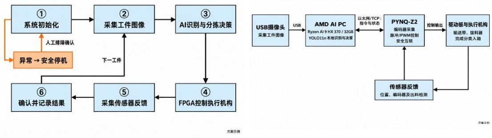

AMD AIPC 借用报告（模板）
<table><tr><td rowspan=1 colspan=1>团队编号</td><td rowspan=1 colspan=4>4062</td></tr><tr><td rowspan=1 colspan=1>作品名称</td><td rowspan=1 colspan=4>基于AMD AI PC 与PYNQ-Z2 的具身智能视觉分拣系统(示例)</td></tr><tr><td rowspan=1 colspan=1>队长信息</td><td rowspan=1 colspan=1>姓名</td><td rowspan=1 colspan=1></td><td rowspan=1 colspan=1>联系邮箱</td><td rowspan=1 colspan=1></td></tr><tr><td rowspan=1 colspan=1></td><td rowspan=1 colspan=1>所在学校</td><td rowspan=1 colspan=1></td><td rowspan=1 colspan=1>电话</td><td rowspan=1 colspan=1></td></tr><tr><td rowspan=1 colspan=1>指导教师信息</td><td rowspan=1 colspan=1>指导教师1姓名</td><td rowspan=1 colspan=1></td><td rowspan=1 colspan=1>指导教师2姓名</td><td rowspan=1 colspan=1></td></tr><tr><td rowspan=1 colspan=1>借用AIPC</td><td rowspan=1 colspan=2>AMD RyzenAI 370(32G)</td><td rowspan=1 colspan=2>(备注：请填写以下 AIPC类型AMD RyzenAI 370(32G)/ AMDRyzenAI 395(64G/128G))</td></tr><tr><td rowspan=1 colspan=1>总设计框</td><td rowspan=1 colspan=4>(关键内容：应用任务、AIPC与FPGA分工、模型名称、输入输出接口/通信方式、执行反馈及异常保护。借用表格描述不得超过2页)</td></tr></table>

方案示例：摄像头识别工件，输送带与拨料器完成分类入箱，传感器确认结果。  
以下为拟定方案，非实测成果。

AI PC用途：拟采用YOLO11n在本地完成识别、分拣决策与状态监控，借用机型沿用上表。

FPGA职责：FPGA芯片负责编码器采集、脉冲/PWM控制和安全互锁，体现实际硬件作用，不只作转接。

通信与反馈：摄像头通过 USB 接入 AI PC；AI PC 与 PYNQ-Z2 经以太网/TCP 交互；板卡驱动执行机构并回传传感器状态，异常时安全停机。

总流程：初始化→图像采集→AI识别与决策→FPGA控制执行→传感器反馈→确认/记录；下一工件返回采集，异常安全停机。

具身智能视觉分拣系统总流程  
  
具身智能视觉分拣系统总设计框图